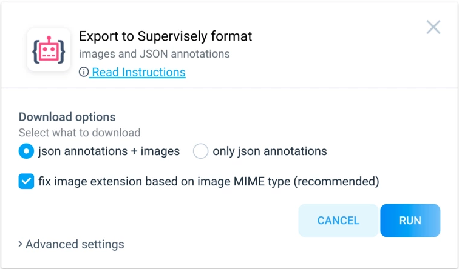
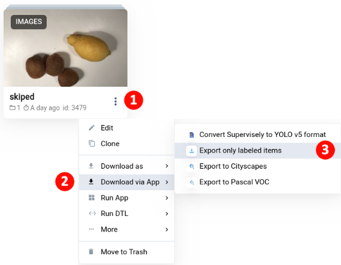
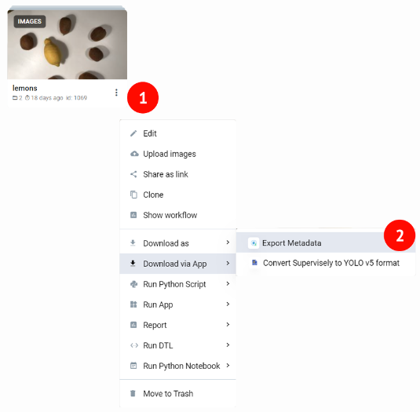

# Export Applications:

Export can be used in different ways:
from the context menu of a project or dataset or launch the application directly from the ecosystem.

1. [**Export to Supervisely Format.**](https://ecosystem.supervisely.com/apps/export-to-supervisely-format)
    we have applications for [export to Supervisely Format.](https://ecosystem.supervisely.com/apps/export-to-supervisely-format)
    Starting from version 2.7.7 the application will save images metadata in JSON format to meta directory in each dataset.

    Download images project or dataset in [Supervisely JSON format](../../../data-organization/Annotation-JSON-format/00_ann_format_navi.md). It is possible to download both images and annotations or only annotations.

    

2. **Export to other Formats**
    * [Export to COCO](https://ecosystem.supervisely.com/apps/export-to-coco)
    * [Export to Pascal VOC](https://ecosystem.supervisely.com/apps/export-to-pascal-voc)
    * [Export activity as csv](https://ecosystem.supervisely.com/apps/export-activity-as-csv)
    * [Export to YOLOv8 format](https://ecosystem.supervisely.com/apps/export-to-yolov8)
    * [Export to DOTA](https://ecosystem.supervisely.com/apps/export-to-dota)

3. [**Export only certain items.**](https://ecosystem.supervisely.com/apps/export-only-labeled-items) App exports only labeled items from project and prepares downloadable tar archive. Annotations will be in Supervisely format. App works with all types of projects: Images, Videos , Point Clouds. Unlabeled items will be skipped. Also there is the additional option to export only annotations without actual data.

   

4. [**Export only metadata.**](https://ecosystem.supervisely.com/apps/export-metadata) 
    Export Images metadata from project to json files.
    
    

5. [**Export to cloud storage.**](https://ecosystem.supervisely.com/apps/export-project-to-cloud-storage)
    This apps allows to export images project with annotations (in [Supervisely format](https://developer.supervisely.com/api-references/supervisely-annotation-json-format?_ga=2.2048241.1588633722.1698657810-1548462166.1688143034)) to the most popular cloud storage providers from Supervisely Private instance.

    **List of providers:**

    * Amazon s3
    * Google Cloud Storage (CS)
    * Microsoft Azure
    * and others with s3 compatible interfaces

    ✅ For developers: you can use the sources of this app as a starting point for your custom export to cloud.

    

