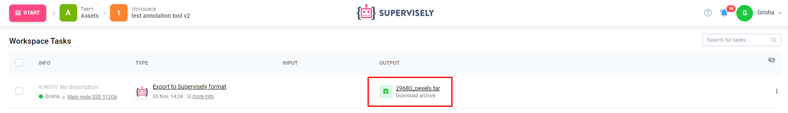
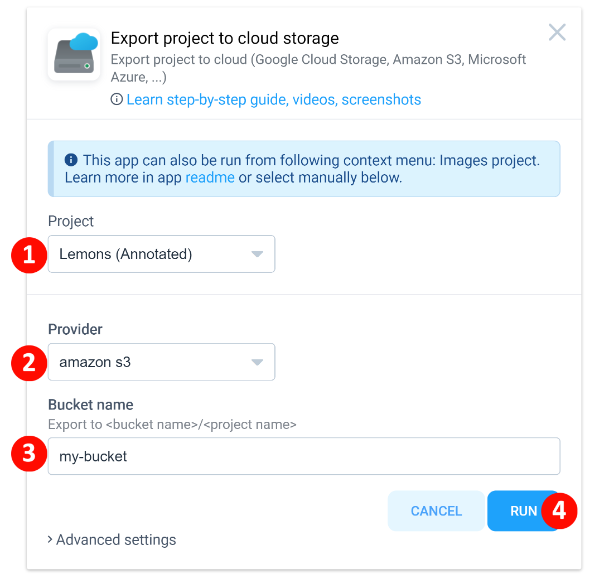

# 🚀 Export

While your data and annotations are stored securely in Supervisely, you can export and save your valuable assets and labels in various formats at any time. Whether you need to exchange data, create backups, or interact with external applications, there are multiple ways to achieve your goal.

## Export using Supervisely Apps

You can export data in different ways: from the context menu of a project or a dataset or you can launch the export application directly from the [Ecosystem.](https://ecosystem.supervisely.com/export)

### **Export to Supervisely Format.**

The best way to export and download your dataset from Supervisely is by saving it to the [Supervisely Format.](../../supervisely-format.md) Since it has the full support of every capability available on the platform, no matter how complex your annotations and data are (for example, 3D labels of cloud point episodes with photo context), you can be 100% sure that all the information is saved in the convenient .json-based format.

To download a project or dataset in Supervisely format, select Download via App in the context menu and choose Export in Supervisely Format.

The appropriate Supervisely App will generate an archive, save it to your Team Files and provide you a download link at the Workspace Tasks page.

### **Export to other Formats**
Of course, there are countless other Supervisely Apps that will help download your dataset in any desirable format. Just like with the Supervisely Format, select Download via App in the project or dataset context menu and choose any format of your likening. Here are some examples:

* [Export to COCO](hhttps://app.supervisely.com/ecosystem/apps/export-to-coco?id=104)
* [Export to Pascal VOC](https://app.supervisely.com/ecosystem/apps/export-to-pascal-voc?id=71)
* [Export activity as csv](https://app.supervisely.com/ecosystem/apps/export-activity-as-csv?id=86)
* [Export to YOLOv8 format](https://app.supervisely.com/ecosystem/apps/export-to-yolov8?id=252)
* [Export to DOTA](https://app.supervisely.com/ecosystem/apps/export-to-dota?id=205)

Explore more [export applications](https://ecosystem.supervisely.com/export) in the Ecosystem.

### **Export only certain items.**

Some other Supervisely Apps will help you export only subsamples of your data. For example, select [Export only labeled items](https://ecosystem.supervisely.com/apps/export-only-labeled-items) application to skip export of any unlabeled items.

### **Export to cloud storage.**
Some Supervisely Apps can do more than just convert your project to some format, but actually provide an interactive web interface to configure more complex exports.

For example, [Export to cloud storage](https://ecosystem.supervisely.com/apps/export-project-to-cloud-storage) allows exporting a project with annotations in Supervisely format directly from Supervisely platform to the most popular cloud storage providers, without any need to download archives. The application supports:
- Amazon S3
- Google Cloud Storage (GCS)
- Microsoft Azure
- Any S3 compatible storage


For developers: you can use the sources of this app as a starting point for your custom export to cloud.


### **Export via SDK:** 
 Utilize our [Software Development Kit (SDK)](https://supervisely.readthedocs.io/en/latest/sdk_packages.html) to create custom solutions for data export, tailored to your unique requirements and processes.

### **Export via API:**
 [Our API](https://api.docs.supervisely.com/) provides the ability to automate the data export process by integrating our system with external applications and services.

