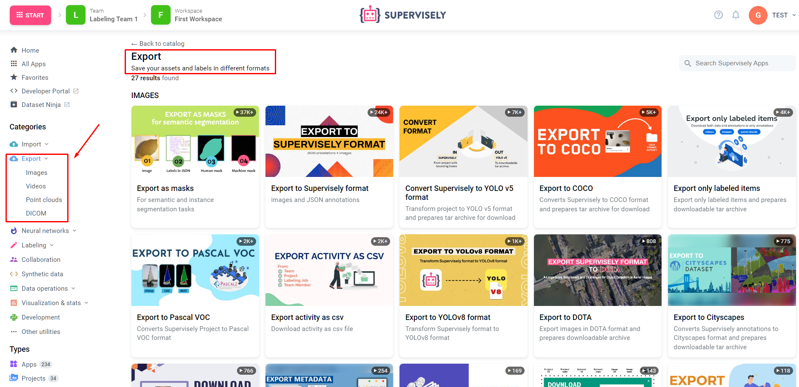

# 🚀 Export

The "Export" feature allows you to securely save your valuable assets and labels in various formats, providing flexibility and accessibility to your data. Whether you need to exchange data, create backups, or interact with external applications, we are always ready to assist you.

Our export feature supports various types of data, including:

- **Images**: You can export annotations for images, providing access to labels, annotations, and more.

- **Video**: Export annotations for video files, enabling you to work with data in video format.

- **Point Clouds**: Export annotations for point clouds, granting access to labels and annotations based on three-dimensional data.

- **DICOM**: Export annotations for DICOM format data, facilitating convenient work with medical images and data.

## Export Methods:
1. [Export via SDK/API](export-sdk-api.md)
2. [Export Applications](export-apps.md)

    