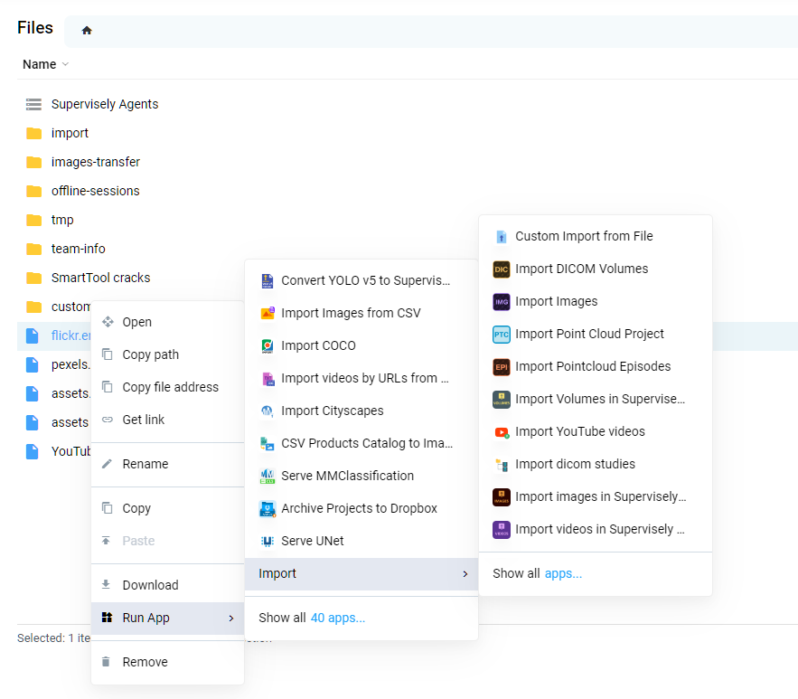

# Import using Team Files.

In fact, when you drag your files into the upload window, we upload them to an auto-generated folder in Team Files, launch the selected episode, passing the path to this folder there, and then automatically delete it.

Sometimes if you a lot of files or you want to upload files via API, and then set an application on them or you launched an application that uploaded the dataset to team files, but this is not a project yet. Then, download files or folders using drag, or get them there in another way above - select the appropriate application from the context menu and enjoy.

