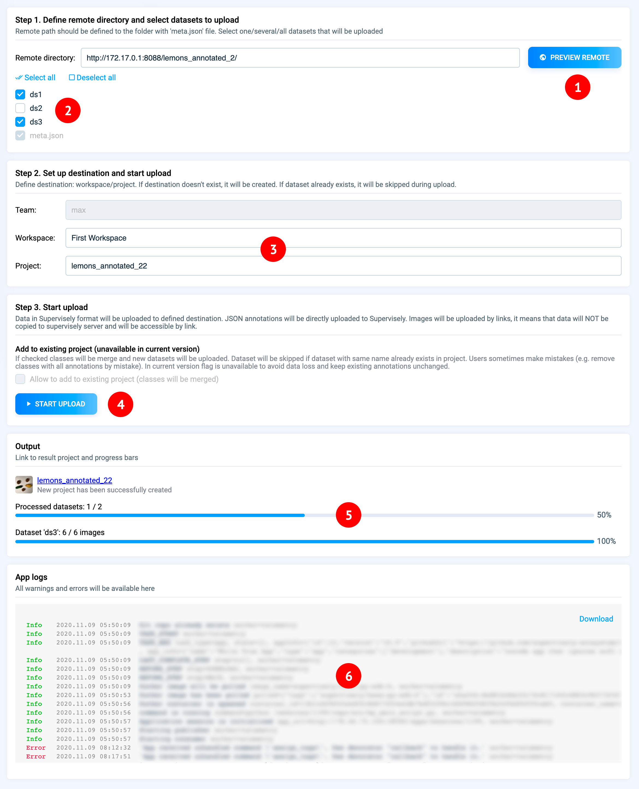

# Import from Cloud
It’s also worth mentioning that we have applications to import data not from your computer, but from cloud services.

## Apps to import your data

### **Remote import**

[Remote import](https://ecosystem.supervisely.com/apps/remote-import) allows you connect your remote data storage to Supervisely Platform without data duplication.

Most frequent use case is when Enterprise Customer would like to connect huge existing data storage (tens of terabytes) and avoid data duplication. In other cases we recommend to use general import procedure to store data in [Supervisely Data Storage](.../../storage/README.md)

### **Import images from cloud storage**

[This apps](https://ecosystem.supervisely.com/apps/import-images-from-cloud-storage) allows to import images from most popular cloud storage providers to Supervisely Private instance.

**List of providers:**

- Amazon s3
- Google Cloud Storage (CS)
- Microsoft Azure
- and others with s3 compatible interfaces

**App supports two types of import:**

- copy images from cloud to Supervisely Storage
- add images by link



### Import from Google Cloud Storage

[This Application](https://ecosystem.supervisely.com/apps/import-from-google-cloud-storage) uploads images using links from provided CSV file. All images will be uploaded to single dataset. User chooses destination: workspace/project/dataset. In addition, other columns can be attached to images as meta information.

## Apps for importing public data

* [Pexels downloader](https://ecosystem.supervisely.com/apps/pexels-downloader)
* [Flickr downloader](https://ecosystem.supervisely.com/apps/flickr-downloader)
* [Import Cityscapes](https://ecosystem.supervisely.com/apps/import-cityscapes)
