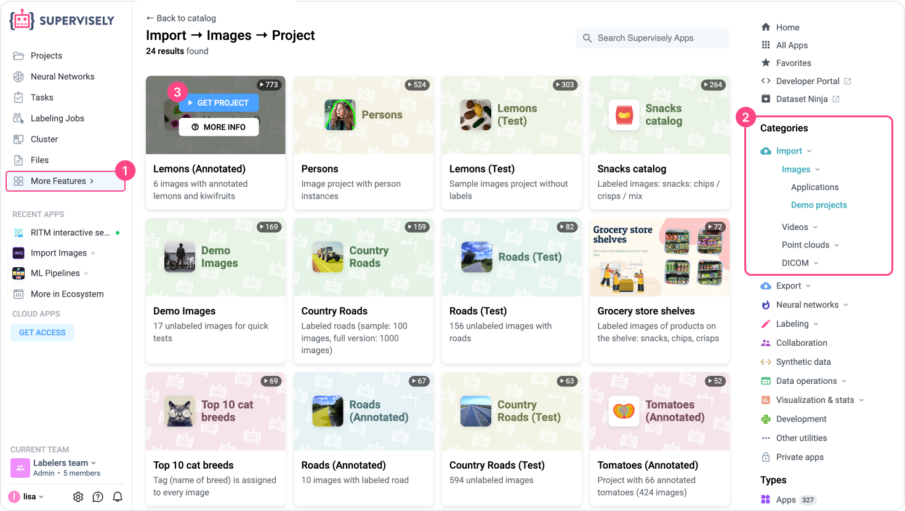
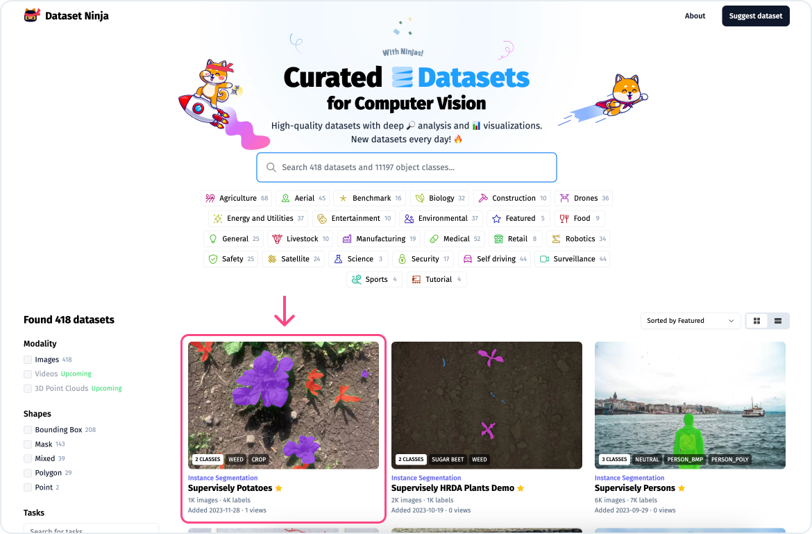
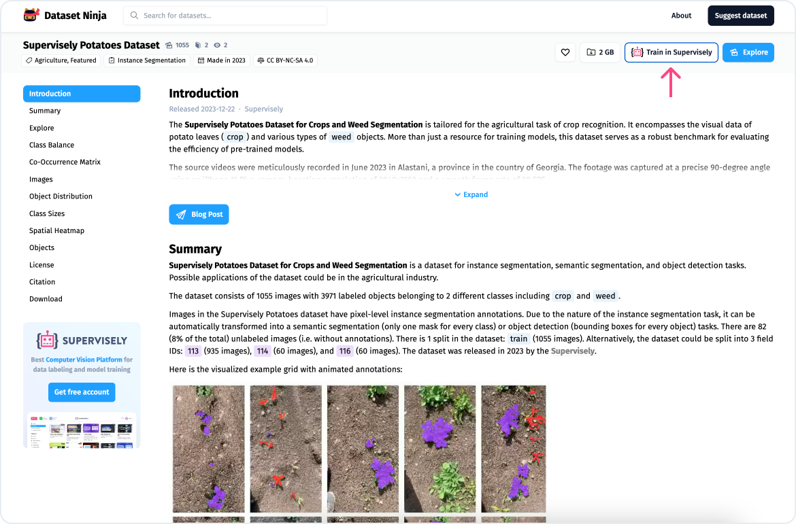

# Import sample dataset

Save valuable time by starting with already prepared datasets. We provide access to a variety of ready-made data to speed up your start.

Just go to the [Ecosystem](https://ecosystem.supervisely.com/), find the **Import** section, select the modality (images, videos, etc) and then click **Demo projects**. Click the dataset you like and finally click `Get project`.

<figure><figcaption></figcaption></figure>

## [**Dataset Ninja**](https://datasetninja.com/)

Or you can take advantage of [DatasetNinja](https://datasetninja.com/) new initiative, an easy-to-use service for searching and exploring Computer Vision datasets. And it is available to the entire machine learning community completely free of charge.

<figure><figcaption></figcaption></figure>

Find any dataset you like and click “Train in Supervisely” button to add it to your list of projects.

<figure><figcaption></figcaption></figure>
