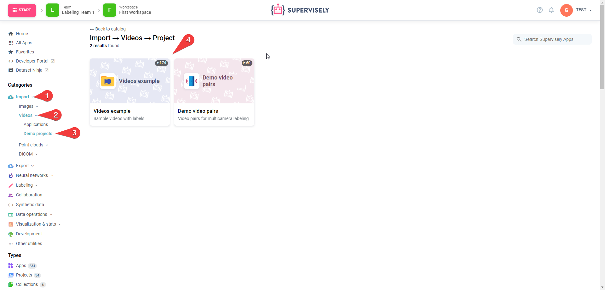
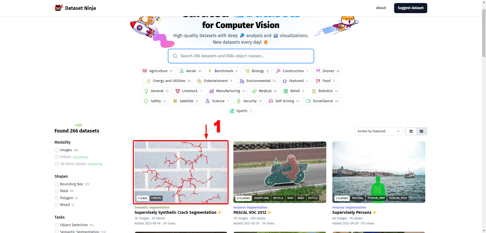

# Import sample dataset
Save valuable time by starting with already prepared datasets. We provide access to a variety of ready-made data to speed up your start. 

Just go to the ecosystem, find the "Import" section and select the modality and then "Demo projects".

## [DatasetNinja](https://datasetninja.com/)
Or you can take advantage of [DatasetNinja](https://datasetninja.com/) new initiative, an easy-to-use service for searching and exploring Computer Vision datasets. And it is available to the entire machine learning community completely free of charge.

You can select a dataset and there is a Train in Supervisely button

