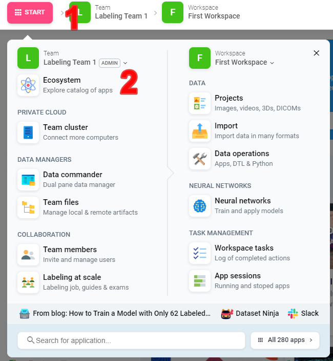
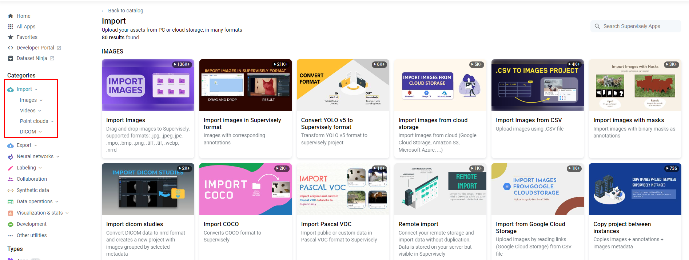
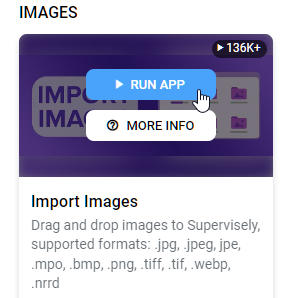
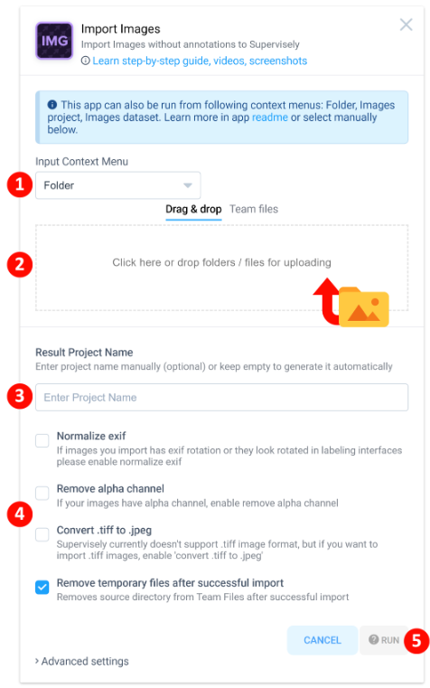
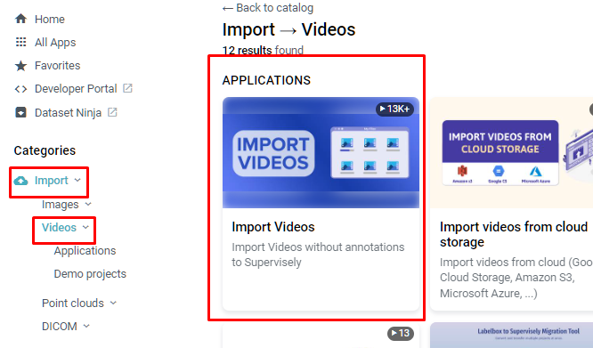
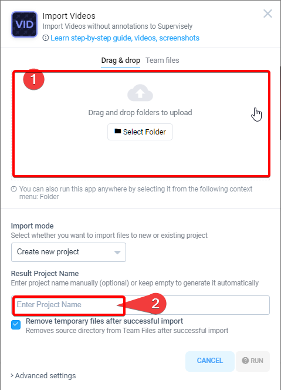

# Import using Web UI

To import data, go to the Import page

Select one of the applications and launch it with the Run button, read the description and follow the instructions

## **Example 1: how to import pictures without annotations.**

App can be launched from ecosystem, team files, images project and images dataset

* [running the app from ecosystem](https://app.supervisely.com/ecosystem/apps/import-images?id=147#run-from-ecosystem) you will be given options to create new project, upload images to existing project or existing dataset

* [running the app from team files](https://app.supervisely.com/ecosystem/apps/import-images?id=147#run-from-team-files) will result in new project
* [running the app from images project](https://app.supervisely.com/ecosystem/apps/import-images?id=147#run-from-images-project) will upload images to existing project, * from which it was launched
* [running the app from images dataset](https://app.supervisely.com/ecosystem/apps/import-images?id=147#run-from-images-dataset) will upload images to existing dataset, from which it was launched

### Step-by-step guide
Step 1. Run the app from Ecosystem

Step 2. Drag & drop folder or images files, select options and press the Run button

## **Example 2: How to import videos with annotations.**

### Step-by-step guide
Step 1. Run the app from Ecosystem

Step 2. Drag & drop folder or video files, enter project name and press the Run button

)

