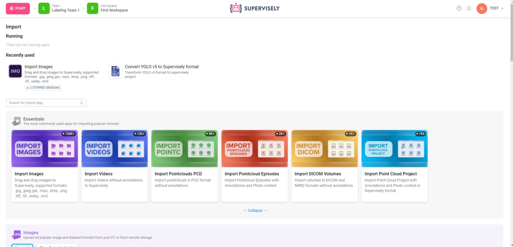
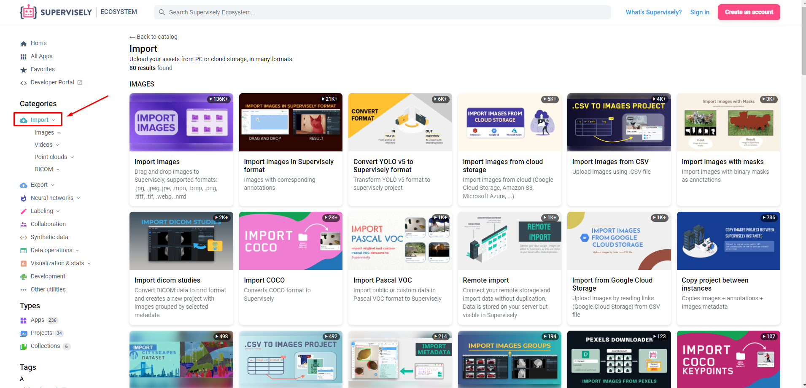
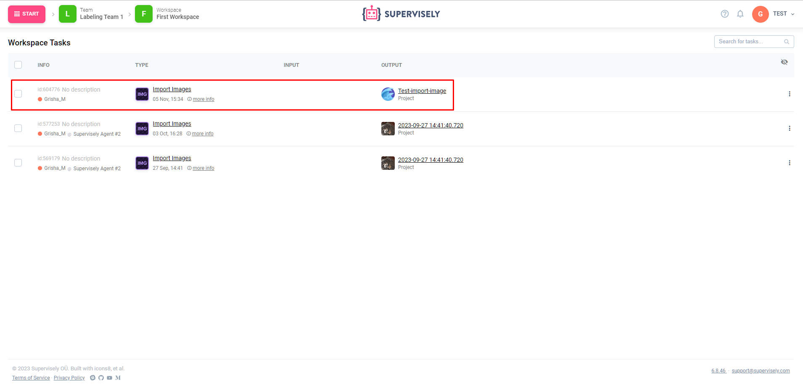

# Import using Web UI

The most simple and straightforward method of importing is uploading your data using one of our Supervisely Apps. To start, open the Import page on the Start menu:

Next, select one of the Supervisely Apps and launch it with the Run button, read the description and follow the instructions.

## **Example: how to import images from your computer.**

**Step 1.** Go to the Import page or Ecosystem and find the Import Images application. Hover your cursor over it and click the “Run app” button.

**Step 2.** In the modal window drag & drop a folder with images or images itself. Enter the name of the future project and click “Run”.

**Step 3.** You will be redirected to the Tasks page where you can watch import progress. When it is done, you will see the link to your new project (or find it at the Projects page).

