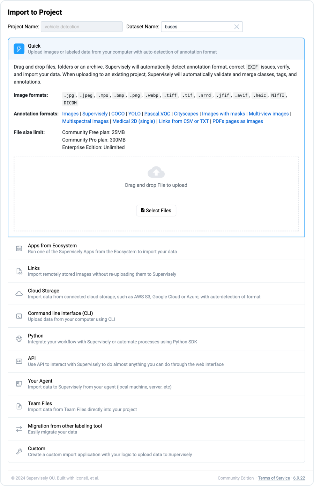
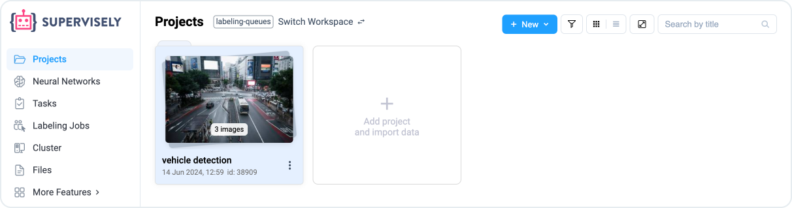
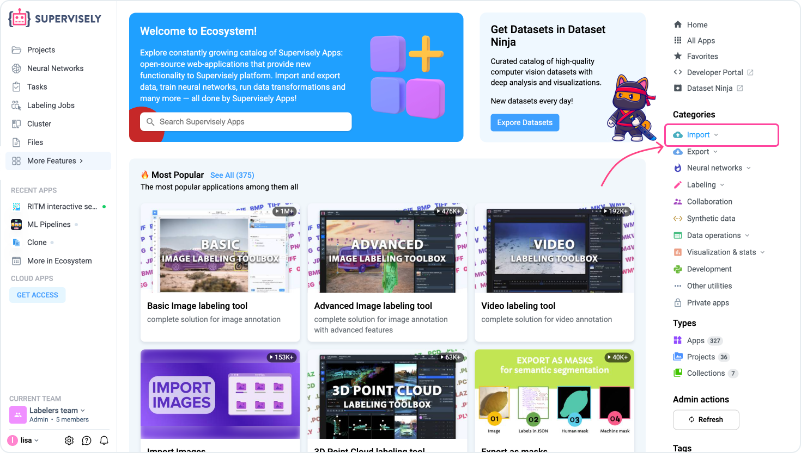

# Import using Web UI


Check our 5-minute tutorial on [how to import your first images to Supervisely](../../../getting-started/How-to-import.md).


The easiest and most straightforward import method is to load data using **Quick Import**. To get started, click the `Import Data` button (if you don't have any projects), `+ New` button or the interactive tile on the Project page.

<figure><figcaption>
3 quick ways to create a project and import data
</figcaption></figure>

Next, follow these step-by-step guide:&#x20;

1. **Name and describe the project.** Enter a unique name for the project. Ensure the name is unique in the workspace and note that it is case-sensitive. (Optional) Add a description to provide additional information about the project or to track updates.
2. If you aren't a new user, you can click the `Create from template` and choose the source project from which to copy the classes and tags. Thus you can select projects from any of your team workspaces.
3. **Define project type.** Select the content modality for the project: images, videos, point clouds, or DICOM 3D volumes.&#x20;


**Note**: You can't mix multiple content types in a single project, and this setting can't be changed later.


4. **Choose labeling interface.** Select one of the available interfaces for labeling your data. These interfaces are cover different industries and annotation scenarios.
5. Click **Create** to finish the project creation and proceed to uploading data.

<figure><figcaption></figcaption></figure>

6. **Drag & drop** one or more images of supported formats into the modal window: .jpg, .jpeg, .mpo, .bmp, .png, .webp, .tiff, .tif, .nrrd, .jfif, .avif, .heic, NIfTI, DICOM.
7. You can view supported annotation formats. Check format you are interested in by clicking on its title.

<figure><figcaption></figcaption></figure>

You will be redirected to the **Tasks** page where you can monitor the upload progress.

To check application logs, click the **three dots (⋮)** icon next to the task.

<figure><figcaption></figcaption></figure>

Once the import is finished, you will see the link to your new project in the `Output` column of the table (or find it at the **Projects** page).

<figure><figcaption></figcaption></figure>

### **How to import images with applications.**

1. Click the `More Features` tab. Navigate to the **Import** page in the `Categories` section. Locate the **Import Images** application.&#x20;

<figure><figcaption></figcaption></figure>

2. Move the cursor over the application and click the `Run Application` button. You can always have a look at the description on the application page and follow the instructions.

<figure><figcaption></figcaption></figure>

3. In the modal window **drag & drop** a folder with images or images itself. Enter the name of the future project and click `Run` button.

<figure><figcaption></figcaption></figure>

3. You will be redirected to the **Tasks** page where you can watch import progress. When it is done, you will see the link to your new project (or find it at the Projects page).

<figure><figcaption></figcaption></figure>
