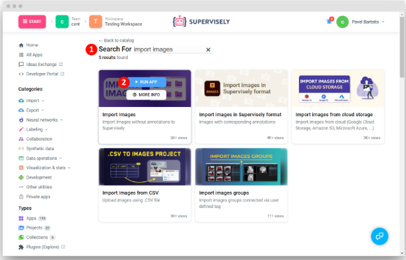
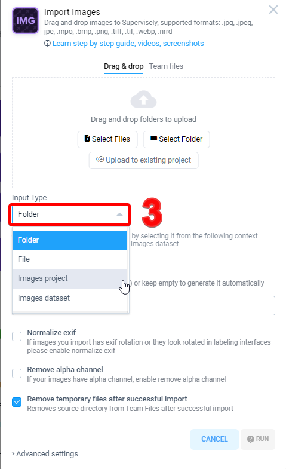
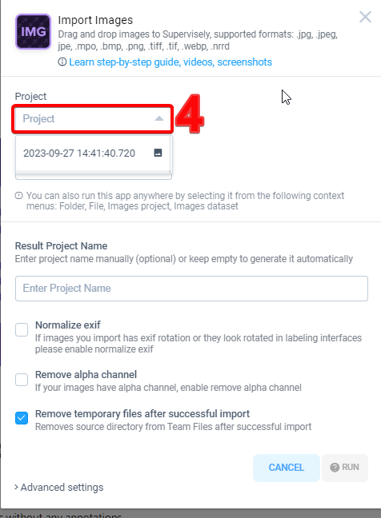
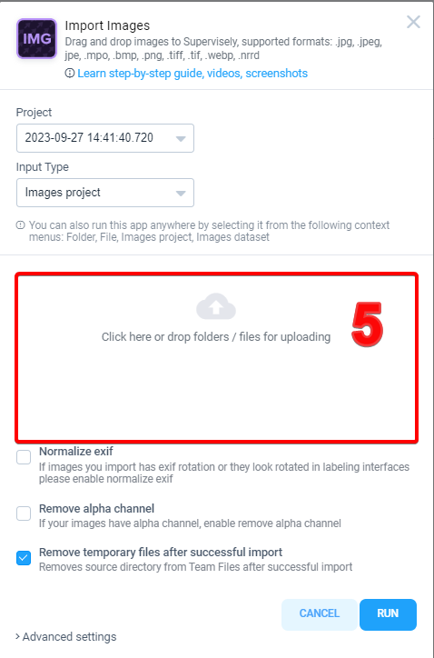

# How to add images to an existing dataset or project
Step 1. Run the app from Ecosystem

Step 2. Find app [Import Images](https://app.supervisely.com/ecosystem/apps/import-images?id=147).

Step 3. Change input type 

Step 4. Select project

Step 5. Drag & drop folder or images files, select options and press the Run button

