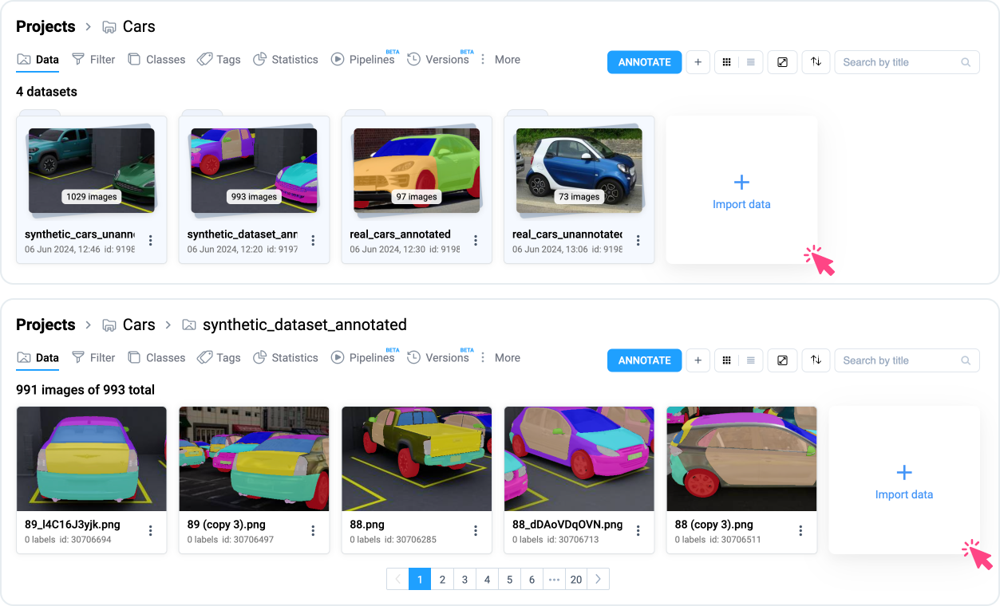
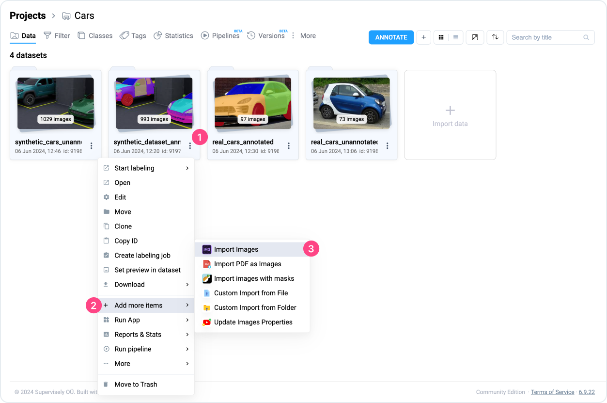
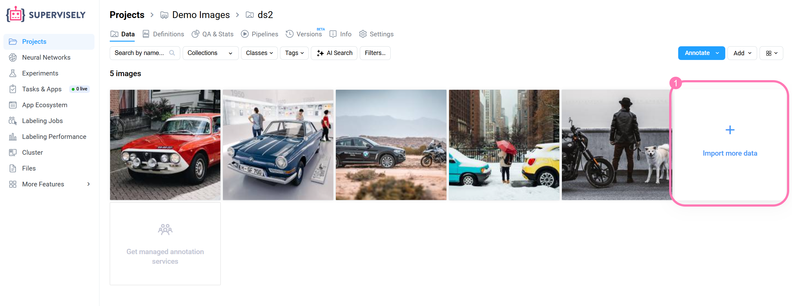
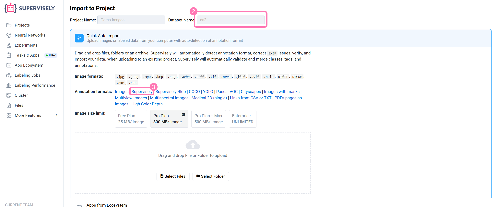
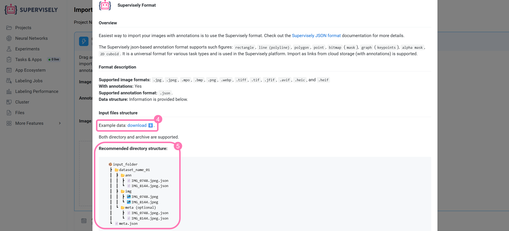
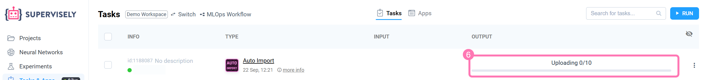
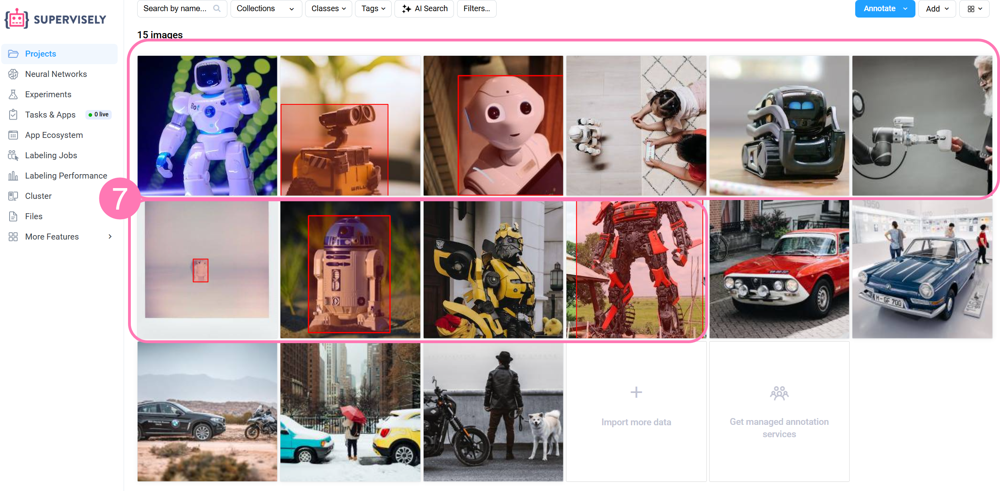

# Import into an existing dataset

It is possible to add more assets such as images to the existing project or dataset.

Just go to the **Projects** or **Datasets** page and click on interactive tile.

<figure><figcaption></figcaption></figure>

You can also import data into an existing project or dataset as follows:


Depending on the [Supervisely App](https://app.supervisely.com/ecosystem/all-apps), some of them (not every application!) support additional context, such as Input Project or Input Dataset. You can look for it in the Run Application modal window, but there is a more simple way.


Go to the **Projects** or **Data** page, select any dataset and use the context menu by **three dots icon (⋮)** and select Add more items → Import. You find the list of [Supervisely Apps](https://app.supervisely.com/ecosystem/all-apps) that support project as an input and allow adding more content to it.

<figure><figcaption></figcaption></figure>

## Example: add more images to a dataset

- Enter the required dataset and click "import more data" ①

<figure><figcaption></figcaption></figure>

- A page will open showing an indicator that you are adding data to the selected dataset ②, and its name cannot be changed (in your screenshot, you are adding data as a new dataset).

- On the upload page, you can review the required format by selecting it ③.

<figure><figcaption></figcaption></figure>

- On the page with the format description, you can find example data ④, download it and compare the structure. You can read more about the structure on the page or via the provided link.

- Additionally, this page features a simplified example of the Supervisely format structure ⑤. Please double-check the data you are uploading.

<figure><figcaption></figcaption></figure>

- The screenshots (⑥ and ⑦ points) show that the images from the example data have been uploaded.

<figure><figcaption></figcaption></figure>

<figure><figcaption></figcaption></figure>
