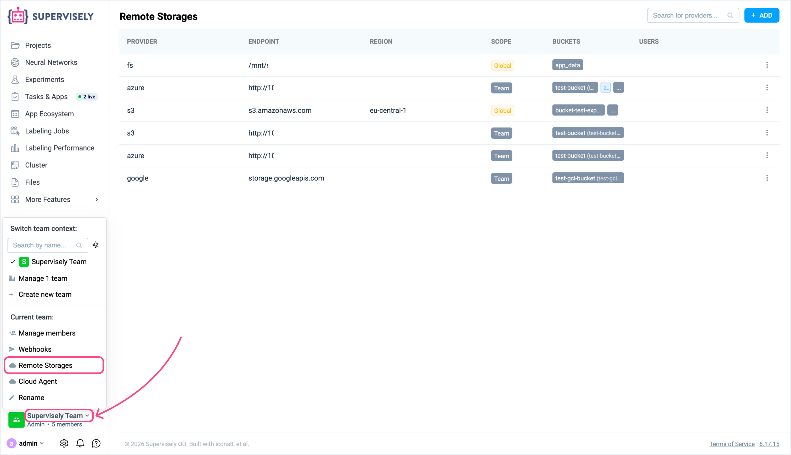
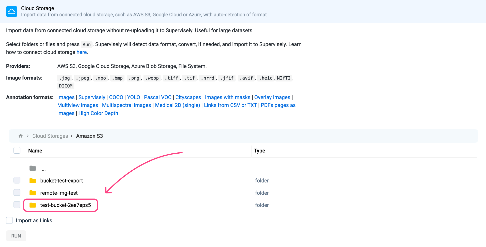
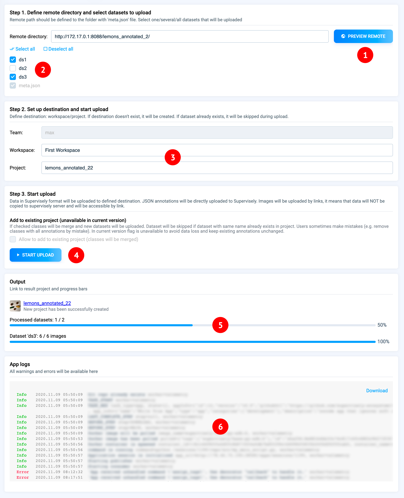

# Import from Cloud

It's also worth mentioning that we have applications to import data not from your computer, but from cloud services.

No matter which method you choose, you have the option to import files by links, meaning they won't be stored directly on the Supervisely disk. These files will only be accessible through the provided links. This method offers flexibility in data management, and you can still use both this approach and the traditional file import for the convenience of your workflows.

## Connect Cloud Storage for a Team

Any team can connect its own cloud storage account (AWS S3, Google Cloud Storage, Azure Blob Storage, or any S3-compatible storage) directly to Supervisely. Once connected, team members can browse the storage and import images, videos, or entire annotated projects straight from the bucket — without downloading the data to their computer first and, optionally, without duplicating it inside Supervisely at all. This is the recommended way to import from cloud storage; the apps described further down on this page are an alternative that don't require a persistent connection.


This is a **Team**-level connection: it is visible and usable only within the team that created it. It's a separate feature from the [instance-wide Remote Storage](../../../enterprise/s3/README.md) that an Enterprise admin can configure as the platform's primary data backend.

Connecting a cloud storage to a team is available on a **Pro** subscription for Community Edition, and for **Enterprise Edition** upon request — contact Supervisely support to enable it for your instance.


### Open Remote Storages

1. In the left sidebar, click on your current team name (bottom-left corner).
2. In the menu that opens, under **Current team**, click **Remote Storages**.

This opens the **Remote Storages** page, listing every cloud storage connected to the instance. Entries you add here are marked with the **Team** scope; any entries configured by an instance administrator are marked **Global**.

<figure><figcaption></figcaption></figure>

In the **Buckets** column, each bucket name is followed by a unique identifier in parentheses, e.g. `test-bucket (test-bucket-2ee7eps5)`. Supervisely generates this identifier automatically so that buckets sharing the same name — across different connections or providers — can still be told apart.

### Add a new connection

1. On the **Remote Storages** page, click **+ ADD** in the top-right corner.
2. In the **Add new cloud provider** dialog, select a **Cloud Provider**: **AWS S3**, **Google Cloud Storage**, or **Azure Storage**.
3. Fill in the fields for the selected provider (see below).
4. Optionally restrict the connection to specific **Buckets** and/or specific **Users**.
5. Click **ADD**.

The new connection appears in the table with scope **Team**.

#### AWS S3

| Field | Description |
| --- | --- |
| Endpoint | **Auto** uses `s3.amazonaws.com`. Switch to **Manual** to point at an S3-compatible endpoint, e.g. a MinIO server or another on-prem S3 (`http://<host>:<port>`). |
| Region | Optional, e.g. `eu-central-1`. Leave empty for S3-compatible storages that don't use regions. |
| Access key / Secret key | Standard AWS credentials (**Keys** tab). Both are required. |
| IAM Anywhere | Alternative to static keys (**IAM Anywhere** tab): `Role Arn`, `Profile Arn`, `Trust Anchor Arn`, a base64-encoded PEM `Signing certificate`, and a base64-encoded PEM `Sign private key`. Use this to authenticate without long-lived access keys. See [Keys from IAM Role](../../../enterprise/s3/README.md#keys-from-iam-role) for the full setup (generating certificates, creating a trust anchor, role, and profile in AWS). |

#### Google Cloud Storage

| Field | Description |
| --- | --- |
| Endpoint | **Auto** uses `storage.googleapis.com`, or switch to **Manual** for a custom endpoint. |
| Credentials file | Drag and drop (or select) the service account JSON key file generated in Google Cloud. |

#### Azure Storage

| Field | Description |
| --- | --- |
| Storage account name | Your Azure storage account name. |
| Secret key or SAS token | Either the account's secret key (looks like `aflmg+wg23fWA+6gAafWmgF4a...`) or a SAS token (looks like `sp=r&st=2026-05-27T10:50:57Z&se=...`). |
| Endpoint | **Auto** derives the endpoint from the account name, or switch to **Manual** to set a custom one (e.g. Azurite or another Azure-compatible endpoint). |

#### Restricting buckets and users

* **Buckets** — if the provided credentials only grant access to specific buckets/containers, list them here, one per line. You can optionally scope a bucket to a prefix by adding it after a slash, and separate multiple prefixes with a colon:

  ```
  bucket1
  bucket2:prefix1
  bucket3:prefix1/abc:prefix2:prefix3/123
  ```

  Leave empty to let Supervisely discover all buckets the credentials have access to.

* **Users** — by default, **All users** in the team can use this connection to import data. Pick specific team members instead to limit who can use it for imports. This only restricts the *import* feature — it does not affect who can view or edit data already imported into a project (that's controlled by regular [project sharing](../../team-files/README.md)).

### Verify, edit, or remove a connection

Click the **⋮** menu at the end of a connection's row:

* **Test** — pick one of the available buckets and check that Supervisely can connect to it with the saved credentials.
* **Edit** — update endpoint, credentials, buckets, or user restrictions.
* **Remove** — delete the connection. This does not delete any data already imported into Supervisely, only the stored connection/credentials.

### Import data from the connected storage

Once a cloud storage is connected, it becomes available as a source in the import wizard:

1. Open a project (or start creating a new one) and go to the **Data** tab.
2. Click **Add** → **Import data**.
3. Choose the **Cloud Storage** import method.
4. Browse **Cloud Storages** → the provider you connected → the bucket → the folder/files you need, and check the ones to import. Buckets are listed here by their unique identifier (the same one shown in parentheses on the Remote Storages page) rather than the plain bucket name, so buckets with identical names don't get mixed up.
   <figure><figcaption></figcaption></figure>
5. Optionally check **Import as Links** to keep the files in the cloud and reference them by link, instead of copying them into Supervisely storage — useful for very large datasets.
6. Click **Run**. Supervisely detects the data and annotation format automatically (images, videos, point clouds, COCO, Pascal VOC, Supervisely format, and more) and imports it into the selected dataset.

## Import images without labels from S3, Google Cloud, Azure and others

[This apps](https://ecosystem.supervisely.com/apps/import-images-from-cloud-storage) allows to import images from most popular cloud storage providers to Supervisely Private instance.

**List of providers:**

* Amazon S3
* Google Cloud Storage (GCS)
* Microsoft Azure
* and others with S3 compatible interfaces

**App supports two types of import:**

* copy images from cloud to Supervisely Storage
* add images by link



## Import images **with** labels from S3, Google Cloud, Azure and others

[This app](https://ecosystem.supervisely.com/apps/import-images-in-sly-format-from-cloud-storage) enables the straightforward import of images with associated annotations from various cloud storage services like S3, Google Cloud, Azure, and others. It provides a convenient way to handle annotated images, facilitating effective data management for various purposes. You can learn about Supervisely format [here](../../Annotation-JSON-format/01_Project_Structure_new.md).

## Import videos, point clouds and other from S3, Google Cloud, Azure

[This apps](https://ecosystem.supervisely.com/apps/import-videos-from-cloud-storage) allows to import videos from most popular cloud storage providers to Supervisely Private instance.

List of providers:

* Amazon S3
* Google Cloud Storage (GCS)
* Microsoft Azure
* and others with S3 compatible interfaces

**App supports two types of import:**

1. Copy videos from cloud to Supervisely Storage (pros: fast video streaming, cons: data is duplicated)
2. Add videos by link (pros: data will not be duplicated, cons: video streaming lags are possible - it depends on cloud configuration)

## Import images from disk without copying

You also have the opportunity to use applications [Import images from cloud storage](https://ecosystem.supervisely.com/apps/import-images-from-cloud-storage) and [Import image projects in Supervisely format from cloud storage](https://ecosystem.supervisely.com/apps/import-images-in-sly-format-from-cloud-storage) with the FileSystem serving as the data provider. This provides the capability to import images directly from the disk without copying, offering convenience and efficiency when working with local data.

## Apps for importing public data

* [Pexels downloader](https://ecosystem.supervisely.com/apps/pexels-downloader)
* [Flickr downloader](https://ecosystem.supervisely.com/apps/flickr-downloader)
* [Import Cityscapes](https://ecosystem.supervisely.com/apps/import-cityscapes)

## **Import in Supervisely Format from a Web-server**

[Remote import](https://ecosystem.supervisely.com/apps/remote-import) allows you connect your remote data storage to Supervisely Platform without data duplication.

Most frequent use case is when Enterprise Customer would like to connect huge existing data storage (tens of terabytes) and avoid data duplication. In other cases we recommend to use general import procedure to store data in [Supervisely Data Storage](https://github.com/supervisely/docs/blob/master/data-organization/import/import/storage/README.md)


