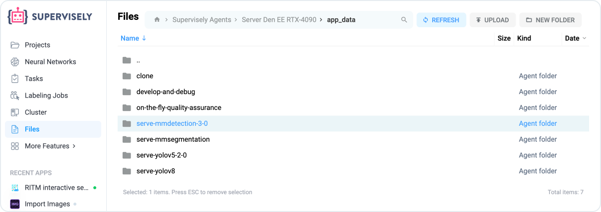

# Import using agent

We have several ways to import data from the agent. Find out which of these methods is best for you.

## **Agent host directory**

A temporary folder in which internal files necessary for the operation of the agent will be stored. Basically these are some kind of caches and other temporary application files. Through this folder you can run [import applications](https://dev.supervise.ly/ecosystem/import). You can safely clear this folder at any time, unless you have no applications running or, for example, one of your training jobs failed and you want to restore missing checkpoints.

<figure><figcaption></figcaption></figure>

## **Folder to mount**

Is a permanent folder you can use to hold files and folders you wish to give applications access to. In some cases, you can provide a mounted folder with your images and use the context menu in the [team files](../../../team-files/) to initiate the import process.

## **Another way**

But, it turned out we have an even better way to do this without the use of agents or the team files. You can actually add any folder on your server as a remote storage at the Instance Settings page using the “filesystem” provider, then use any [Supervisely App](https://ecosystem.supervisely.com/import), such as [Import images from cloud storage](https://ecosystem.supervisely.com/apps/import-images-from-cloud-storage) or [Import image projects in Supervisely format from cloud storage](https://ecosystem.supervisely.com/apps/import-images-in-sly-format-from-cloud-storage) and select your filesystem remote - this gives you are the flexibilities, plus, you don't have to actually copy image files to the Supervisely storage - files will be added to your [datasets](/broken/pages/-M54fC5lCGh1KuU-VTCW) “by links”.
