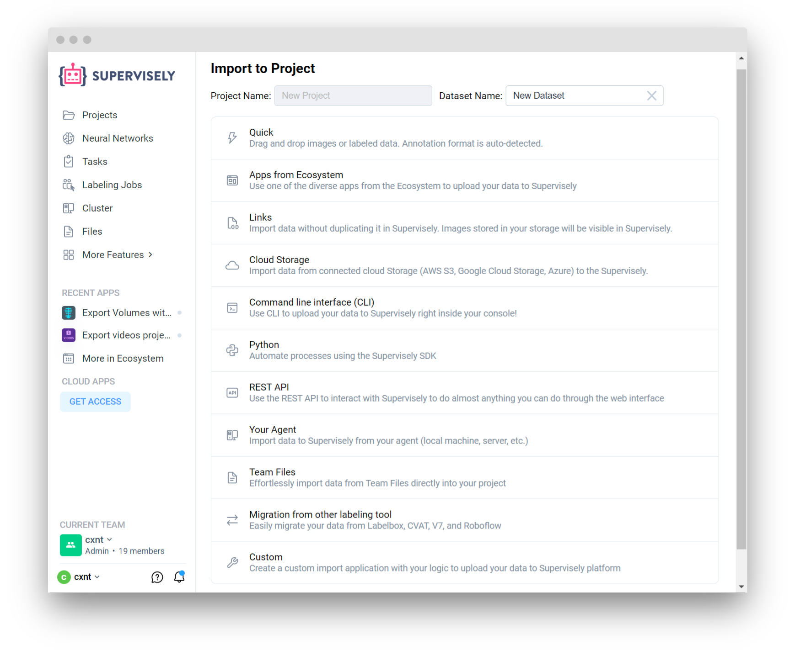
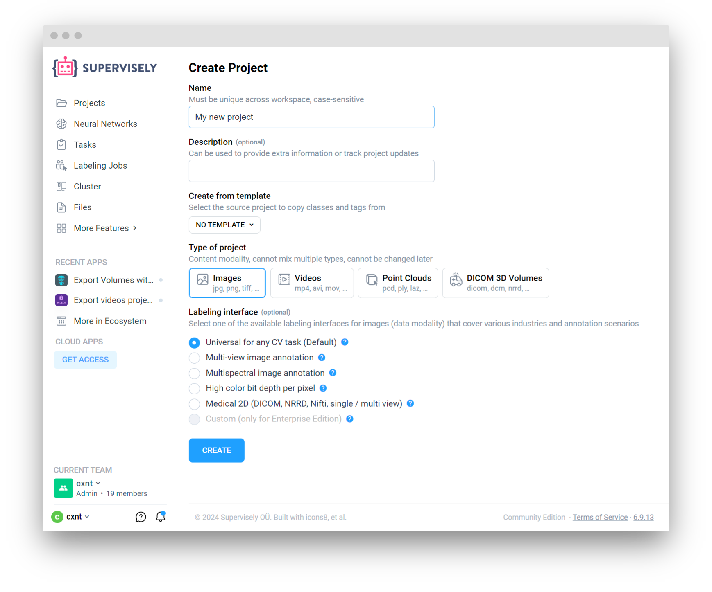
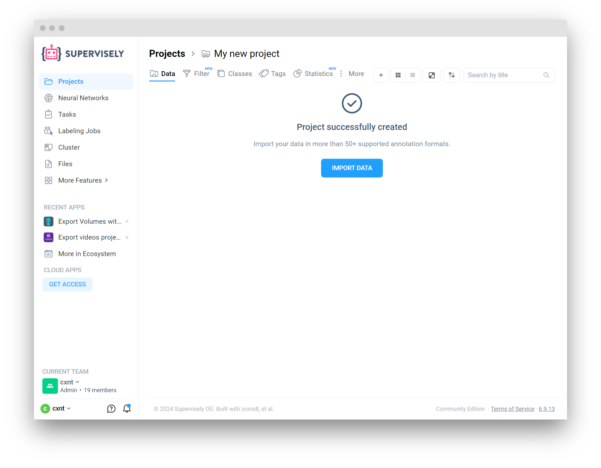

# Import Wizard

 

Welcome to Import Wizard, an all-in-one tool for effortlessly importing data into Supervisely from a variety of sources. Whether you're an experienced user or just getting started, Import Wizard streamlines the import process, guiding you through each step to ensure smooth data import without the hassle.

### Features:

1. **Quick:**
   - Simply drag and drop images or labeled data from your local machine. Supervisely platform will try to automatically detect annotation format, saving you time and effort. If no annotation format is detected, only images will be imported.
   - List of available annotation formats for quick import:
      * Images in any directory structure
      * [Supervisely (any Computer Vision task)](/data-organization/import/import/supported-formats-images/supervisely.md)
      * [COCO (detection, semantic and instance segmentations, keypoints, captioning)](/data-organization/import/import/supported-formats-images/coco.md)
      * [Pascal VOC (detection, semantic and instance segmentation)](/data-organization/import/import/supported-formats-images/pascal.md)
      * [YOLO (detection, instance segmentation or keypoints)](/data-organization/import/import/supported-formats-images/yolo.md)
      * [Images with masks (semantic or instance segmentation)](/data-organization/import/import/supported-formats-images/masks.md)
      * [Multi-view images](/data-organization/import/import/supported-formats-images/multiview.md)
      * [Multispectral images](/data-organization/import/import/supported-formats-images/multispectral.md)
      * [Medical 2D (single or multi-view) in DICOM, nrrd, nifti format](/data-organization/import/import/supported-formats-images/medical2d.md)
      * [Cityscapes](/data-organization/import/import/supported-formats-images/cityscapes.md)
      * [Links from CSV or txt](/data-organization/import/import/supported-formats-images/csv.md)
      * [Images extracted from PDFs](/data-organization/import/import/supported-formats-images/pdf.md)

2. **Apps from Ecosystem:**
   - Explore and select from a diverse range of apps within the Ecosystem to seamlessly upload your data to Supervisely. Enjoy the flexibility of choosing the most suitable app for your specific needs.

3. **Links:**
   - Skip the file upload process entirely by importing data directly from external links. Your images stored in various storage platforms are seamlessly streamed to the Supervisely platform for immediate use.

4. **Cloud Storage:**
   - Import data from your connected cloud storage services such as AWS S3, Google Cloud Storage, and Azure. Enjoy the convenience of accessing your data directly from the cloud.

5. **Command Line Interface (CLI):**
   - Harness the power of the Command Line Interface (CLI) to upload your data to Supervisely right from your console. Streamline your workflow with efficient, command-based imports.

6. **Python SDK Integration:**
   - Automate and streamline processes using the Supervisely SDK. Seamlessly integrate data import tasks into your Python scripts for enhanced efficiency and productivity.

7. **REST API:**
   - Utilize the Supervisely REST API to interact with the platform and perform a wide range of actions programmatically. Enjoy the flexibility of integrating Supervisely functionalities into your applications and workflows.

8. **Supervisely Agent:**
   - Import data to Supervisely directly from your agent, whether it's your local machine, a server, or any other device.

9. **Team Files:**
   - Effortlessly import data from Team Files directly into your project. Enjoy streamlined collaboration and data sharing within your Supervisely team environment.

10. **Migration from other labeling tool:**
    - Easily migrate your existing data from other labeling tools such as Labelbox, CVAT, V7, and Roboflow. Our migration tools ensure a smooth transition without data loss or compatibility issues.

11. **Custom Import Applications:**
    - Develop custom import applications tailored to your unique requirements. Utilize your logic and workflows to seamlessly upload data to the Supervisely platform, ensuring a perfect fit for your specific needs.

### Getting Started:

To start using Import Wizard, simply follow these steps:

1. **Create or open an existing Project:**
    - Before importing data, create a new project or open an existing one within Supervisely.

   
  
2. **Access Import Wizard:**
   - Open newly created project and press Import Data button to open Import Wizard.

   

3. **Choose Your Import Method:**
   - Select the import method that best suits your needs, whether it's drag-and-drop, app selection, link import, or any other available option.

### Need Help?

If you encounter any issues or have questions regarding Import Wizard, don't hesitate to reach out to our support team in [Slack](https://supervisely.com/slack/).
