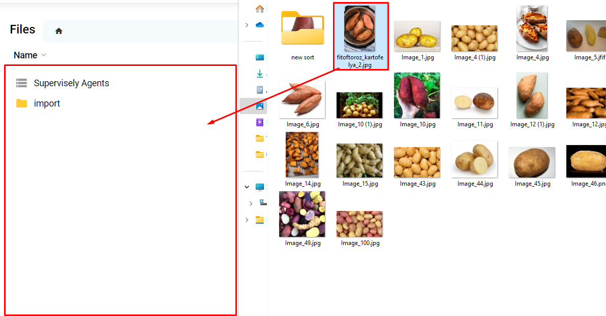

## 📁 Drag-and-Drop in Team Files

"Drag-and-Drop in Team Files" provides a convenient way to manage data within your team. This method allows you to drag and drop files directly into Team Files, making it easy to share and organize data among your team members, ensuring a smooth collaboration process.

## **Advantages of "Drag-and-Drop in Team Files":**

- **Ease of Use:** To import data into Team Files, you simply need to drag files from one window or application and release them in the Team Files section. This method allows for quick and convenient addition of resources to the team's shared storage.

- **Collaboration:** Dragging and dropping in Team Files facilitates collaborative work on projects, as team members can easily add and organize resources in the shared space.

- **Data Structuring:** This method allows for storing and structuring team resources in a convenient way, providing a more systematic approach to data management.

## **How to Use "Drag-and-Drop in Team Files":**

1. Open [Team Files](../team-files/README.md) where you want to add files or resources.

2. Select the files or resources you want to import.
3. Simply drag the selected items and release them in the corresponding section of Team Files.

