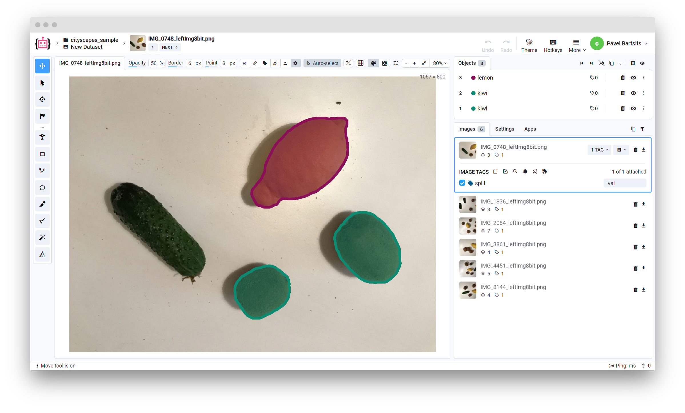

# Overview

This converter allows to import images with `.json` annotations in [Cityscapes](https://github.com/mcordts/cityscapesScripts) format.

⚠️ **Note:** images must have suffix `_leftImg8bit` and annotations suffix `_gtFine_polygons` and `.json` extension. Check the example of the file structure below.



# Format description

**Supported image formats:** `.jpg`, `.jpeg`, `.mpo`, `.bmp`, `.png`, `.webp`, `.tiff`, `.tif`, `.jfif`, `.avif`, `.heic`, and `.heif`<br>
**With annotations:** yes<br>
**Supported annotation file extension:** `.json`.<br>
**Grouped by:** any structure (uploaded to a single dataset)<br>

# Input files structure


Example data: [download ⬇️](https://github.com/supervisely-ecosystem/import-wizard-docs/files/14908276/sample_cityscapes.zip)<br>


Recommended directory structure:

```text
📦project name
 ┣ 📂gtFine
 ┃ ┣ 📂test
 ┃ ┃ ┗ 📂ds1
 ┃ ┃ ┃ ┗ 📜IMG_8144_gtFine_polygons.json
 ┃ ┣ 📂train
 ┃ ┃ ┗ 📂ds1
 ┃ ┃ ┃ ┣ 📜IMG_1836_gtFine_polygons.json
 ┃ ┃ ┃ ┣ 📜IMG_2084_gtFine_polygons.json
 ┃ ┃ ┃ ┣ 📜IMG_3861_gtFine_polygons.json
 ┃ ┃ ┃ ┗ 📜IMG_4451_gtFine_polygons.json
 ┃ ┗ 📂val
 ┃ ┃ ┗ 📂ds1
 ┃ ┃ ┃ ┗ 📜IMG_0748_gtFine_polygons.json
 ┣ 📂leftImg8bit
 ┃ ┣ 📂test
 ┃ ┃ ┗ 📂ds1
 ┃ ┃ ┃ ┗ 🖼️IMG_8144_leftImg8bit.png
 ┃ ┣ 📂train
 ┃ ┃ ┗ 📂ds1
 ┃ ┃ ┃ ┣ 🖼️IMG_1836_leftImg8bit.png
 ┃ ┃ ┃ ┣ 🖼️IMG_2084_leftImg8bit.png
 ┃ ┃ ┃ ┣ 🖼️IMG_3861_leftImg8bit.png
 ┃ ┃ ┃ ┗ 🖼️IMG_4451_leftImg8bit.png
 ┃ ┗ 📂val
 ┃ ┃ ┗ 📂ds1
 ┃ ┃ ┃ ┗ 🖼️IMG_0748_leftImg8bit.png
 ┗ 📜class_to_id.json
```

# Format Config File

In order to import custom annotations for the images, you need to provide a `class_to_id.json` file.
This file should contain a list with dictionaries.
Each dictionary should contain information about the class with the following fields:

- `name` - the name of the class. It should be unique.
- `id` - the ID of the class. From 1 to N-1, where N is the number of classes.
- `color` - the color of the class in RGB format. If not specified, the color will be generated randomly

<details>
    <summary>📜class_to_id.json</summary>

```json
[
  {
    "name": "kiwi",
    "id": 1,
    "color": [255, 0, 0]
  },
  {
    "name": "lemon",
    "id": 2,
    "color": [81, 198, 170]
  }
]
```

</details>

# Individual Image Annotations

Annotation file should contain the following fields:

- `imgHeight` - the height of the image
- `imgWidth` - the width of the image
- `objects` - a list of dictionaries, each containing information about the object
  - `label` - the name of the class
  - `polygon` - a list of points that form the polygon of the object

Example of the annotation file from provided sample data:

<details>
    <summary>📜IMG_1836_gtFine_polygons.json</summary>

```json
{
    "imgHeight": 800,
    "imgWidth": 1067,
    "objects": [
        {
            "label": "lemon",
            "polygon": [
                [772, 421],
                [771, 422],
                ...
                [785, 422],
                [784, 421]
            ]
        },
        {
            "label": "kiwi",
            "polygon": [
                [637, 122],
                [636, 123],
                ...
                [645, 123],
                [644, 122]
            ]
        },
        {
            "label": "kiwi",
            "polygon": [
                [543, 539],
                [542, 540],
                ...
                [548, 540],
                [547, 539]
            ]
        }
    ]
}
```

</details>

# Useful links

- [Cityscapes format](https://github.com/mcordts/cityscapesScripts)
- [[Supervisely Ecosystem] Import Cityscapes](https://ecosystem.supervisely.com/apps/import-cityscapes)
