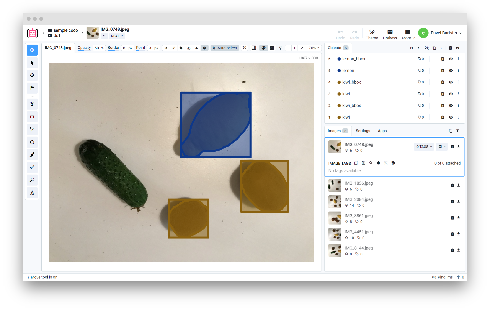

<!-- <h1 align="left" style="border-bottom: 0">  COCO Format </h1>

<br> -->

# Overview

This converter allows to import images with annotations in [COCO](https://cocodataset.org/#home) format. COCO format has all annotations in one `.json` file, usually named `instances.json`.

Supervisely supports the following annotation types: instances, keypoints, captions.



# Format description

**Supported image formats:** `.jpg`, `.jpeg`, `.mpo`, `.bmp`, `.png`, `.webp`, `.tiff`, `.tif`, and `.jfif`.<br>
**With annotations:** yes<br>
**Supported annotation format:** `.json`.<br>
**Grouped by:** any structure (uploaded to a single dataset)<br>

# Input files structure

You can download an example data:

- instances: [download ⬇️](https://github.com/supervisely-ecosystem/import-wizard-docs/files/14918161/sample_coco.zip)
- keypoints: [download ⬇️](https://github.com/supervisely-ecosystem/import-wizard-docs/files/14918389/sample_coco_keypoints.zip)

Recommended directory structure:

```text
    📦project name
     ┗ 📂dataset
        ┣ 📂annotations
        ┃  ┗ 📜instances.json
        ┗ 📂images
           ┣ 🖼️0001.png
           ┣ 🖼️0002.png
           ┣ 🖼️0003.png
           ┣ 🖼️0004.png
           ┗ 🖼️0005.png
```

# COCO Annotation

COCO format is a complex format that can contain multiple types of annotations. Supervisely import supports only `instances`, `keypoints`, and `captions`.
The COCO dataset is formatted in `.json` and is a dictionary of keys `info`, `licenses`, `images`, `annotations`, and `categories` (in most cases).

- `info` - contains high-level information about the dataset
- `licenses` - contains a list of image licenses that apply to images in the dataset.
- `images` - contains the complete list of images in your dataset. Note that image ids need to be unique among other images.
- `annotations` - contains a list of every individual object annotation from every image in the dataset.
- `categories` - contains a list of categories (e.g. dog, boat) and each of those belongs to a supercategory (e.g. animal, vehicle). The original COCO dataset contains 90 categories. You can use the existing COCO categories or create an entirely new list of your own. Each category ID must be unique among the rest of the categories.

## Instances

Regions of interest indicated by these annotations are specified by `segmentations`, which are usually a list of polygon vertices around the object, but can also be a run-length-encoded (RLE) bit mask. Typically, RLE is used for groups of objects (like a large stack of books).

Example annotation for instances for one image in COCO format:

<details>
    <summary>📜 instances.json</summary>

```json
{
    "info": {
        "description": "",
        "url": "None",
        "version": "1.0",
        "year": 2023,
        "contributor": "Supervisely",
        "date_created": "2023-08-22T09:33:23.811Z"
    },
    "licenses": [
        {
            "url": "None",
            "id": 0,
            "name": "None"
        }
    ],
    "images": [
        {
            "license": "None",
            "file_name": "IMG_1836.jpeg",
            "url": "None",
            "height": 800,
            "width": 1067,
            "date_captured": "2023-08-22T09:33:23.890Z",
            "id": 22027400
        }
    ],
    "annotations": [
        {
            "segmentation": [[759.0, 429.0, ..., 765.0, 423.0]],
            "area": 29889.5,
            "iscrowd": 0,
            "image_id": 22027400,
            "bbox": [752.0, 421.0, 257.0, 167.0],
            "category_id": 2,
            "id": 1
        },
        {
            "segmentation": [[665.0, 128.0, ..., 673.0, 132.0]],
            "area": 15603.5,
            "iscrowd": 0,
            "image_id": 22027400,
            "bbox": [569.0, 122.0, 137.0, 151.0],
            "category_id": 1,
            "id": 2
        },
        {
            "segmentation": [[563.0, 542.0, ..., 572.0, 549.0]],
            "area": 15740.5,
            "iscrowd": 0,
            "image_id": 22027400,
            "bbox": [464.0, 539.0, 131.0, 151.0],
            "category_id": 1,
            "id": 3
        }
    ],
    "categories": [
        {
            "supercategory": "kiwi",
            "id": 1,
            "name": "kiwi"
        },
        {
            "supercategory": "lemon",
            "id": 2,
            "name": "lemon"
        }
    ]
}
```

</details>

## Keypoints

Annotations for keypoints are just like in Object Detection (Segmentation) above, except a number of keypoints is specified in sets of 3, (x, y, v).

- **x** and **y** indicate pixel positions in the image.
- **v** indicates visibility — v=0: not labeled (in which case x=y=0), v=1: labeled but not visible (behind an object for example), and v=2: labeled and visible

All keypoints with 0 visibility are ignored and will not be presented in the project.
As for other 2: you can specify label preferences in the modal window whether you want to include key points that are labeled, but not visible or import only clearly visible keypoints.

**Visibility flag example:**

<div>
    <table style="width: 100%">
        <tr>
            <th>Visibility = 1</th>
            <th>Visibility = 2</th>
        </tr>
        <tr>
            <td style="width:50%">
            
            </td>
            <td style="width:50%">
            
            </td>
        </tr>
    </table>
</div>

**Example:** 229, 256, 2 means there’s a keypoint at pixel x=229, y=256 and 2 indicates that it is a visible keypoint

In the case of a class person, keypoints indicate different body parts.
The skeleton indicates connections between points.
For example, [16, 14] means "left_ankle" connects to "left_knee".

Example of the annotation file with keypoints:

<details>
    <summary>📜 instances.json with keypoints</summary>

```json
{
    "info": {
        "description": "",
        "url": "None",
        "version": "1.0",
        "year": 2023,
        "contributor": "Supervisely User",
        "date_created": "2023-09-15T16:36:43.593Z"
    },
    "licenses": [
        {
            "url": "None",
            "id": 0,
            "name": "None"
        }
    ],
    "images": [
        {
            "license": "None",
            "file_name": "pexels-photo-175706.png",
            "url": "None",
            "height": 800,
            "width": 1292,
            "date_captured": "2023-09-15T16:36:43.742Z",
            "id": 23364344
        }
    ],
    "annotations": [
        {
            "segmentation": [],
            "area": 608998,
            "iscrowd": 0,
            "image_id": 23364344,
            "bbox": [617.0, 279.0, 152.0, 517.0],
            "category_id": 1,
            "id": 1,
            "keypoints": [727, 295, 2, ..., 758 ,794 ,2],
            "num_keypoints": 17
        }
    ],
    "categories": [
        {
            "supercategory": "person",
            "id": 1,
            "name": "person",
            "keypoints": [
                "nose",
                "left_eye",
                "right_eye",
                "left_ear",
                "right_ear",
                "left_shoulder",
                "right_shoulder",
                "left_elbow",
                "right_elbow",
                "left_wrist",
                "right_wrist",
                "left_hip",
                "right_hip",
                "left_knee",
                "right_knee",
                "left_ankle",
                "right_ankle"
            ],
            "skeleton": [
                [16,14],
                [14,12],
                [17,15],
                [15,13],
                [12,13],
                [6,12],
                [7,13],
                [6,7],
                [6,8],
                [7,9],
                [8,10],
                [9,11],
                [2,3],
                [1,2],
                [1,3],
                [2,4],
                [3,5],
                [4,6],
                [5,7]
            ]
        }
    ]
}
```

</details>

## Captions

Image caption annotations are pretty simple. There are no categories in this `.json` file, just annotations with caption descriptions.

<details>
    <summary>📜 instances.json with captions</summary>

```json
{
  "info": {
    "description": "",
    "url": "None",
    "version": "1.0",
    "year": 2023,
    "contributor": "Supervisely",
    "date_created": "2023-08-22T09:33:23.811Z"
  },
  "licenses": [
    {
      "url": "None",
      "id": 0,
      "name": "None"
    }
  ],
  "images": [
    {
      "license": "None",
      "file_name": "IMG_1836.jpeg",
      "url": "None",
      "height": 800,
      "width": 1067,
      "date_captured": "2023-08-22T09:33:23.890Z",
      "id": 22027400
    }
  ],
  "annotations": [
    {
      "image_id": 22027400,
      "id": 1,
      "caption": "An image of 2 pieces of kiwi and 1 lemon."
    }
  ]
}
```

</details>

# Useful links

- [COCO dataset](https://cocodataset.org/#home)
- [COCO annotation structure](https://www.immersivelimit.com/tutorials/create-coco-annotations-from-scratch)
- [[Supervisely Ecosystem] Import COCO](https://ecosystem.supervisely.com/apps/import-coco)
