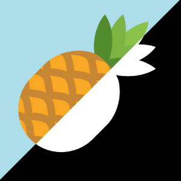
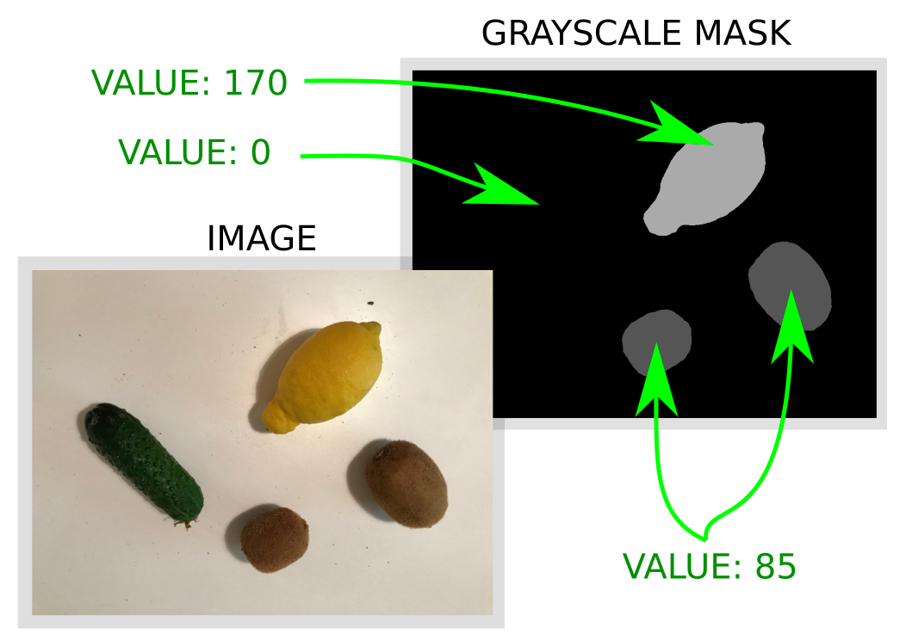
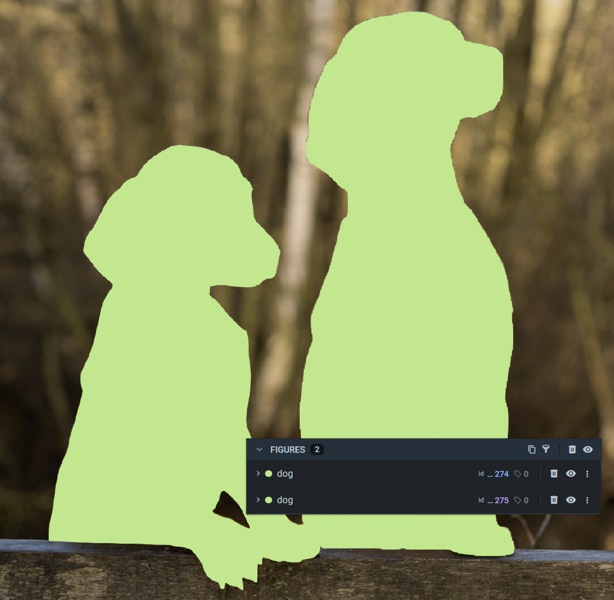

<!-- <h1 align="left" style="border-bottom: 0"> Images with masks Format</h1>

<br> -->

# Overview

Allows to upload images with annotations in the format of PNG masks. Masks are 3-(1-)channel images containing only pixels that have the same values in all channels, to map pixel masks with the appropriate class app requires `obj_class_to_machine_color.json` file to match classes and colors, otherwise app won't start.
The converter supports both semantic and instance segmentation masks. All data will be uploaded to a single dataset.

# Format description

**Supported image formats:** `.jpg`, `.jpeg`, `.mpo`, `.bmp`, `.png`, `.webp`, `.tiff`, `.tif`, and `.jfif`.<br>
**With annotations:** yes<br>
**Supported annotation format:** `.png`.<br>

# Input files structure

Images should be in the folder `"img"` and masks should be in one (or more) of the following folders below:

- `ann` - contains binary masks, you can place both semantic and instance segmentation here.
- `masks_machine` - contains semantic segmentation masks. Masks for semantic segmentation should have the same name as the original images (but may have a different extension e.g original image name: `cats_1.jpg` -> mask name `cats_1.png`).
- `masks_instance` - contains for instance segmentation masks. Masks for instance segmentation must be placed in the subdirectories that have the same name as the original images (but without extension e.g original image name: `cats_1.jpg` -> subdirectory name `cats_1`).

**Input data structure example:**

```text
Drag & Drop
├── obj_class_to_machine_color.json
├── img
│   ├── image_1.jpg
│   └── image_2.jpg
├── masks_instances
│   ├── image_1
│   │   ├── dog_1.png # <- `dog` class instance mask
│   │   └── dog_2.png
│   └── image_2
│       ├── dog_1.png
│       └── dog_2.png
└── masks_machine
    ├── image_1.png # <- class name for each pixel > 0 must be in the obj_class_to_machine_color.json
    └── image_2.png
```

**`obj_class_to_machine_color.json`** example:

```json
{
  "Lemon": 170,
  "Kiwi": 85
}
```

**Semantic (machine) masks example**

In this configuration example all pixels in the mask which value **equal to 170** will be combined in one Bitmap figure and will be assigned to the class **"Lemon"** and **equal to 85** will be assigned to the class **"Kiwi"**.



**Instance masks example**

For example we have an image with 2 cats on it placed in `img/**cats_1.jpg**` directory, and we have instance masks for them placed in `mask_instances/**cats_1**/cat_1.png` and `mask_instances/**cats_1**/cat_2.png`.
Subdirectories in `mask_instances` folder define to which original image these masks belong to. Masks names inside these subdirectories define a names of the class.
As a result, we will have an image `cats_1.jpg` with 2 labels `cat` and `cat`.

<div align="center" markdown>
  
</div>

**⚠️ Notice**: If you just want to import semantic segmentation masks, just drag & drop original images, semantic segmentation masks and `obj_class_to_machine_color.json` file. Same for instance segmentation masks, you don't have to create all directories if this is unnessecary.
