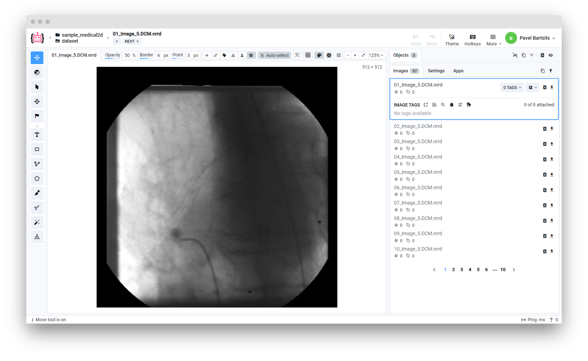

<!-- <h1 align="left" style="border-bottom: 0">  Medical 2D Files Converter </h1>

<br> -->

# Overview

Medical 2D Converter allows to import 2D files with `.nrrd`, `.dcm`, `.nii` and `.nii.gz` extensions. Files with extensions different from `.nrrd` will be converted to `.nrrd`


While this converter primarily supports 2D medical images, it is possible to import 3D files. However, please note that 3D files will be transposed and sliced along the axial plane. This process converts the 3D image into a series of 2D slices, which can then be viewed and analyzed individually.

# Format description

**Supported image formats:** `.nrrd`, `.dcm`, `.nii` and `.nii.gz`<br>
**With annotations:** No<br>
**Grouped by:** Not applicable (yet)<br>


## Formats explained

- **DCM**

    `DCM` file is an image following Digital Imaging and Communications in Medicine (DICOM) format. Format is used to store various medical images like CT scans, MRIs, PET, ultrasound, etc.

    Uses `.dcm` and `.DICOM` extensions
  
  ----

- **NRRD**

    `NRRD` file is a medical imaging format. It is used to store 2D and 3D images along with metadata. It is commonly used in medical imaging.

    Uses `.nrrd` extension.        
  
  ----
 
- **NII**

    `NII` format is commonly used to store magnetic resonance imaging (MRI) data.

    Uses `.nii` and `.nii.gz` extensions.
        



# Input files structure

Example of data for import: [download ⬇️](https://github.com/supervisely-ecosystem/import-wizard-docs/files/14934438/sample_medical2d.zip)<br>

Recommended directory structure:

```text
📦project name
 ┣ 📜Image_1.dcm
 ┣ 📜Image_2.dcm
 ┣ 📜Image_3.dcm
 ┣ 📜Image_4.dcm
 ┣ 📜Image_5.DCM
 ┣ 📜Image_6.nrrd
 ┗ 📜Image_7.nii
```

# Useful links

- [[Supervisely Ecosystem] Import DICOM studies](https://ecosystem.supervisely.com/apps/import-dicom-studies)
- [Nearly Raw Raster Data (NRRD): Format, Examples etc.](https://teem.sourceforge.net/nrrd/)
- [Overview of The Content of The DICOM Standard](https://dicom.nema.org/medical/dicom/current/output/html/part01.html#chapter_6)
- [Neuroimaging Informatics Technology Initiative (NIfTI)](https://nifti.nimh.nih.gov/)