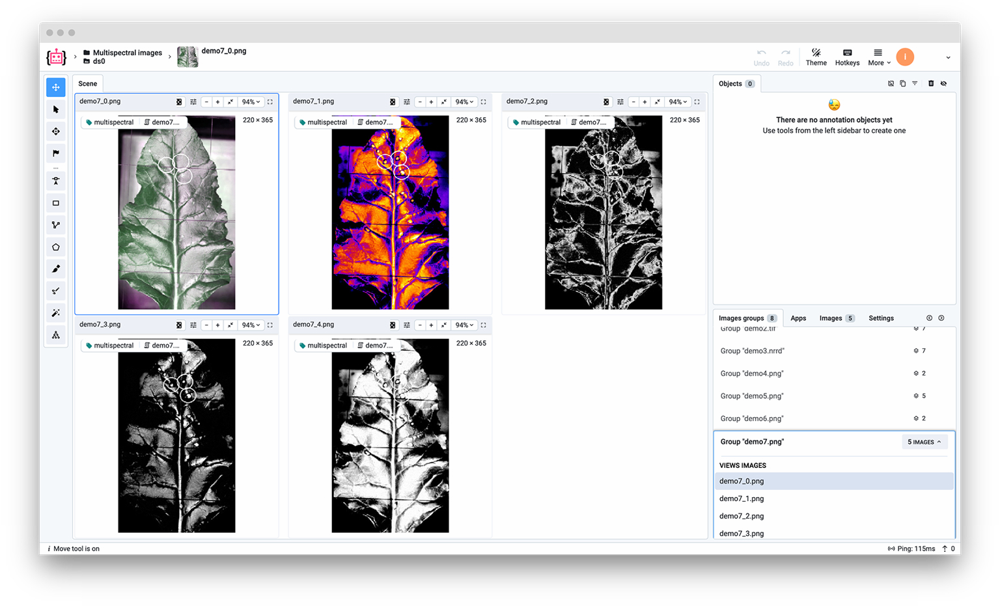

# Overview

This converter allows to import of multispectral images as channels or as separate images without annotations.<br>
Images will be grouped by directories, files from the "split" directory will be split into separate images by channels and the files from the "images" directory will be uploaded as they are.<br>


Note: To use the multispectral import feature, you need to create a project with the `Multispectral image annotation` setting enabled. You can also enable this setting in the project settings after the import. Here is a illustration of how to upload multispectral images:



Result of the import:



# Format description

**Supported image formats:** `.jpg`, `.jpeg`, `.mpo`, `.bmp`, `.png`, `.webp`, `.tiff`, `.tif`, `.jfif`, `.avif`, `.heic`, and `.heif`<br>
**With annotations:** No<br>
**Supported annotation file extension:** Not applicable <br>
**Grouped by:** Folders (corresponding tags will be assigned to images)<br>

# Input files structure


Example data: [download ⬇️](https://github.com/supervisely-ecosystem/import-multispectral-images/files/13487269/demo_data.zip)<br>


Recommended directory structure:

```text
  📦project_name
   ┣ 📂group_name_1
   ┃  ┗ 📂split
   ┃     ┗ 🏞️demo1.png
   ┣ 📂group_name_2
   ┃  ┣ 📂images
   ┃  ┃  ┣ 🏞️demo4-rgb.png
   ┃  ┃  ┗ 🏞️demo4-thermal.png
   ┃  ┗ 📂split
   ┃     ┗ 🏞️demo4-thermal copy.png
   ┗ 📂group_name_3
      ┗ 📂images
         ┣ 🏞️demo8-mri1.png
         ┣ 🏞️demo8-mri2.png
         ┗ 🏞️demo8-rgb.png
```

In this example, we have 3 groups with images. In the first group, we have one image, which should be split. In the second group, we have one image, which should be split and two images, which should be uploaded as is. In the third group, we have three images, which should be uploaded as is.<br>

# Useful links

- [[Supervisely Developer Portal] Multispectral Images](https://developer.supervisely.com/getting-started/python-sdk-tutorials/images/multispectral-images)
- [[Supervisely Blog] How to Annotate Multispectral Images for Computer Vision Models](https://supervisely.com/blog/labeling-multispectral-images/)
- [[Supervisely Ecosystem] Import Multispectral Images](https://ecosystem.supervisely.com/apps/import-multispectral-images)

# Easy integration for Python developers

Automate processes with multi-view images using Supervisely Python SDK.

```bash
pip install supervisely
```

You can learn more about it in our [Developer Portal](https://developer.supervisely.com/getting-started/python-sdk-tutorials/images/multispectral-images), but here we'll just show how you can upload your multispectral images with just a few lines of code.

```python
# Setting multispectral settings for the project.
api.project.set_multispectral_settings(project.id)

# Preparing images for upload.
image_name = "demo7.png"
images = ["demo_data/demo7-rgb.png", "demo_data/demo7-thermal.png"]

# Reading thermal image and extracting its channels as 2d numpy arrays.
image = cv2.imread(images[1])
channels = [image[:, :, i] for i in range(image.shape[2])]

# Uploading images.
image_infos = api.image.upload_multispectral(dataset.id, image_name, channels, images)
```

In the example above we uploaded two images as they are and also split a thermal image into separate channels<br>
