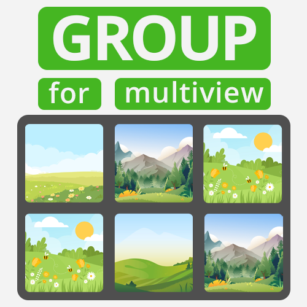
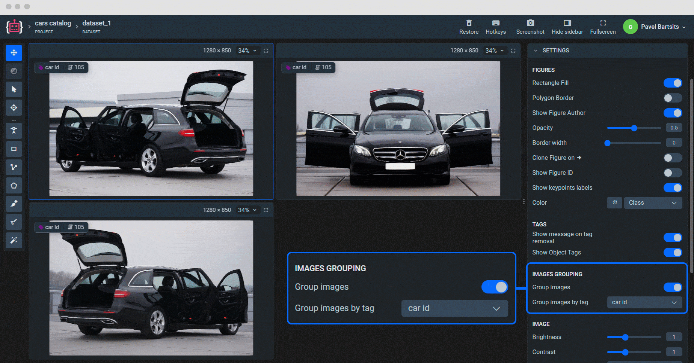
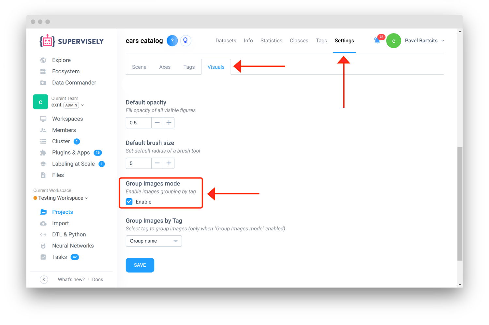
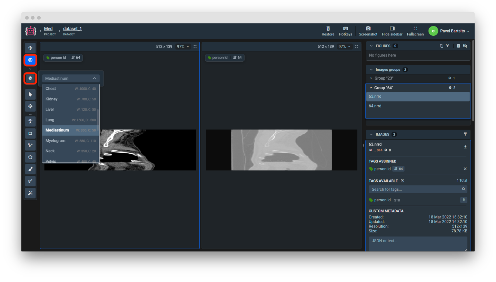
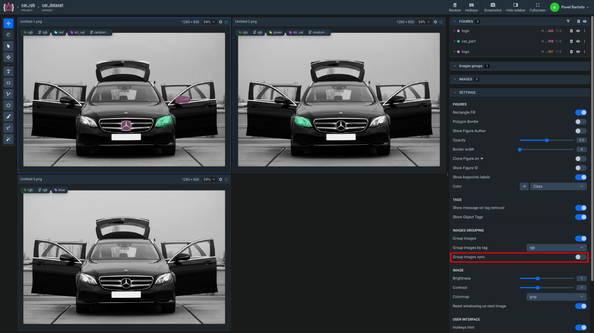
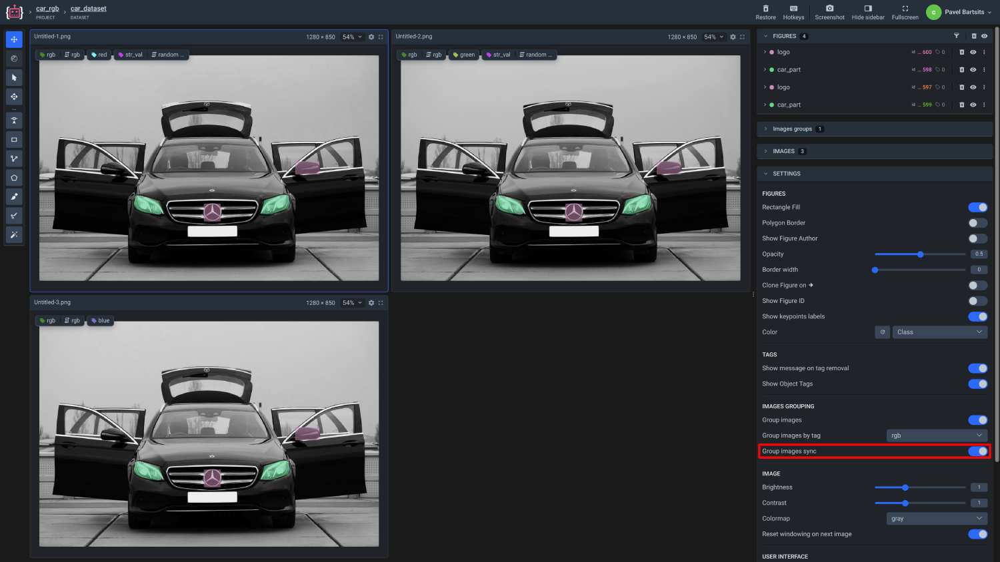

<!--
<h1 align="left" style="border-bottom: 0">  Multiview Labeling Format</h1>

<br> -->

# Overview

Multi-view mode is a feature that allows you to view and annotate multiple images simultaneously. It is especially useful when you need to label objects from different perspectives, 3D reconstruction images, Autonomous vehicle camera views or depth estimation task images. Labeling in multi-view mode can significantly increase the speed of the labeling process (for example, you don't need to switch between images and select a desired class to label the same object)

Just organize images into groups and drop them to the import. The app will do the rest: it will detect groups, tag images, and activate grouping and multi-view modes in the project settings.

# Format description

**Supported format:** structured catalogs<br>
**With annotations:** yes<br>
**Annotation types:** tags <br>
**Grouped by:** tag values<br>

## Key Features

- All images in groups in the created project will be tagged
- `Images Grouping` option will be turned on by default in the created project
- Images will be grouped by tag's value
- Tag value is defined by group directory name
- Works with `.nrrd` image format (2D only)

## How to Use

#### 1. Prepare structure:

- **Archive** `zip`, `tar`, `tar.xz`, `tar.gz`

  ```text
    📦 my_project.zip
     ┗ 📂 cars catalog
        ┗ 📂 used cars
           ┣ 📂 105
           ┃  ┣ 🏞️ car_105_front.jpg
           ┃  ┗ 🏞️ car_105_top.jpg
           ┣ 📂 202
           ┃  ┣ 🏞️ car_202_front.jpg
           ┃  ┗ 🏞️ car_202_top.jpg
           ┣ 📂 357
           ┃  ┣ 🏞️ car_357_front.jpg
           ┃  ┗ 🏞️ car_357_top.jpg
           ┣ 🏞️ car_401_front.jpg
           ┣ 🏞️ car_401_top.jpg
           ┗ 🏞️ car_401_side.jpg
  ```

- **Folder**

  ```text
    📂 cars catalog
     ┗ 📂 used cars
        ┣ 📂 car_id_105
        ┃  ┣ 🏞️ car_105_front.jpg
        ┃  ┗ 🏞️ car_105_top.jpg
        ┣ 📂 car_id_202
        ┃  ┣ 🏞️ car_202_front.jpg
        ┃  ┗ 🏞️ car_202_top.jpg
        ┣ 📂 car_id_357
        ┃  ┣ 🏞️ car_357_front.jpg
        ┃  ┗ 🏞️ car_357_top.jpg
        ┣ 🏞️ car_401_front.jpg
        ┣ 🏞️ car_401_top.jpg
        ┗ 🏞️ car_401_side.jpg
  ```

  #### Structure explained:

  - Archive must contain only 1 project directory.
  - Inside project directory must be 1 dataset directory.
  - Group directories must be populated with images and placed inside dataset directory. All images inside groups will be tagged with folder name value.
  - All images in the root dataset directory will be uploaded as a regular images and will not be tagged.

  You can download an example data:

  - images: [download ⬇️](https://github.com/supervisely-ecosystem/import-images-groups/releases/download/v0.0.1/cars.catalog.zip)
  - NRRD: [download ⬇️](https://github.com/supervisely-ecosystem/import-images-groups/releases/download/v0.0.1/research.zip)

  Example data representation:

  - **Dataset name:** ds0
  - **Images:**

    |    Image name     |        Tag         |
    | :---------------: | :----------------: |
    | car_105_front.jpg | `multiview`: `105` |
    |  car_105_top.jpg  | `multiview`: `105` |
    | car_202_front.jpg | `multiview`: `202` |
    |  car_202_top.jpg  | `multiview`: `202` |
    | car_357_front.jpg | `multiview`: `357` |
    |  car_357_top.jpg  | `multiview`: `357` |
    | car_401_front.jpg |
    |  car_401_top.jpg  |
    | car_401_side.jpg  |

#### 2. Drop to Import

#### 3. Open imported project using Toolbox 2.0

#### 4. Configure additional Settings after import

- To display single images switch off `Images Grouping` setting.

  

- If you want to disable images grouping for the whole project, go to `Project` → `Settings` → `Visuals` and uncheck

  

- Windowing tool is available when working with `.nrrd` files. It helps to filter pixels to see bones, air, liquids etc.

  

- Images view synchronization

  <div>
    <table>
      <tr style="width: 100%">
    <td>
    <b>Synchronization OFF</b>
    
    </td>
    <td>
    <b>Synchronization ON</b>
    
    </td>
      </tr>
    </table>
  </div>

# Useful links

- [[Supervisely Ecosystem] Group Images for Multiview Labeling](https://ecosystem.supervisely.com/apps/group-images-for-multiview-labeling)

    

- [[Supervisely Ecosystem] Import images groups](https://ecosystem.supervisely.com/apps/import-images-groups)

    
