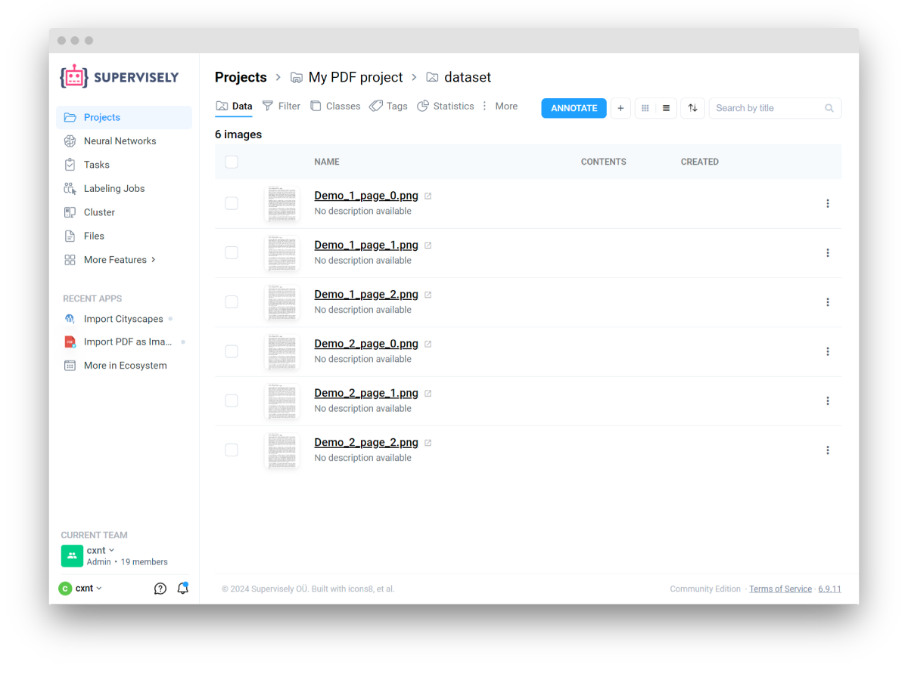

<!-- <h1 align="left" style="border-bottom: 0">  PDF Format </h1>

<br> -->

# Overview

This converter allows to import `.PDF` files as images in `.PNG` format.
Each page of the `.PDF` file will be converted to a separate image. The images will have a suffix added to their names to indicate the page number.

# Format description

**Supported image formats:** `.pdf`<br>
**With annotations:** Yes<br>
**Supported annotation format:** No<br>
**Grouped by:** Not Applicable<br>



# Input files structure

You can download an example of data for import [here](https://github.com/supervisely-ecosystem/import-wizard-docs/files/14905329/Sample_PDF.zip).<br>

Recommended directory structure:

```text
📦project name
 ┣ 📜Demo_1.pdf
 ┣ 📜Demo_2.pdf
 ┣ 📜Demo_3.pdf
 ┣ 📜Demo_4.pdf
 ┗ 📜Demo_5.pdf
```

# Useful links

- [[Supervisely Ecosystem] Import PDF as Images](https://ecosystem.supervisely.com/apps/import-pdf-as-images)

# Python SDK example

You can also use Supervisely Python SDK to import `.PDF` files. Here's an example of how to do it:

```python
# TBD after converter release
```
