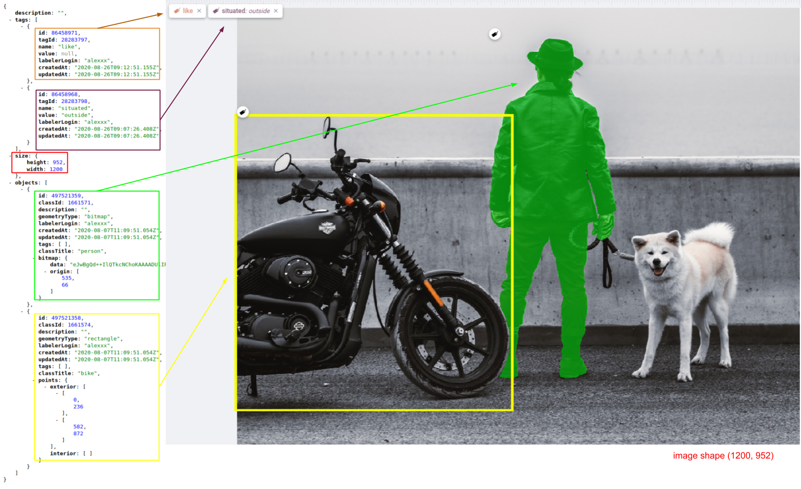

<!-- <h1 style="display: flex; align-items: center">
 <div>Supervisely format</div>
</h1> -->

# Overview

Easily import your images with annotations in the [Supervisely format](https://docs.supervise.ly/data-organization/00_ann_format_navi). The Supervisely json-based annotation format supports such figures: `rectangle`, `line (polyline)`, `polygon`, `point`, `bitmap` (`mask`), `graph` (`keypoints`). It is a universal format that supports various types of annotations and is used in the Supervisely platform.

# Format description

**Supported image formats:** `.jpg`, `.jpeg`, `.mpo`, `.bmp`, `.png`, `.webp`, `.tiff`, `.tif`, and `.jfif`.<br>
**With annotations:** yes<br>
**Supported annotation format:** `.json`.<br>
**Grouped by:** any structure (uploaded to a single dataset)<br>

# Input files structure

Both directory and archive are supported.

**Recommended directory structure:**

```text
📦 input_folder
 ┣ 📂 dataset_name_01
 ┃ ┣ 📂 ann
 ┃ ┃ ┣ 📄 IMG_0748.jpeg.json
 ┃ ┃ ┗ 📄 IMG_8144.jpeg.json
 ┃ ┣ 📂 img
 ┃ ┃ ┣ 🏞️ IMG_0748.jpeg
 ┃ ┃ ┗ 🏞️ IMG_8144.jpeg
 ┃ ┗ 📂 meta (optional)
 ┃   ┣ 📄 IMG_0748.jpeg.json
 ┃   ┗ 📄 IMG_8144.jpeg.json
 ┗ 📄 meta.json
```



**Struggled with the structure?** No worries!
All images will be uploaded to a single dataset, so you don't have to worry about the full project structure in Supervisely format. All you need is to prepare images with annotations and `meta.json` file (recommended).

Items even can be placed in any subdirectories or the root directory. Just make sure that an annotation file names match the image file names (e.g. annotaions file `image_1.jpg.json` is for the image `image_1.jpg`) and that the annotation file format is correct (we will provide an example in the next section). The application will do the rest.

Project meta file `meta.json` is recommended to be present in the project directory. It contains classes and tags definitions for the project. If it is not present, it will try to create it from the annotations. Learn more about the `meta.json` file [here](https://docs.supervisely.com/customization-and-integration/00_ann_format_navi/02_project_classes_and_tags).



# Individual Image Annotations

For each image, we store the annotations in a separate `json` file named `image_name.image_format.json` with the following file structure:

```json
{
  "description": "food",
  "name": "tomatoes-eggs-dish.jpg",
  "size": {
    "width": 2100,
    "height": 1500
  },
  "tags": [],
  "objects": []
}
```

**Fields definitions:**

- `name` - string - image name
- `description` - string - (optional) - This field is used to store the text we want to assign to the image. In the labeling intrface it corresponds to the 'data' filed.
- `size` - stores image size. Mostly, it is used to get the image size without the actual image reading to speed up some data processing steps.
- `width` - image width in pixels
- `height` - image height in pixels
- `tags` - **list** of strings that will be interpreted as image [tags](https://docs.supervisely.com/customization-and-integration/00_ann_format_navi/03_supervisely_format_tags)
- `objects` - **list** of [objects on the image](https://docs.supervisely.com/customization-and-integration/00_ann_format_navi/04_supervisely_format_objects)

## Image annotation example with objects and tags



Example:

```json
{
  "description": "",
  "tags": [
    {
      "id": 86458971,
      "tagId": 28283797,
      "name": "like",
      "value": null,
      "labelerLogin": "alexxx",
      "createdAt": "2020-08-26T09:12:51.155Z",
      "updatedAt": "2020-08-26T09:12:51.155Z"
    },
    {
      "id": 86458968,
      "tagId": 28283798,
      "name": "situated",
      "value": "outside",
      "labelerLogin": "alexxx",
      "createdAt": "2020-08-26T09:07:26.408Z",
      "updatedAt": "2020-08-26T09:07:26.408Z"
    }
  ],
  "size": {
    "height": 952,
    "width": 1200
  },
  "objects": [
    {
      "id": 497521359,
      "classId": 1661571,
      "description": "",
      "geometryType": "bitmap",
      "labelerLogin": "alexxx",
      "createdAt": "2020-08-07T11:09:51.054Z",
      "updatedAt": "2020-08-07T11:09:51.054Z",
      "tags": [],
      "classTitle": "person",
      "bitmap": {
        "data": "eJwBgQd++IlQTkcNChoKAAAADUlIRF",
        "origin": [535, 66]
      }
    },
    {
      "id": 497521358,
      "classId": 1661574,
      "description": "",
      "geometryType": "rectangle",
      "labelerLogin": "alexxx",
      "createdAt": "2020-08-07T11:09:51.054Z",
      "updatedAt": "2020-08-07T11:09:51.054Z",
      "tags": [],
      "classTitle": "bike",
      "points": {
        "exterior": [
          [0, 236],
          [582, 872]
        ],
        "interior": []
      }
    }
  ]
}
```

# Useful links

- [Supervisely Annotation Format](https://developer.supervisely.com/getting-started/supervisely-annotation-format)
- [Supervisely Image Annotation](https://developer.supervisely.com/getting-started/supervisely-annotation-format/images)
- [[SDK CLI] Upload projects in Supervisely format](https://developer.supervisely.com/getting-started/command-line-interface/sdk-cli#upload-a-project)
- [[CLI Tool Beta] Upload projects in Supervisely format](https://developer.supervisely.com/getting-started/command-line-interface/cli-tool/workflow-automation#upload-projects-in-supervisely-format)
- [[Supervisely Ecosystem] Import images in Supervisely format](https://ecosystem.supervisely.com/apps/import-images-in-sly-format)

  
