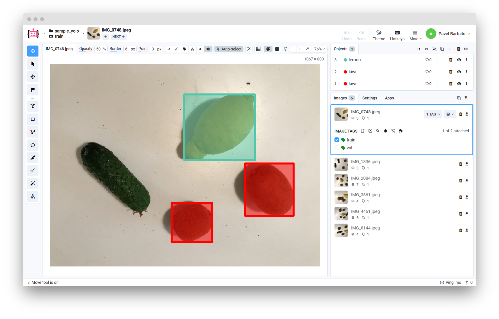
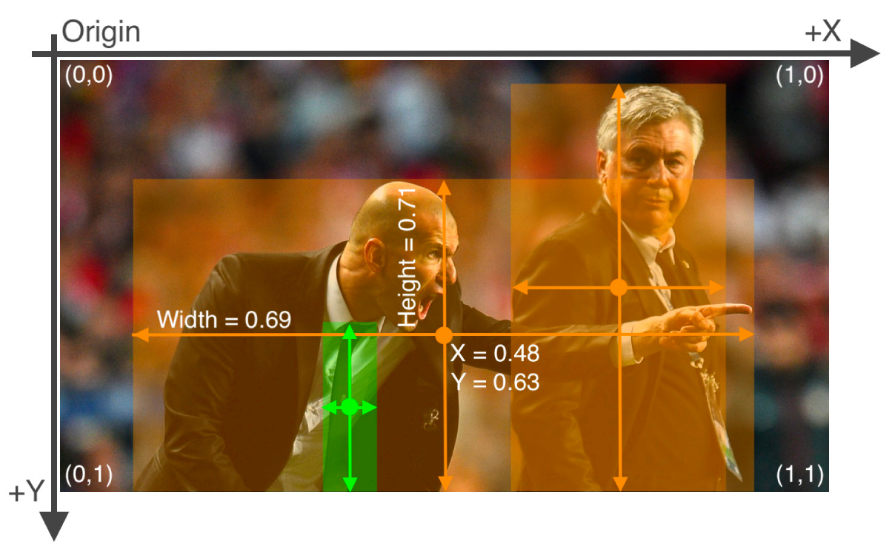

# Overview

This converter allows to import images with annotations in [YOLO](https://docs.ultralytics.com/datasets/detect/) format for **segmentation**, **detection** and **pose estimation** tasks.

Each image should have a corresponding `.txt` file with the same name, which contains information about objects in the image. 

- Segmentation labels will be converted to polygons. Labels format: `<class-index> <x1> <y1> <x2> <y2> ... <xn> <yn>`
- Detection labels will be converted to rectangles. Labels format: `<class-index> <x_center> <y_center> <width> <height>`
- Pose estimation labels will be converted to keypoints. Labels format: `<class-index> <x> <y> <width> <height> <px1> <py1> <px2> <py2> ... <pxn> <pyn>` for Dim=2 and `<class-index> <x> <y> <width> <height> <px1> <py1> <p1-visibility> <px2> <py2> <p2-visibility> <pxn> <pyn> <p2-visibility>` for Dim=3.

YOLO format data should have a specific configuration file that contains information about classes and datasets, usually named `data_config.yaml`.

⚠️ **Note:** If the input data does not contain `data_config.yaml` file, it will use default COCO class names.



<details>
    <summary> Default COCO class names </summary>

```text
names:
  [
    "person",
    "bicycle",
    "car",
    "motorcycle",
    "airplane",
    "bus",
    "train",
    "truck",
    "boat",
    "traffic light",
    "fire hydrant",
    "stop sign",
    "parking meter",
    "bench",
    "bird",
    "cat",
    "dog",
    "horse",
    "sheep",
    "cow",
    "elephant",
    "bear",
    "zebra",
    "giraffe",
    "backpack",
    "umbrella",
    "handbag",
    "tie",
    "suitcase",
    "frisbee",
    "skis",
    "snowboard",
    "sports ball",
    "kite",
    "baseball bat",
    "baseball glove",
    "skateboard",
    "surfboard",
    "tennis racket",
    "bottle",
    "wine glass",
    "cup",
    "fork",
    "knife",
    "spoon",
    "bowl",
    "banana",
    "apple",
    "sandwich",
    "orange",
    "broccoli",
    "carrot",
    "hot dog",
    "pizza",
    "donut",
    "cake",
    "chair",
    "couch",
    "potted plant",
    "bed",
    "dining table",
    "toilet",
    "tv",
    "laptop",
    "mouse",
    "remote",
    "keyboard",
    "cell phone",
    "microwave",
    "oven",
    "toaster",
    "sink",
    "refrigerator",
    "book",
    "clock",
    "vase",
    "scissors",
    "teddy bear",
    "hair drier",
    "toothbrush",
  ]

```

</details>

# Format description

**Supported image formats:** `.jpg`, `.jpeg`, `.mpo`, `.bmp`, `.png`, `.webp`, `.tiff`, `.tif`, `.jfif`, `.avif`, `.heic`, and `.heif`<br>
**With annotations:** Yes<br>
**Supported annotation format:** `.txt`.<br>
**Grouped by:** Any structure (will be uploaded as a single dataset)<br>

# Input files structure


Example data: [download ⬇️](https://github.com/supervisely-ecosystem/import-wizard-docs/files/14919196/sample_yolo.zip)<br>


Recommended directory structure:

```text
  📂project name
   ┣ 📂images
   ┃  ┣ 📂train
   ┃  ┃  ┣ 🖼️IMG_0748.jpeg
   ┃  ┃  ┣ 🖼️IMG_1836.jpeg
   ┃  ┃  ┣ 🖼️IMG_2084.jpeg
   ┃  ┃  ┗ 🖼️IMG_3861.jpeg
   ┃  ┗ 📂val
   ┃     ┣ 🖼️IMG_4451.jpeg
   ┃     ┗ 🖼️IMG_8144.jpeg
   ┣ 📂labels
   ┃  ┣ 📂train
   ┃  ┃  ┣ 📜IMG_0748.txt
   ┃  ┃  ┣ 📜IMG_1836.txt
   ┃  ┃  ┣ 📜IMG_2084.txt
   ┃  ┃  ┗ 📜IMG_3861.txt
   ┃  ┗ 📂val
   ┃     ┣ 📜IMG_4451.txt
   ┃     ┗ 📜IMG_8144.txt
   ┗ 📜data_config.yaml
```

# Format Config File

File `data_config.yaml` should contain the following keys:

- `names` - a list of class names
- `colors` - a list of class colors in RGB format
- `nc` - the number of classes
- `train` - the path to the train images
- `val` - the path to the validation images

<details>
    <summary>📜data_config.yaml</summary>

```yaml
names: [kiwi, lemon] # class names
colors: [[255, 1, 1], [1, 255, 1]] # class colors
nc: 2 # number of classes
train: ../lemons/images/train # path to train imgs (or "images/train")
val: ../lemons/images/val # path to val imgs (or "images/val")

# Keypoints (for pose estimation)
kpt_shape: [17, 3]  # number of keypoints, number of dims (2 for x,y or 3 for x,y,visible)
```

</details>

# Individual Image Annotations

Annotation files are in `.txt` format and should contain object labels on each line:

- Class numbers that correspond to the class names in the `data_config.yaml` file.
- Label coordinates must be in normalized format (from 0 to 1).

**1. Segmentation**

Labels should be formatted with one row per object in:

```text
<class-index> <x1> <y1> <x2> <y2> ... <xn> <yn>
```

**2. Detection:**

Labels should be formatted with one row per object in:

```text
<class-index> <x_center> <y_center> <width> <height>
```

If your boxes are in pixels, you should divide x_center and width by image width, and y_center and height by image height.

**3. Pose Estimation:**

Labels should be formatted with one row per object. 

For Dim=2:

```text
<class-index> <x> <y> <width> <height> <px1> <py1> <px2> <py2> ... <pxn> <pyn>
```

For Dim=3:

```text
<class-index> <x> <y> <width> <height> <px1> <py1> <p1-visibility> <px2> <py2> <p2-visibility> ... <pxn> <pyn> <pn-visibility>
```

**Example:**

The label file corresponding to the below image contains 2 persons (class 0) and a tie (class 27) from original COCO classes.

📜zidan.txt:

```text
0 0.481719 0.634028 0.690625 0.713278
0 0.741094 0.524306 0.314750 0.933389
27 0.364844 0.795833 0.078125 0.400000
```



# Useful links

- [YOLO format](https://docs.ultralytics.com/datasets/detect/)
- [[Supervisely Ecosystem] Convert YOLO v5 to Supervisely format](https://ecosystem.supervisely.com/apps/convert-yolov5-to-supervisely-format)
