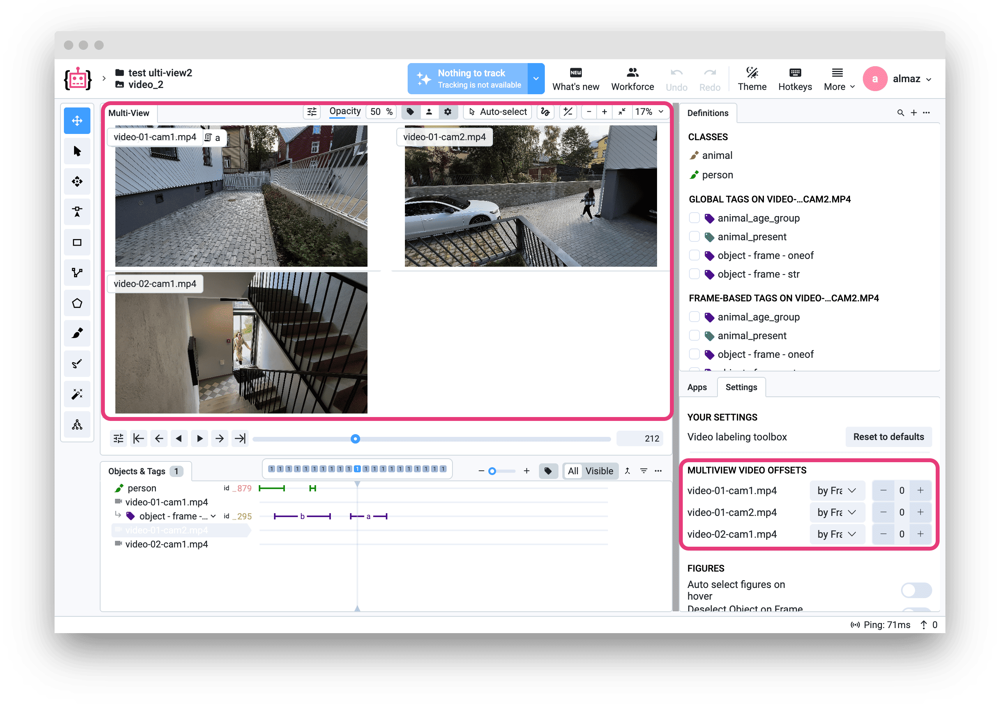

# Overview

Import format for multiview video projects in Supervisely. Videos are grouped by datasets - all videos within one dataset form a synchronized multiview group.



# Format description

**Supported video formats:** `.mp4`, `.avi`, `.mov`, `.webm`, `.wmv`, `.3gp`, `.flv`, `.mkv`, `.mpeg`, `.mpg`<br>
**With annotations:** Yes<br>
**Grouped by:** Datasets (each dataset = one multiview group)<br>


## When to Use Multiview

Multiview mode is particularly useful when you have multiple videos of the same scene captured from different angles or cameras, featuring a specific object of interest.

**Unified object across all videos:** If you have a common object appearing in different videos, you can annotate it as a single Supervisely object (with a shared ID). When you export and re-import the project, this object will be recreated as a unified entity — a cross-video object spanning all videos in the dataset (multiview set).

**Tags are video-specific:** Unlike objects, tags apply only within a specific video. When you tag a figure, frame, or video on a particular video, that tag will be associated only with that video and displayed only on it.

## Key Features

- Videos are grouped by datasets
- Synchronized playback of multiple video streams
- Unified object annotations across all videos in the multiview group
- Video-specific tags
- Optional annotations in Supervisely video format
- Optional metadata files for keeping video frame offset information

## How to Use

#### Prepare structure:

Example data: [download ⬇️](https://github.com/user-attachments/files/23659139/multiview-videos-sample.zip)<br>

- **Archive** `zip`, `tar`, `tar.xz`, `tar.gz`

  ```text
  📦 archive.zip
   ┗ 📂 project_name
      ┣ 📂 dataset_01
      ┃  ┣ 📂 video
      ┃  ┃  ┣ 🎥 camera_front.mp4
      ┃  ┃  ┣ 🎥 camera_left.mp4
      ┃  ┃  ┗ 🎥 camera_right.mp4
      ┃  ┣ 📂 ann (optional)
      ┃  ┃  ┣ 📄 camera_front.mp4.json
      ┃  ┃  ┣ 📄 camera_left.mp4.json
      ┃  ┃  ┗ 📄 camera_right.mp4.json
      ┃  ┗ 📂 metadata (optional)
      ┃     ┣ 📄 camera_front.mp4.meta.json
      ┃     ┣ 📄 camera_left.mp4.meta.json
      ┃     ┗ 📄 camera_right.mp4.meta.json
      ┣ 📂 dataset_02
      ┃  ┣ 📂 video
      ┃  ┃  ┗ ...
      ┃  ┣ 📂 ann (optional)
      ┃  ┃  ┗ ...
      ┃  ┗ 📂 metadata (optional)
      ┃     ┗ ...
      ┗ 📄 meta.json (optional)
  ```

- **Folder**

  ```text
  📂 project_name
   ┣ 📂 dataset_01
   ┃  ┣ 📂 video
   ┃  ┃  ┣ 🎥 video_001.mp4
   ┃  ┃  ┣ 🎥 video_002.mp4
   ┃  ┃  ┗ 🎥 video_003.mp4
   ┃  ┣ 📂 ann (optional)
   ┃  ┃  ┣ 📄 video_001.mp4.json
   ┃  ┃  ┣ 📄 video_002.mp4.json
   ┃  ┃  ┗ 📄 video_003.mp4.json
   ┃  ┗ 📂 metadata (optional)
   ┃     ┣ 📄 video_001.mp4.meta.json
   ┃     ┣ 📄 video_002.mp4.meta.json
   ┃     ┗ 📄 video_003.mp4.meta.json
   ┗ 📄 meta.json
  ```

**Structure explained:**

- Inside project directory can be one or multiple dataset directories
- **Each dataset = one multiview group:** All videos within the same dataset will be displayed together
- Each dataset directory can contain:
- `video/` - directory with video files
- `ann/` - (optional) directory with annotations in Supervisely format
- `metadata/` - (optional) directory with video metadata files
- Annotation file names pattern: `{video_name}.{video_ext}.json`
- Metadata file names pattern: `{video_name}.{video_ext}.meta.json`

**Meta explained**

Required setting for the project to import as multiview. Also shown only lines of interest.

```json
{
  "projectSettings": {
    "multiView": {
      "enabled": true,
      "tagName": null,
      "tagId": null,
      "isSynced": false
    },
    "labelingInterface": "multi_view"
  }
}
```

**Annotation explained**

This format uses the standard Supervisely video annotation format. Check [the documentation](https://docs.supervisely.com/customization-and-integration/00_ann_format_navi/06_supervisely_format_videos) for more details.

```json
{
  "objects": [
    {
      "key": "object_key_1",
      "classTitle": "Car",
      "tags": []
    }
  ]
}
```

**Metadata explained**

Optional JSON file with custom video information:

```json
{
  "offsetType": "frame",
  "offsetValue": 5,
  "videoStreamIndex": 0
}
```

`offsetType` - type of offset, can be `frame` or `time (ms)`<br>
`offsetValue` - offset value in frames or milliseconds<br>
`videoStreamIndex` - index of the video stream in the multiview group (starting from 0)<br>

Can contain offset value, video stream index and offset type.

# Useful links

- [[Supervisely Documentation] Video Annotation Format](https://docs.supervisely.com/data-organization/00_ann_format_navi/04_supervisely_format_videos)
- [[Supervisely Ecosystem] Export Videos in Supervisely Format](https://ecosystem.supervisely.com/apps/export-videos-in-supervisely-format)
