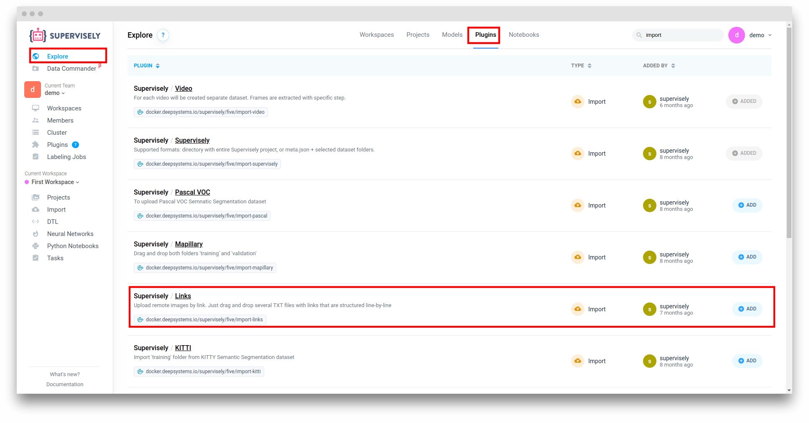
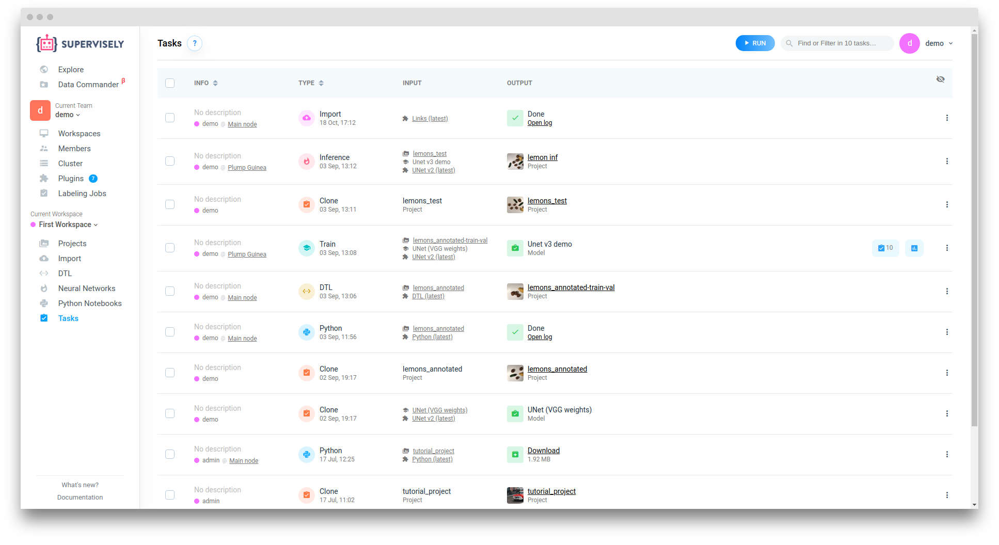

If your images are storing on the server that available from the browser you can use "Links" plugin, to use them on the Supervisely without duplicating.

## Import images via "Links" plugin

### Step 1: Create dataset_1.txt files with links

```
http://192.168.1.49:4321/dataset_1/00003.png
http://192.168.1.49:4321/dataset_100004.png
```

Each link should be placed on a separate line.
After importing into Supervisely, a separate dataset will be created for each .txt file.

### Step 2: Go to the Explore page

Select "Plugins" tab. Find "Links" plugin in the list and click "Add" button.



### Step 3: Import files

Go to the "Import" page. Select "Links" plugin and drag and drop your .txt files.


Enter project name and click "Start import" button.


Import will be started after files uploaded to the server.



After task completed go to the "Projects" page


## Automatic files with links generation


For the following steps you need have `docker` and `docker-compose` to be installed


Create 'docker-compose.yml' with following content

```
version: '2.2'

services:
  app:
    image: supervisely/links-plugin-txt-generator
    environment:
      - IMAGES_SERVER_PATH=<images_server_url>
    volumes:
    - <path_to_your_images_folder>:/tmp/data-src:ro
    - <path_to_out_txt_files>/:/tmp/data-dest
```

If you doesn't have images server, you can add following code in the `docker-compose`


`port` must be available from the browser


```
  server:
    image: nginx:1.15.8-alpine
    volumes:
    - <path_to_your_images_folder>:/usr/share/nginx/html:ro
    ports:
    - "<port>:80"
```

For example:
```
version: '2.2'

services:
  app:
    image: supervisely/links-plugin-txt-generator
    environment:
      - IMAGES_SERVER_PATH=http://192.168.1.49:4321
    volumes:
    - ./data/:/tmp/data-src:ro
    - ./output/:/tmp/data-dest

  server:
    image: nginx:1.15.8-alpine
    volumes:
    - ./data/:/usr/share/nginx/html:ro
    ports:
    - "4321:80"
```

Next run the following command in the terminal:

```
  docker-compose up -d server
  docker-compose up app
```

After `app` container complete execution, you can import files from `<path_to_out_txt_files>` folder as described above.
