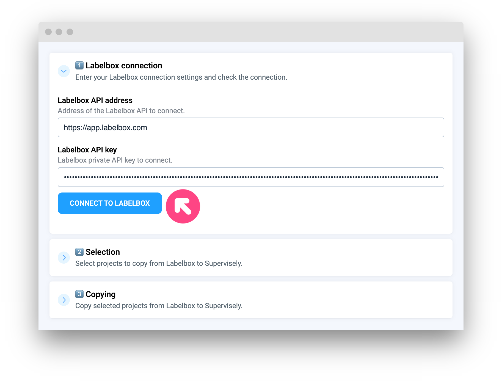
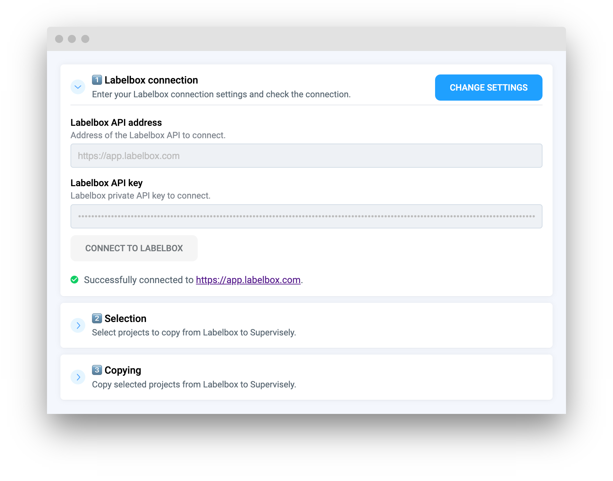

# Labelbox to Supervisely

[This application](https://ecosystem.supervisely.com/apps/labelbox-to-sly) allows you to copy multiple projects from Labelbox instance to Supervisely instance, you can select which projects should be copied. You can preview the results in the table, which will show URLs to corresponding projects in Labelbox and Supervisely.


[Complete migration guide](https://ecosystem.supervisely.com/apps/labelbox-to-sly) from Labelbox to Supervisely.


## Preparation


**ℹ️ NOTE:** There are some limitations on the Labelbox side depending on your subscription plan. You can find more information about it [here](https://docs.labelbox.com/docs/limits).



**ℹ️ NOTE:** It is allowed to export only Images or Videos projects from Labelbox, so you need to make sure that your projects meet this requirement, otherwise it's impossible to export data from Labelbox.


In order to run the app, you need to obtain Private API key to work with Labelbox API. You can refer to [this documentation](https://docs.labelbox.com/reference/create-api-key) to do it.

Now you have two options to use your API key: you can use team files to store an .env file with API key or you can enter the API key directly in the app GUI. Using team files is recommended as it is more convenient and faster, but you can choose the option that is more suitable for you.

### Using team files

You can download an example of the .env file [here](https://github.com/supervisely-ecosystem/labelbox-to-sly/files/13227776/labelbox.env.zip) and edit it without any additional software in any text editor. ℹ️ NOTE: you need to unzip the file before using it.

1. Create a .env file with the following content: `LB_API_KEY=<your Labelbox API key>`
2. Upload the .env file to the team files.
3. Right-click on the .env file, select Run app and choose the **Labelbox to Supervisely Migration Tool app**.

The app will be launched with the API key from the .env file and you won't need to enter it manually. If everything was done correctly, you will see the following message in the app UI:

* ℹ️ Connection settings was loaded from .env file.
* ✅ Successfully connected to https://app.labelbox.com.

## Entering credentials manually

1. Launch the app from the Ecosystem.
2. Enter the API key.
3.  Press the Connect to Labelbox button.

    

    

If everything was done correctly, you will see the following message in the app UI:

* ✅ Successfully connected to https://app.labelbox.com.

**ℹ️ NOTE:** The app will not save your API key, you will need to enter it every time you launch the app. To save your time you can use the team files to store your credentials.

You can see all the functionality of our migration application [here](https://ecosystem.supervisely.com/apps/labelbox-to-sly)
