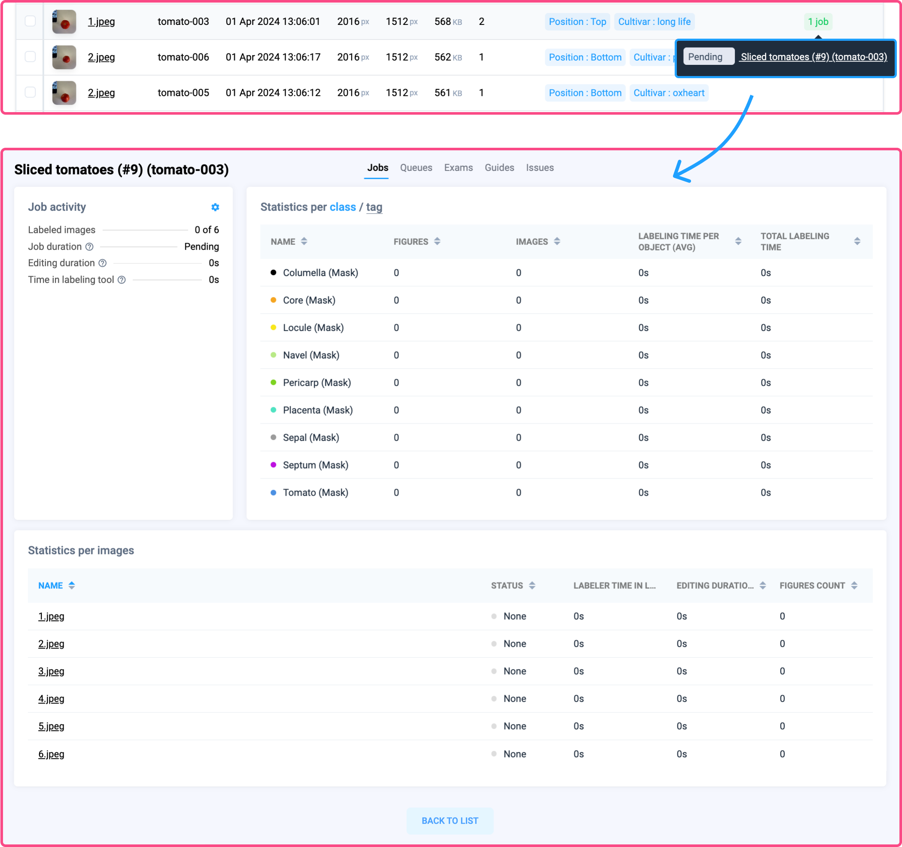

# How to use advanced filters

### **Open the project and navigate to the Filter tab**&#x20;

Open the images project you are working on and navigate to the Filter tab. Here, you can search among all images, subsample the desired dataset, configure filters, and preview filtering results.

<figure><figcaption></figcaption></figure>

### **Create custom conditional filters**

Click the `Filter` button to open a modal window where you can customize your filters based on various criteria. Fine-tune your view by including or excluding specific criteria, such as conditions on the number of objects. For example, you can filter images with the tag validation that contain more than 5 objects of the class _plant_.

#### Let's create custom filters step-by-step

1. **Open filter configuration**: Click the `Filter` button to open the filter configuration modal.
2. **Set criteria**: Choose criteria based on datasets, names, image tags, object classes, assignees, issues, or labeling job status.
3. **Fine-tune filters:** Include or exclude specific conditions, such as the number of objects within a specified range.
4. **Apply filters:** Click the `Apply` button to retrieve and preview the data that meets your specified conditions.

<figure><figcaption></figcaption></figure>

***

### Video tutorial 

In this 3-minute video tutorial, you will learn how to use advanced conditional filters for Computer Vision datasets, helping you search, filter, and explore annotated images of any size.



## **Tracking image status in labeling jobs**

Users can easily view the status of each image within a labeling job, simplifying the monitoring of annotation progress. By clicking on the status of a labeling job, users can access statistics on job activity, labeling time per object, and total labeling time. Detailed statistics are available for individual images, including labeler time in the tool, editing durations, and object counts. This comprehensive information ensures thorough tracking and analysis of the annotation process, enabling managers to accurately assess their annotation workflow.

<figure><figcaption></figcaption></figure>

## **Labeling job management**

When selecting multiple images, users can quickly create labeling jobs or delete unnecessary data, allowing for more precise data selection for labeling.

<figure><figcaption></figcaption></figure>

## **Data operations: copy and move**

Users can easily copy or move images with annotations from filtering results to other datasets, streamlining training data management.

## Use сases for advanced dataset filters

Explore some illustrative examples and common use cases of how filters can be used in real projects.

### Find unique data with custom filters

You can easily find unique data by combining different filters. Let's look at an example using the [Pascal VOC dataset](https://datasetninja.com/pascal-voc-2012). Suppose we need to find images from the "train" dataset that contain both _buses_ and _cars_. The number of _buses_ in the image should not exceed 5, and the number of _cars_ should be 1 or more. Here are the steps you can follow:

1. Apply a simple filter to subsample images from the "train" dataset.&#x20;
2. Add a filter to find images with _buses_ and set the maximum number of _buses_ in the image to 5.&#x20;
3. Add another filter to find images with _cars_ and set the minimum number of _cars_ in the image to 1.&#x20;
4. Press the `Apply` button to retrieve the data that meets all of the specified conditions and to view the filter results.

<figure><figcaption>
Combining filters to search for object classes "bus" and "car" in specific quantities
</figcaption></figure>

### 2. Manage huge datasets at any scale with ease 

Conditional dataset filters make managing large datasets simple. These filters help you to explore and identify images that can be merged into a new labeling job, moved or submitted to additional review and verification. Instead of using API and writing custom Python scripts, data annotation managers can quickly configure custom conditions and integrate them into their labeling pipelines in a few clicks.

Creating a new labeling job from unannotated images

### 3. Use filters to explore model predictions 

Data scientists can use custom filters to evaluate predictions from custom Neural Networks. For example, Supervisely users can easily apply custom object detection model, save model predictions and further use them for analysis or as an initial data prelabeling. In that case, every object (bounding box) will have the tag `Confidence` with some value from 0 to 1. Thus you can create custom filter to find all images with the most or less confident predictions (e.g. "Confidence < 0.5"). Analyzing bounding boxes with low confidence levels can help to gain insights and better understand model performance and uncover the ways to improve it.

Or developers can leverage the Supervisely platform for exploratory data analysis, finding data outliers or possible errors in training data. It can be used to improve adaptive learning strategies by dynamically filtering images based on model feedback, performance metrics, or user-defined criteria to iteratively sample, annotate, and improve model performance.

Also filters can be utilized to make smaller training datasets from the large ones for model evaluation also known K-fold cross-validation training technique.

Searching for images in the training dataset with a low threshold and removing them

### 4. Labeling job tracking for team collaboration 

Efficient [team collaboration](https://supervisely.com/blog/labeling-queues/) requires streamlined processes for tracking and managing annotation tasks. Supervisely's advanced dataset filtering capabilities optimize the job tracking process. By filtering datasets based on labeling jobs and their status and combining with other conditional filters, you can quickly find relevant images, explore unusual patters in your annotations, find hidden mistakes and perform simple yet effective quality assurance operations. This also improves visibility of job progress and ensures quick access to job activity and statistics.

[Labeling job](https://supervisely.com/blog/labeling-jobs/) statuses indicates the progress of the annotation or the quality of the data annotation: for example, images with `rejected` status may require review or correction. Sorting by these statuses helps to quickly identify and respond to potential data quality issues. Optimized job tracking through dataset filtering enables your team to be more productive, resulting in faster annotation project completion.

