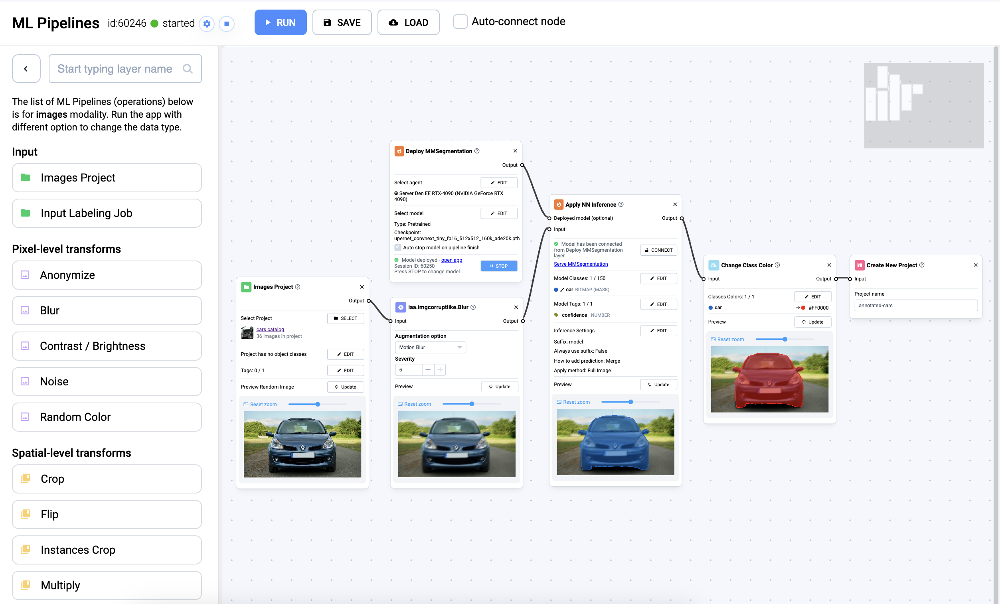
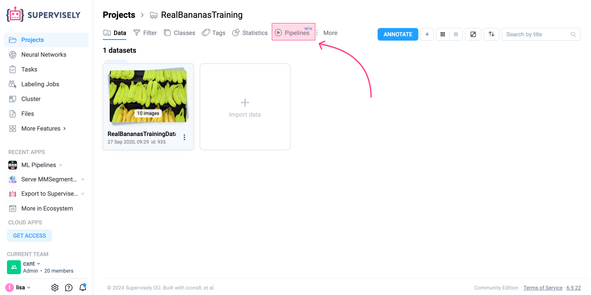
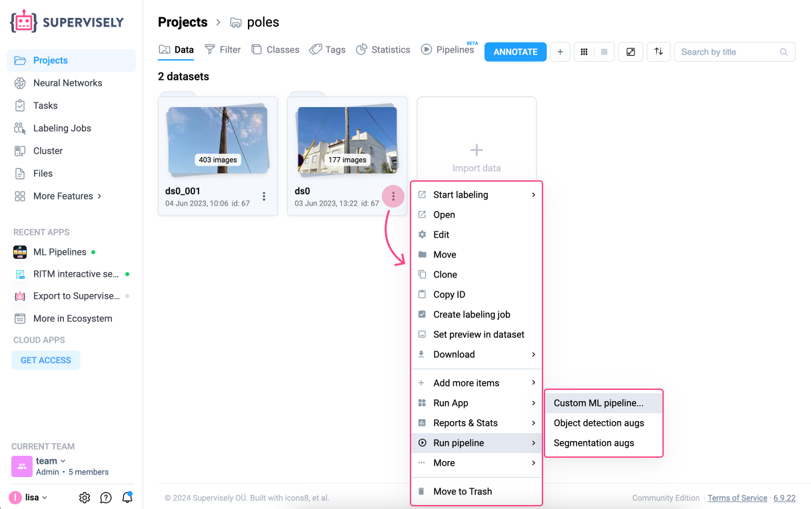
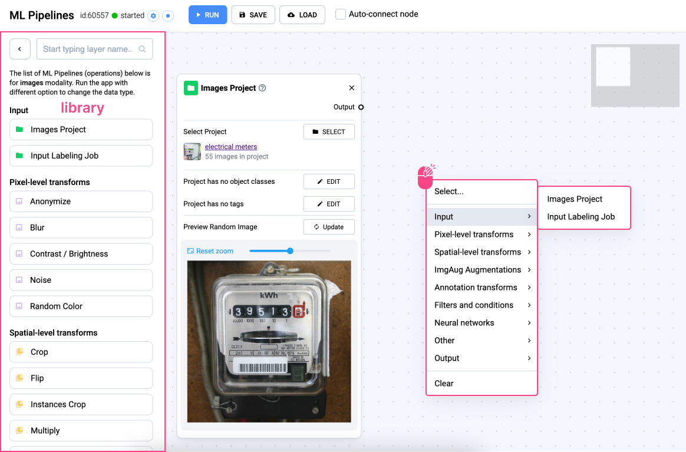
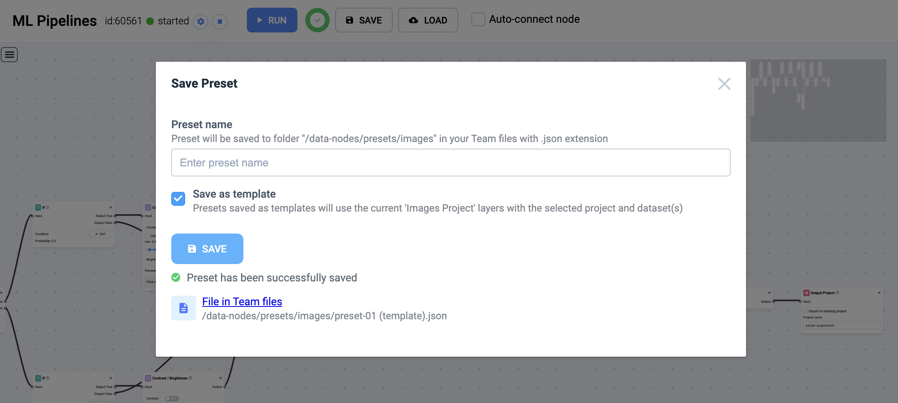
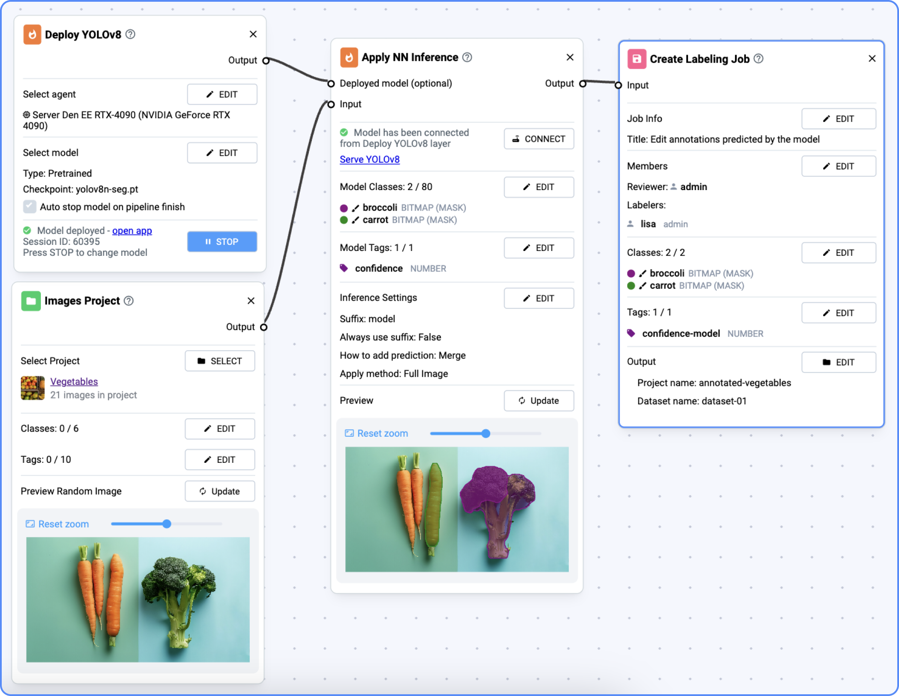

# Pipelines

**Pipelines** are built in the [ML Pipelines](https://ecosystem.supervisely.com/apps/data-nodes) app. A pipeline is a graph of nodes on a canvas: it starts with an input (a project, some of its datasets, filtered items or a labeling job), passes the data through transformations, filters and neural networks, and ends with one or more outputs (a new project, an existing project, an archive in Team Files or a labeling job).

Your source data is not changed: results go to new projects, datasets or files. The exceptions are the nodes that write into existing data on purpose: **Move**, which removes the items from the source, **Add to Existing Project**, **Output Project** saving to an existing project, and **Copy Annotations**.

<figure><figcaption></figcaption></figure>

One session of the app works with one data type: **images** or **videos**. The list of nodes depends on it. To work with the other type, start the app again.

## Start the app

* **From a project:** open the project and click the **Pipelines** tab. The pipeline starts with an **Images Project** or **Videos Project** node with this project.

<figure><figcaption></figcaption></figure>

* **From a project or dataset menu:** choose **Run pipeline → Custom ML pipeline...** to start with the project or dataset as the input, or one of the ready pipelines (**Object detection augs**, **Segmentation augs**) to open a complete augmentation pipeline for it.

<figure><figcaption></figcaption></figure>

* **From filters:** filter the images of a project, or select some of them, and run the pipeline. It starts with a **Filtered Project** node with exactly these images.
* **From the Ecosystem:** run **ML Pipelines** and choose the data type (images or videos). The canvas is empty.
* **From a saved pipeline:** in Team Files, open the context menu of a preset (`.json`) and run ML Pipelines on it. The app opens with that pipeline.

## Build a pipeline

<figure><figcaption></figcaption></figure>

* **Add nodes** from the library on the left (type in the search field to find one), or right-click the canvas and choose a node from its groups. **Select...** in the same menu opens a searchable list of all nodes, and **Clear** removes all nodes.
* **Connect nodes** by dragging from an output of one node to an input of another. With **Auto-connect node** on, a new node is connected to the last one you added.
* **Configure nodes** on the node card: **SELECT** and **EDIT** open the settings in a side panel, where you confirm them with **SAVE**. Other settings are edited on the card itself.
* **Preview** (images only): **Update** on a node shows a random image of the input as it looks after this node, with its labels.
* **Read about a node:** the **?** icon next to its name opens its documentation, with every setting explained.
* **Remove** a node with **×**.

How data flows between nodes:

* Every item goes to one output of a node. Filters and **If** have several outputs, for example **Output True** and **Output False**: connect only the one you need, and the items of the other are dropped.
* Several connections into one input merge the data, for example two branches of an augmentation into one output project.
* One output can feed several nodes, to save the same data in different ways.
* Input nodes choose which classes and tags go into the pipeline. Classes and tags that are not selected are removed from the annotations.

## Run a pipeline

Click **RUN**. The app checks the pipeline first: it needs at least one input and one output node, and every node's settings must be complete. Then it processes the items and shows the progress. You can close the run window and open it again with the progress circle next to **RUN**. **STOP** ends the run early; the results can be incomplete.

When the run finishes, the run window lists the results: links to the new or updated projects, to the archives in Team Files and to the labeling jobs. The run is also recorded in the **Workflow** of the input and output projects.

* Media is downloaded only when a node needs it. A pipeline that only filters, changes annotations or reorganizes datasets does not download the images, and images that no node needs are added to the output by reference, without uploading them again. A video is downloaded only when a node reads it, so videos dropped by a filter are never downloaded.
* If some items fail, the run goes on without them and the error is written to the session's log. If the output has fewer items than you expected, check the log.
* Archives are saved in Team Files, in `/data-nodes/archives/<images or videos>/<task id>/`.

## Save and load pipelines

<figure><figcaption></figcaption></figure>

* **SAVE** saves the pipeline as a preset, a `.json` file in Team Files, in `/data-nodes/presets/images` or `/data-nodes/presets/videos`.
* **Save as template** makes the preset reusable for any project: when you load it in a session started from another project, the input node takes that project instead of the saved one.
* **LOAD** opens a preset from the same folder. You can change the loaded pipeline and run it again, or save it under another name.

Presets are plain JSON, so you can share them with your team through Team Files, or open them from Team Files directly (see [Start the app](#start-the-app)).

## Nodes

| Group | Nodes | Images | Videos |
| --- | --- | --- | --- |
| **Input** | **Images Project**, **Input Labeling Job**, **Filtered Project** (only when started from filters) | ✓ | |
| | **Videos Project** | | ✓ |
| **Pixel-level transforms** | Anonymize, Blur, Contrast / Brightness, Noise, Random Color | ✓ | |
| **Spatial-level transforms** | Crop, Flip, Instances Crop, Multiply, Orientation, Resize, Rotate, Sliding Window | ✓ | |
| **ImgAug Augmentations** | ImgAug Studio, imgcorruptlike Noise, Blur, Weather, Color and Compression, Elastic Transformation, Perspective Transform | ✓ | |
| **Annotation transforms** | Approx Vector, Bitwise Masks, Change Class Color, Drop Lines by Length, Drop Noise, Drop Object by Class, Duplicate Objects, Image Tag, Line to Mask, Mask Morphology, Mask to Lines, Mask to Polygon, Merge Classes, Merge Masks, Objects Filter, Objects Filter by Area, Polygon to Mask, Rasterize, Rename Classes, Skeletonize, Split Masks | ✓ | |
| | Background, Bounding Box, BBox to Polygon | ✓ | ✓ |
| **Video transforms** | Split Video by Duration | | ✓ |
| **Filters and conditions** | Filter Images by Objects, Filter Images by Tags, Filter Images without Objects, If | ✓ | |
| | Filter Videos by Objects, Filter Videos by Tags, Filter Videos without Object Classes, Filter Videos without Annotations, Filter Videos by Duration | | ✓ |
| **Neural networks** | Apply NN Inference; Deploy YOLOv5, YOLO v8 - v11, YOLO v8 - v26, MMDetection, MMSegmentation, RT-DETR, RT-DETRv2, DEIM | ✓ | |
| **Other** | Dataset, Split Data, Dummy, Copy, Move | ✓ | |
| **Output** | Create New Project, Add to Existing Project, Export Archive, Create Labeling Job | ✓ | ✓ |
| | Output Project, Export Archive with Masks, Copy Annotations | ✓ | |

The documentation of every node is in the app (the **?** icon) and in the [app's repository](https://github.com/supervisely-ecosystem/data-nodes#available-layers).

## Neural networks

To label data with a model in a pipeline, use two nodes:

1. A **Deploy** node (for example **Deploy YOLO v8 - v26**): select an agent and a model and press **SERVE**. The model is deployed on that agent as a serving app. With **Auto stop model on pipeline finish**, it is stopped when the run ends.
2. **Apply NN Inference**: connect the **Deploy** node to its **Deployed model** input, or connect it to a model that is already running. Choose the model's classes and tags to keep and how to add the predictions to the existing labels.

You can chain several models, for example detect objects with one model and segment them with another, and filter the predictions with the annotation nodes before you save them.

<figure><figcaption></figcaption></figure>

## Examples

**Prepare a training set from images.** Images Project → Filter Images by Tags (keep the reviewed images) → Rename Classes or Merge Classes → Split Data (train and val datasets) → Create New Project.

**Augment a detection dataset.** Run **Object detection augs** from the dataset menu, or build it yourself: Images Project → If (by probability) → Flip, Crop, Contrast / Brightness, Blur and so on in branches → merge the branches into one Create New Project.

**Pre-label images with a model and review them.** Images Project → Deploy YOLO v8 - v26 + Apply NN Inference → Objects Filter by Area (drop tiny boxes) → Create Labeling Job. The labelers get the model's predictions to correct.

**Cut long videos into clips.** Videos Project → Filter Videos by Tags → Split Video by Duration → Create New Project. Every clip keeps its objects and tags for its frames.

**Move a filtered selection to another project.** Filter the images in the project, run the pipeline from the filters, and connect Filtered Project → Move → Output Project.

## Custom Nodes

If a step needs your own code or your company's Python packages, add your own nodes:

1. Fork the [ML Pipelines repository](https://github.com/supervisely-ecosystem/data-nodes).
2. Put your nodes in the `src/custom_nodes/` folder. They appear in the **Custom** group of the app, next to the standard nodes.
3. Install your packages into the fork's Docker image, for example from a private package index.
4. Release the fork as a private app on your instance and run it on any agent.

Your code runs only in your fork: nothing is typed into the app's interface. The developer tutorial [Add your own node to ML Pipelines](https://developer.supervisely.com/app-development/ml-pipelines/custom-nodes) shows every step, with example nodes for a video pipeline that selects videos, scans their frames in parallel and cuts clips into a new project. How the app works inside, its pipeline format and how to run a pipeline from code are in [ML Pipelines for developers](https://developer.supervisely.com/app-development/ml-pipelines).
