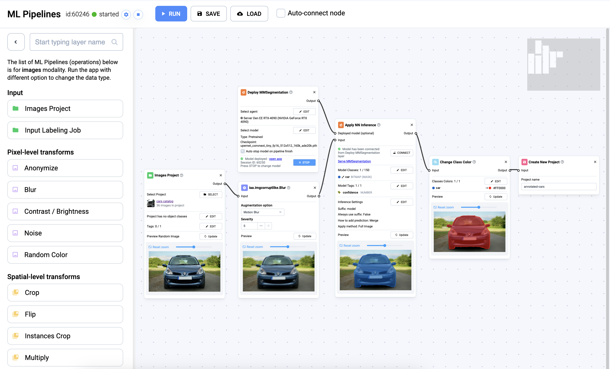

# Pipelines

Supervisely introduces a robust Computer Vision Pipelines system designed to simplify MLOps (Machine Learning Operations) and DataOps (Data Operations) with a node-based architecture.&#x20;

This innovative system allows users to manage data, perform augmentations, apply filters and run neural network operations seamlessly using an intuitive drag-and-drop interface. The system includes over 150 nodes to cater to various data processing needs.

<figure><figcaption></figcaption></figure>

## What are Pipelines?

Pipelines in Supervisely are a modular approach to data processing and workflow management. They enable users to create complex workflows by connecting different nodes, each representing a specific operation, such as data transformation, neural network application, collaboration or data enhancement. This node-based system, inspired by similar approaches in video editing, 3D graphics, and game development, streamlines the process of building and managing sophisticated data workflows.

<figure><figcaption></figcaption></figure>

* **Transform Data:** Apply a wide variety of data transformation operations to images within a project. These transformations include rotation, cropping, blurring, resizing, and many more.
* **Use Neural Networks:** Apply deployed models on your data to perform object detection, instance segmentation, and other tasks. You can use any of the neural network models available in the Supervisely Ecosystem, or train your custom models.
* **Enhance Data:** Improve the quality and usability of your image data by adjusting contrast, brightness, and noise levels.
* **Object-Level Manipulation:** Perform operations on individual objects or instances within images, such as cropping, duplicating, or changing their color classes.
* **Customize Workflows:** Create complex data transformation workflows by combining multiple transformation nodes to meet your specific requirements.
* **Node Documentation:** Detailed documentation is available for each transformation node, explaining how to use it effectively. These guides provide step-by-step instructions and examples for each node, making it easy for users to understand and leverage the full power of the application.
* **Save & Load Presets:** Save your customized transformation workflows as presets for future use. This feature allows you to store and reuse your preferred configurations quickly.
* **Output Flexibility:** Choose from multiple export options to save your transformed data in a format that best suits your needs.
* **MLOps:** Manage ML workflows from data annotation to model deployment, incorporating CI/CD (Continuous Integration/Continuous Deployment) and continuous training principles.
* **DataOps:** Efficiently process and manage data throughout its lifecycle with an emphasis on collaboration, quality assurance, and automation.

## How to use Pipelines?

Using Computer Vision Pipelines in Supervisely is easy and powerful. With an intuitive, easy-to-understand interface, users can create advanced workflows without extensive programming knowledge. Drag-and-drop functionality and a wide range of customization options allow pipelines to be tailored to specific needs.

From managing datasets - copying, moving, filtering, merging and splitting - to performing complex transformations and augmentations, Supervisely makes it straightforward. Users can easily crop and resize images, convert shapes (such as polygons to bounding boxes for object detection tasks), and apply a variety of operations to enrich and modify data.

### Step 1. Launch Pipelines 

You have several options to run a pipeline, offering flexibility based on your workflow and preferences.

#### **Running Pipelines from the Project Interface**

You can run the `Pipelines` from the project's interface, allowing for project-specific workflows, or start the pipeline from dataset, enabling dataset-specific processing and transformations.

<figure><figcaption></figcaption></figure>

#### **Other Shortcuts**

There are several other convenient ways to start a pipeline. You can launch the desired application directly from the Supervisely Ecosystem, access and run the app from the project's context menu, or run the app directly from the dataset's context menu to streamline the process.

<figure><figcaption></figcaption></figure>

In addition, you can apply filters to your data before running pipelines to ensure precise and targeted transformations.

### Step 2. Drag-and-Drop and Connect Nodes

Creating a pipeline in Supervisely involves adding and connecting nodes to define your data processing workflow:

* **Add Nodes:** Select the necessary nodes from the library or use the context menu to quickly add nodes. Nodes represent different operations such as data transformation, Neural Network application, and data enhancement.

<figure><figcaption></figcaption></figure>

* **Configure Nodes:** For each node, set up its parameters according to your requirements. This could include specifying transformation types, Neural Network models, or enhancement settings.
* **Connect Nodes:** Use the **drag-and-drop** interface to connect nodes in the desired sequence. The connections represent the data flow from one operation to the next, creating a streamlined and logical processing path.
* **Customize Workflow:** Adjust and rearrange nodes as needed to tailor the workflow to your specific needs. You can combine multiple nodes to handle complex data processing tasks.

### Step 3. Run Pipelines 

Once your pipeline is set up, you can easily manage its execution and reuse:

* **Run Pipeline:** Start the pipeline by clicking the run button. Supervisely will process the data according to the defined workflow, applying each node's operations in sequence.
* **Monitor Progress:** As the pipeline runs, monitor its progress through the interface. You can view real-time updates and ensure each step is completed successfully.
* **Modify and Re-run:** If needed, modify the loaded pipeline by adding, removing, or reconfiguring nodes. Once adjusted, re-run the pipeline to apply the updated workflow to your data.

### Step 4. Save Pipelines 

* **Custom Templates:** Create custom templates for your pipelines and save your configured pipelines as a preset for future use. Custom templates allow you to standardize and share specific workflows across your team or organization. By using templates, you can ensure that everyone member follows best practices for data processing tasks and quickly replicates the same workflow without having to set it up again.
* **Load Pipelines:** Load a previously saved pipeline preset to reuse your customized workflows. This feature enhances efficiency by allowing you to apply consistent processing steps across different projects and datasets.

<figure><figcaption></figcaption></figure>

### Dataset Management with Pipelines

Even basic dataset operations such as copying, moving, filtering, merging, and splitting datasets and projects are now made incredibly easy thanks to pipelines.

Imagine you have a large dataset of images that needs to be prepared for a machine learning project. Here's how you can leverage Supervisely Pipelines to streamline this process:

**Copying and Moving Data**

**Node 1. Copy Dataset:** Use a node to duplicate your original dataset. This ensures that your original data remains intact while you work on the copy.

**Node 2. Move Data:** Add a node to move specific subsets of the copied data to different directories based on your organizational needs.

<figure><figcaption></figcaption></figure>

#### **Filtering and Splitting Data**

**Node 3. Filter Data:** Apply a filtering node to select images based on specific criteria, such as resolution or file type. This helps in focusing on the most relevant data.

**Node 4. Split Dataset:** Use a split node to divide the filtered dataset into training, validation, and test sets, ensuring a balanced distribution for your machine learning tasks.

#### **Merging Datasets**

**Node 5. Merge Datasets:** If you have multiple datasets that need to be combined, add a merge node. This node will unify different datasets into a single, cohesive set, simplifying further processing and analysis.

<figure><figcaption></figcaption></figure>

#### **Performing Complex Transformations**

**Node 6. Data Augmentation:** Add nodes for various data augmentation techniques such as rotation, flipping, and color adjustments to enrich the dataset.

**Node 7. Convert Shapes:** Use a node to convert shapes, such as changing polygons to bounding boxes, which is crucial for object detection tasks.

By connecting these nodes in a pipeline, you create an automated, repeatable workflow that handles every step of dataset management.

### Transformations & Augmentations

The system supports a wide range of data transformations and augmentations. You can easily convert videos to images or resize images. Additionally, users can transform polygons into bounding boxes for object detection tasks.

Furthermore, features like rotation, cropping, flipping, and adjusting brightness and contrast are available, along with many other capabilities. Data augmentation allows for the creation of numerous variations from a single image, helping models train under diverse conditions and enhancing their generalization ability.

<figure><figcaption></figcaption></figure>

### Neural Networks Inference & Model Ensembles 

Our Nodes facilitate the creation and deployment of Neural Networks and their ensembles for inference tasks. You can create a Node to deploy a model and then apply this model to your data using another Node. Moreover, you are not limited to a single model; you can use multiple models in conjunction.

For example, you can first apply a model for object detection and then use another model to segment each detected object. This allows you to build model ensembles, significantly improving performance and providing more comprehensive results.

### Labeling Tasks

In Supervisely, you can create labeling tasks based on your input project. For instance, you can perform advanced filtering to isolate images with specific tags or those without annotations, and then create a labeling task based on the results of this filtering.

<figure><figcaption></figcaption></figure>

In another scenario, if you have unlabeled images, you can first apply a Neural Network to these images for automatic annotation, and then create a labeling task based on the generated annotations.

<figure><figcaption></figcaption></figure>

### Creating Complex Pipelines

With Supervisely Pipelines, you can create complex combinations of your nodes and large and complex pipelines, that include both data processing and Neural Network operations.

**For example:**

1. You can take a large image and split it into smaller blocks using a `sliding window` split.
2. Then apply a neural network operation to this image to perform detection and segmentation.
3. Apply a filter to remove all small rectangles with a low-confidence level less than 0.5.&#x20;
4. Finally, you can create a labeling task based on filtered results.

Supervisely Pipelines support multiple modalities, including images, video, and much more. Our comprehensive set of operations, which already includes over 150 nodes, is constantly being expanded.

If you need specific functionality or have any questions, please don't hesitate to contact our support team. We're always here to help!

