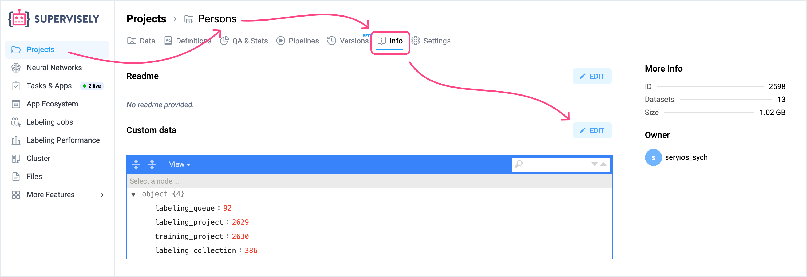
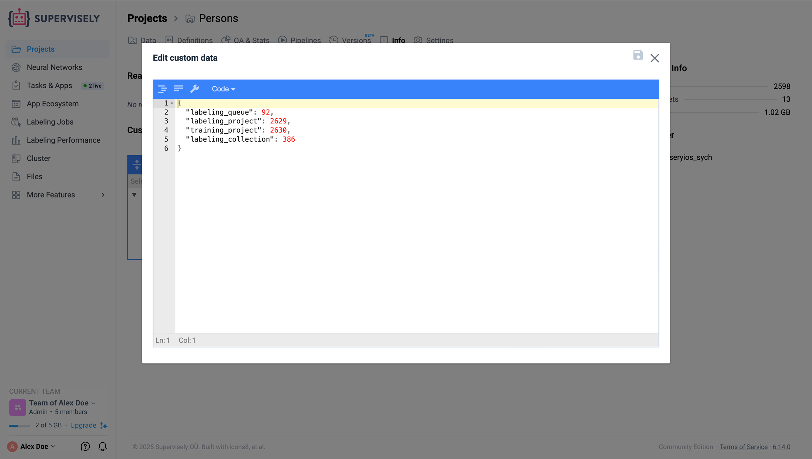

# Custom Data

## Overview

Custom Data allows you to store additional technical information in JSON format for projects and datasets. This feature enables you to save configuration parameters, metadata, and settings that can be used by Supervisely Apps and custom tooling.

## Accessing Custom Data

Navigate to any project or dataset and click the **Info** tab. You'll find two sections:

- **README** — Documentation in Markdown format
- **Custom Data** — Technical data in JSON format

<figure><figcaption></figcaption></figure>

## When to Use Custom Data

Use Custom Data when you need to:
- Store app configuration parameters
- Save processing results and metadata
- Share settings between different applications
- Keep references to external resources

Use README for project descriptions, annotation guidelines, and human-readable documentation.

## Common Use Cases

### Training Configuration
Store model training parameters for training apps:

```json
{
  "training": {
    "epochs": 100,
    "batch_size": 16,
    "learning_rate": 0.001
  },
  "model": {
    "architecture": "YOLOv8",
    "input_size": [640, 640]
  }
}
```

### Export Settings
Define default export parameters:

```json
{
  "export": {
    "format": "COCO",
    "include_masks": true,
    "min_object_area": 100
  }
}
```

### External Integration
Store references to external systems:

```json
{
  "integration": {
    "mlflow_experiment_id": "exp_12345",
    "external_project_id": "proj_abc789"
  }
}
```

### Processing Results
Save processing outcomes and metrics:

```json
{
  "last_validation": {
    "date": "2024-03-15",
    "total_images": 1500,
    "issues_found": 8,
    "quality_score": 0.94
  }
}
```

## Data Structure

Keep your JSON structured and include version information:

```json
{
  "version": "1.0",
  "created_by": "username",
  "config": {
    // Your configuration here
  }
}
```

## Editing and Retrieving Custom Data

There are two ways to work with Custom Data:

### 1. Web Interface

The web interface is ideal for static settings that don't change frequently during data processing:

1. Navigate to your project or dataset
2. Click on the **Info** tab
3. Find the **Custom Data** section
4. Click **Edit** to modify the JSON
5. Save your changes

<figure><figcaption></figcaption></figure>

### 2. Python SDK

For dynamic data that needs to be updated programmatically, use the Python SDK:

#### Retrieving Custom Data for a Project

```python
import supervisely as sly

# Initialize API
api = sly.Api()

# Get project custom data
project_id = 12345
custom_data = api.project.get_custom_data(project_id)
print(custom_data)
```

#### Updating Custom Data for a Project

```python
import supervisely as sly

# Initialize API
api = sly.Api()

project_id = 12345

# Get current custom data
custom_data = api.project.get_custom_data(project_id)

# Modify the data
custom_data["processing_status"] = "completed"
custom_data["processed_items"] = 150

# Update the custom data
api.project.update_custom_data(project_id, custom_data)
```

#### Silent Mode for Projects

When updating project custom data, you can use silent mode to prevent updating the project's modification timestamp:

```python
# Update without changing the project's updated_at timestamp
api.project.update_custom_data(project_id, custom_data, silent=True)
```

This is useful when you want to update technical metadata without marking the project as recently modified.

#### Working with Dataset Custom Data

For datasets, retrieve custom data through the dataset info:

```python
# Get dataset info
dataset_id = 67890
dataset_info = api.dataset.get_info_by_id(dataset_id)

# Access custom data
custom_data = dataset_info.custom_data

# Modify only the keys you need to update
custom_data["validation_score"] = 0.95
custom_data["last_checked"] = "2024-03-20"

# Update dataset custom data
api.dataset.update_custom_data(dataset_id, new_custom_data)
```

## Best Practices

- Use clear, descriptive key names
- Group related settings together
- Include version numbers for configurations
- Keep file size under 1MB
- Store sensitive data externally, use references only

## Limitations

- Must be valid JSON format
- Visible to all users with project access
- No comments supported in JSON
- Recommended size limit: 1MB

## How Apps Use Custom Data

Supervisely Apps can read custom data to:
- Configure their behavior based on stored settings
- Resume processing from saved state
- Share parameters between different workflow steps
- Store results for later reference

This enables building automated workflows where configuration and state persist across different operations.