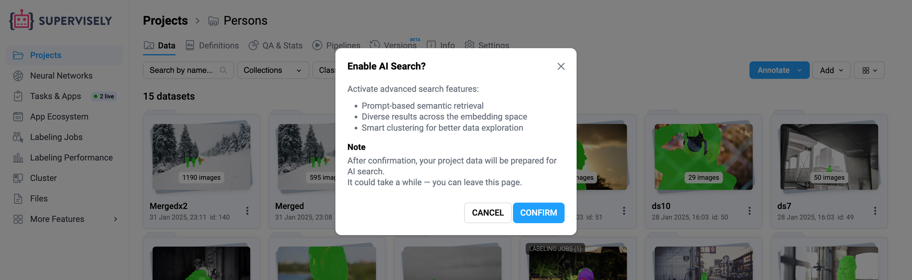
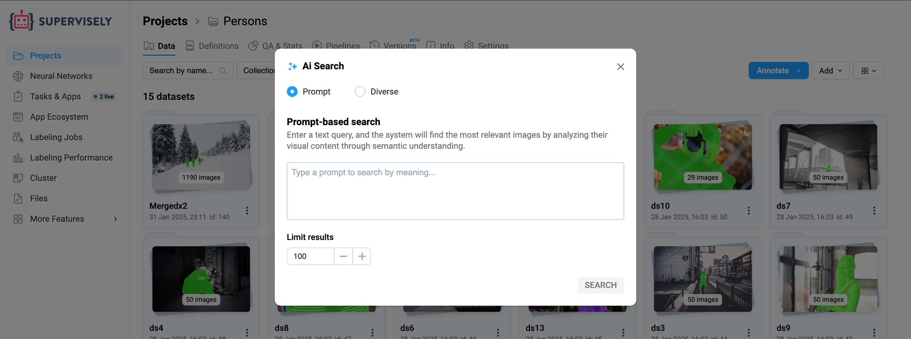
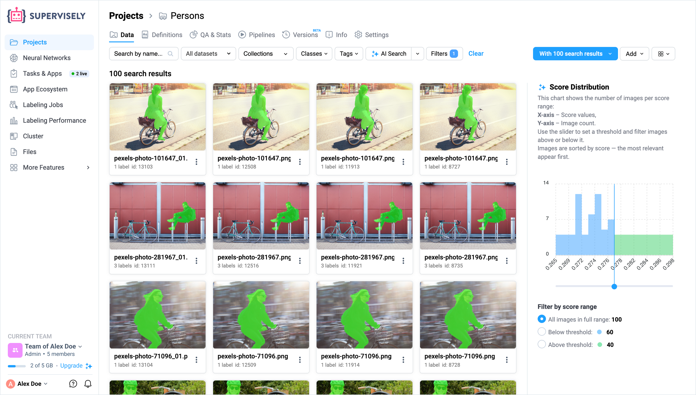
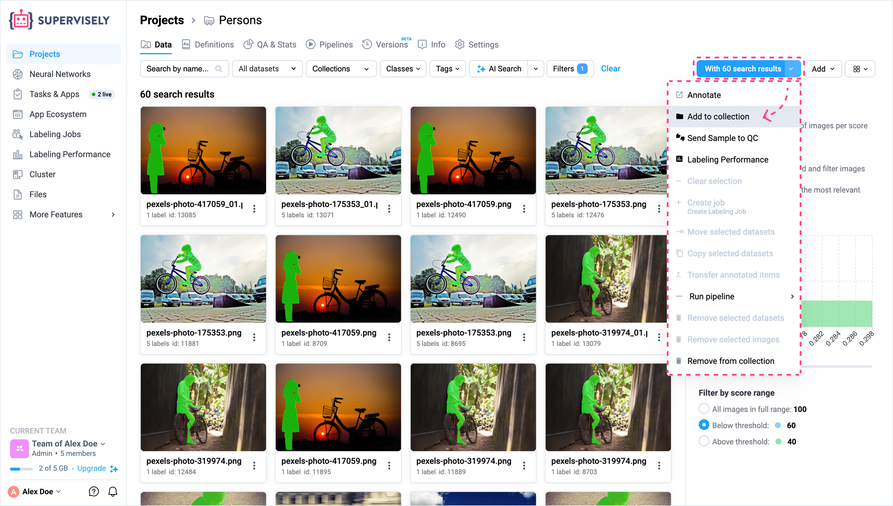
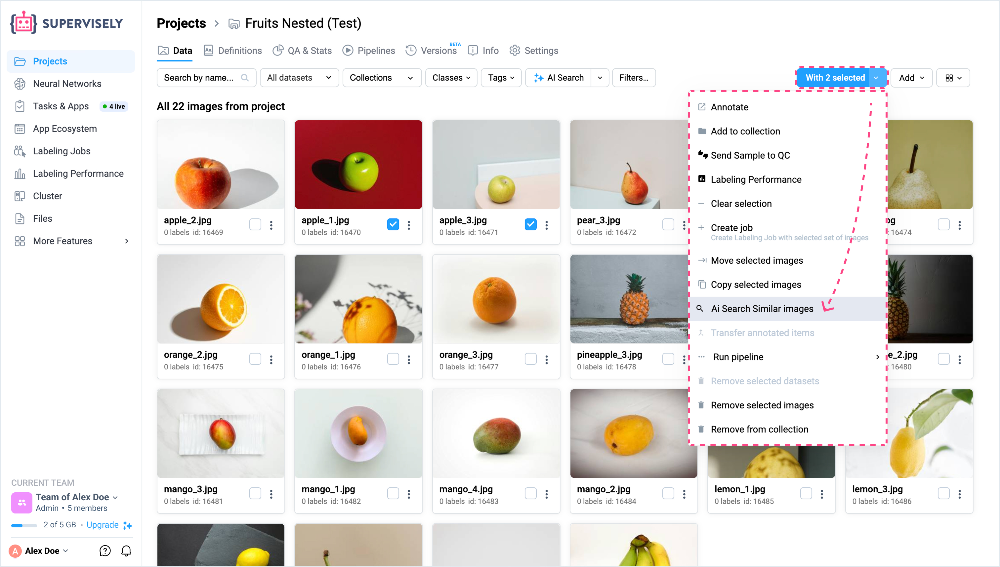
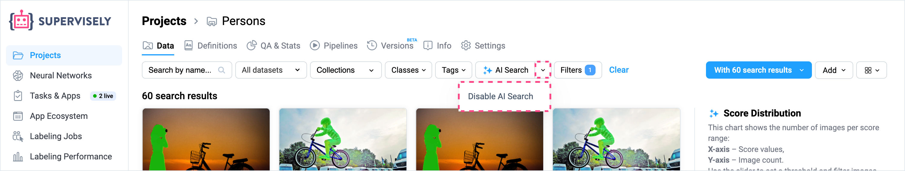

# AI Search

**AI Search** allows users to intelligently search for images within a project or dataset using semantic similarity. It leverages **CLIP** under the hood to generate vector embeddings of images, which are stored in a dedicated embedding database (Qdrant). These embeddings are used both to process search queries and to keep the data up to date through automated updates.


**AI Search** is only available to:
- Users with a **PRO subscription**
- Clients using **Supervisly Enterprise Instances**. 
If you do not have access, a prompt will appear suggesting you upgrade your subscription to unlock this feature.


## Enabling AI Search

When a user opens a project in Supervisely, the **AI Search** button appears at the top of the interface.

<figure><figcaption></figcaption></figure>

### First-time Activation

1. Click the **AI Search** button.
2. If AI Search is not yet enabled for this project, a modal dialog will appear asking if you want to enable it.

<figure><figcaption></figcaption></figure>

3. Upon confirmation:
    - The project is connected to the AI Search service.
    - Image embeddings for all images in the project begin generating automatically.
    - While embeddings are being prepared, search is temporarily unavailable.


While embeddings are being created, the **AI Search** button shows animated **sparkling stars**.  
Once complete, the star icon in the button turns **solid blue**, indicating that the project is ready for searching.


<figure><figcaption></figcaption></figure>

Embeddings are updated automatically on a regular schedule. Manual updates can also be triggered via API.

## Performing a Search

After embeddings are ready, clicking the **AI Search** button opens a modal window with two available search modes:

### 1. Prompt-based Search

Search for images using a natural language prompt.

- **Description**: The system embeds your text prompt and compares it with image embeddings to find the most semantically similar images.
- **Score Chart**: After search, a distribution chart shows similarity scores between the prompt and images.
- **Filtering**: You can filter results by adjusting score thresholds directly on the chart.
- **Results Limit**: You can set how many top images to return. If the number of relevant images is lower than the limit, all available matches are shown.

<figure><figcaption></figcaption></figure>

**Example:**  
> _"A person riding a bicycle"_ returns images that visually and semantically match this description — regardless of labeling.

### Filter by Score Range

After performing a prompt-based search, a score distribution chart is shown:

- **X-axis** – similarity score  
- **Y-axis** – number of images  

Use the slider below the chart to filter results by similarity:

- **Above threshold**: shows images most similar to the prompt  
- **Below threshold**: shows edge cases with low similarity  
- **Full range (default)**: all results

Images are always sorted by score, with the most relevant first.

<figure><figcaption></figcaption></figure>

### 2. Diverse Search

Explore a representative variety of images based on the semantic structure of your dataset.

#### Available Methods:

- **Random**: A simpler approach that selects points evenly across the cluster, but may miss edge cases or unique examples.
- **Centroids**: Returns a more diverse sample by prioritizing points on the edges of each cluster. Useful for understanding the boundaries and variability within the data

No text input is required in this mode.

<figure><figcaption></figcaption></figure>

## Search Results and Collections

Each search creates a **collection**, which acts as a dynamic filter within your project.

- Collections contain only images that matched the query.
- They can be renamed, reused, or removed like any other filter.
- Useful for organizing search results and building datasets based on semantic criteria.

## Managing AI Search

### Temporary Collections

All search results are shown as a **temporary collection** in the Filters panel.  
You can:

- Tag images  
- Copy them to other datasets  
- Move or delete  
- Use the collection to create annotation jobs  

Collections behave like any other filter, but are not saved unless you take action.

<figure><figcaption></figcaption></figure>

### AI Search Similar (Search by Image)

An additional feature allows searching by image similarity:

- Only available if **AI Search** is enabled for the project  
- Triggered through the **image context menu**  
- Additionally, developers can access this functionality **programmatically** via API

<figure><figcaption></figcaption></figure>

### Disable AI Search

Next to the **AI Search** button, there's a dropdown menu:

- **Disable AI Search**  
    - Disconnects the project from AI Search.
    - Embeddings will be deleted.
    - The project is removed from the auto-update queue.


Embeddings are automatically refreshed on a schedule (e.g., every few days) if AI Search is enabled.


<figure><figcaption></figcaption></figure>