# AI Search

**AI Search** allows users to intelligently search for images within a project or dataset using semantic similarity. It leverages **CLIP** under the hood to generate vector embeddings of images, which are stored in a dedicated embedding database (Qdrant). These embeddings are used both to process search queries and to keep the data up to date through automated updates.


**AI Search** is only available to:

-   Users with a **PRO subscription**
-   Clients using **Supervisely Enterprise Instances**

If you do not have access, a prompt will appear explaining the feature requirements.



**Data Privacy & Security**

All data processed for AI Search remains completely private and secure. No data or embeddings are transmitted to external services or shared outside environment, ensuring full data privacy.


## Enabling AI Search

When a user opens a project in Supervisely, the **AI Search** button appears at the top of the interface.

<figure>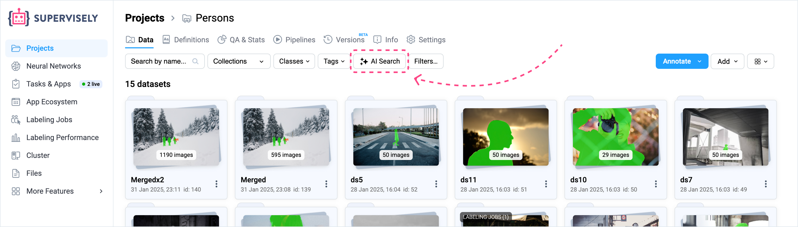<figcaption></figcaption></figure>

### First-time Activation

1. Click the **AI Search** button.
2. If AI Search is not yet enabled for this project, a modal dialog will appear asking if you want to enable it.

<figure>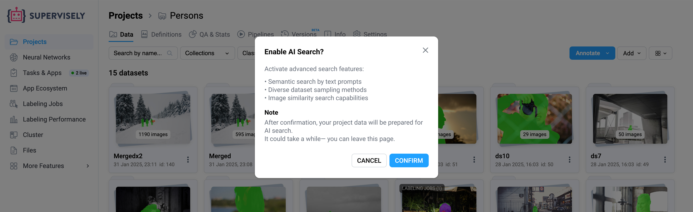<figcaption></figcaption></figure>

3. Upon confirmation:
    - The project is connected to the AI Search service.
    - Image embeddings for all images in the project begin generating automatically.
    - While embeddings are being prepared, search is temporarily unavailable.


While embeddings are being created, the **AI Search** button shows animated **sparkling stars**.  
Once complete, the star icon in the button turns **solid blue**, indicating that the project is ready for searching.


<figure>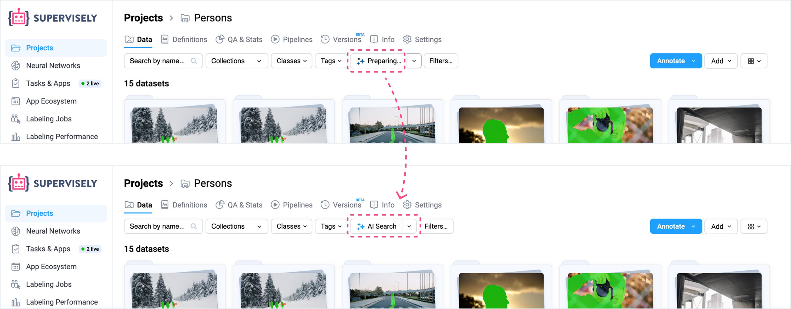<figcaption></figcaption></figure>

Embeddings are updated automatically on a regular schedule. Manual updates can also be triggered via API.

## Performing a Search

After embeddings are ready, clicking the **AI Search** button opens a modal window with two available search modes:

### 1. Prompt-based Search

Search for images using a natural language prompt.

-   **Description**: The system embeds your text prompt and compares it with image embeddings to find the most semantically similar images.
-   **Score Chart**: After search, a distribution chart shows similarity scores between the prompt and images.
-   **Filtering**: You can filter results by adjusting score thresholds directly on the chart.
-   **Results Limit**: You can set how many top images to return. If the number of relevant images is lower than the limit, all available matches are shown.

<figure>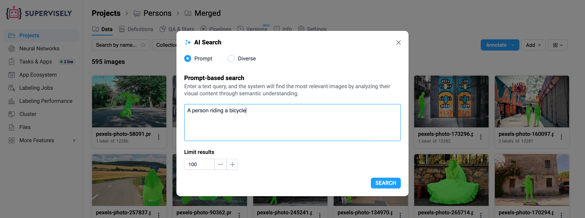<figcaption></figcaption></figure>

**Example:**

> _"A person riding a bicycle"_ returns images that visually and semantically match this description - regardless of labeling.

#### Filter by Score Range

After performing a prompt-based search, a score distribution chart is shown:

-   **X-axis** – similarity score
-   **Y-axis** – number of images

Use the slider below the chart to filter results by similarity:

-   **Above threshold**: shows images most similar to the prompt
-   **Below threshold**: shows edge cases with low similarity
-   **Full range (default)**: all results

Images are always sorted by score, with the most relevant first.

<figure>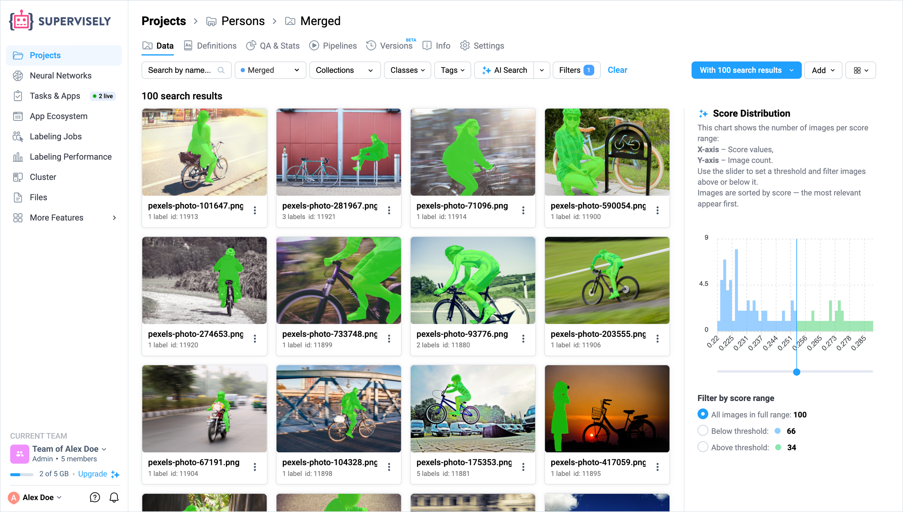<figcaption></figcaption></figure>

### 2. Diverse Search

Explore a representative variety of images based on the semantic structure of your dataset.

#### Available Methods:

-   **Random**: A simpler approach that selects points evenly across the cluster, but may miss edge cases or unique examples.
-   **Centroids**: Returns a more diverse sample by selecting representative points closer to cluster centers. Useful for getting typical examples from each semantic group in your data.

No text input is required in this mode.

<figure>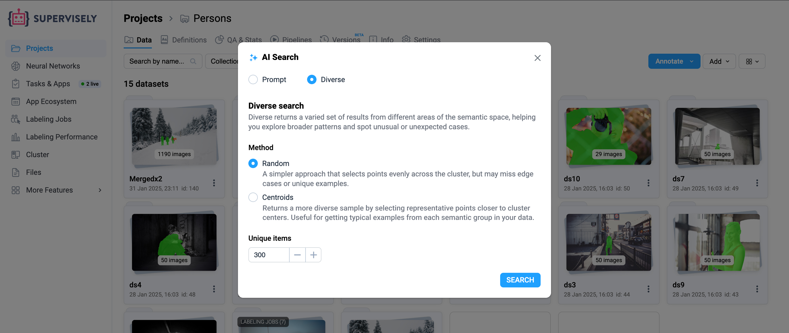<figcaption></figcaption></figure>

Diverse Search is particularly valuable for complex machine learning scenarios such as iterative active learning workflows, additional sampling for underrepresented classes, and refining labeling tasks based on insights from previous annotation iterations.

## Search Results and Collections

Each search creates a temporary **collection** that acts as a dynamic filter within your project:

-   This collection contains only the images that matched the query.
-   If needed, it can be saved as a separate collection for future use as a filter, since each new search overwrites the previous results and renaming the temporary collection is not possible.
-   Useful for organizing search results and building datasets based on semantic criteria.

## AI Search in Machine Learning Workflows

Beyond basic image search, AI Search serves as a powerful tool for various machine learning scenarios. Here are some practical applications that can significantly improve your ML workflow efficiency:

### Rare Instance Detection in Video Data

When monitoring production lines through continuous video streams, defective products or anomalies represent only 0.1-2% of all captured frames, while 98%+ show normal operation. Traditional manual review is almost impossible at this scale. Supervisely AI Search allows you to simply search for relevant instances of interest using an example image query, or trying a text-based query. This could be useful for finding out all relevant instances and using them in training an AI model, which can automatically detect such instances in production.

### Active Learning Approach

When developing AI models, some industries collect millions of images daily, but manually annotating even 1% would be very expensive. The Active Learning approach aims to select the most informative samples that will maximally improve your model with minimal annotation effort. The **Diverse Sampling with Centroids** is very helpful in this context. Instead of randomly selecting data to be manually annotated, selecting more diverse data proves to be more effective.

For example, in autonomous vehicle development, such sampling would intelligently select images across different conditions: daylight scenes with clear visibility, nighttime scenarios with artificial lighting, rainy weather with reduced visibility, urban environments with heavy traffic, rural roads with minimal infrastructure, and edge cases like unusual vehicle types or unexpected road obstacles. This ensures your model learns from the full spectrum of driving conditions rather than being biased toward the most common scenarios, hence, creating more robust and reliable AI systems with significantly less annotation effort.

### Data Curation & Quality Control

AI Search transforms manual data curation into an intelligent, systematic approach.

**Data exploration:** Start by understanding what's actually in your dataset using diverse search, getting a representative sample of your entire dataset.

**Systematic collection building:** You can create targeted collections for different aspects of your dataset. For example, search "nighttime urban scenes" and save the images to a "Lighting_Night" collection. Search "blurry images" and save as "Quality_Blur" collection or remove them.

## Managing AI Search

### Temporary Collections

All search results are shown as a temporary collection in the Filters panel. This collection acts as a dynamic filter within your project, containing only the images that matched your search query.

#### Using Temporary Collections as Filters

The temporary collection functions as a base filter that can be combined with additional filtering options available in the Filters panel. You can:

-   **Apply additional filters**: While the temporary collection is active, you can further refine your results by adding filters with AND logic:

    -   **AI Search results**: Filter by similarity score threshold (Above/Below) when using AI Search
    -   **Objects Class**: Filter by specific object classes and set the number of objects (between min and max values)
    -   **Images Tag**: Filter images by their tags (is/is not)
    -   **Objects Tag**: Filter by tags assigned to objects (is/is not)
    -   **Labeling Job**: Filter by labeling job and status (Pending, Accepted, Rejected, etc.)
    -   **Objects Author**: Filter by the author who created the objects
    -   **Issues**: Filter images with open issues

-   **Combine multiple criteria**: All filters work with AND logic, allowing you to create precise queries. For example, you could search for "nighttime scenes" and then additionally filter to show only images containing more than 5 annotated objects with class "car".

-   **Real-time filtering**: All filter operations work in real-time, providing instant results even on large datasets.

<figure>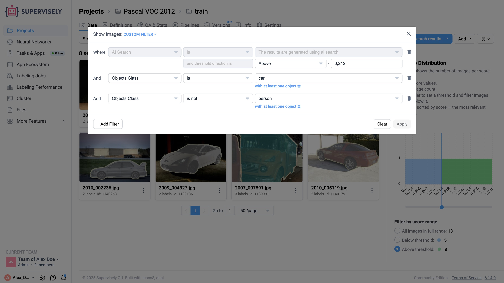<figcaption></figcaption></figure>

#### Working with Temporary Collections

With images in a temporary collection, you can:

-   Copy them to other datasets
-   Move or delete images
-   Create annotation jobs from the filtered results
-   Use the collection to start annotating only the filtered subset of images



**Important Notes**

-   Collections behave like any other filter but are **not saved automatically**
-   Each new search **overwrites** the previous temporary collection
-   Renaming the temporary collection is **not possible**
-   To preserve search results for future use, you must save the collection as a separate, permanent collection



<figure>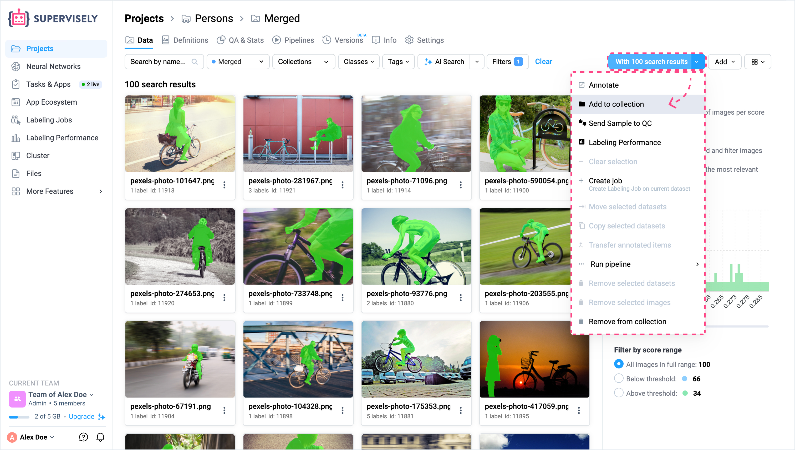<figcaption></figcaption></figure>

This temporary collection feature is particularly useful for organizing search results and building datasets based on semantic criteria combined with precise filtering conditions.

### AI Search Similar (Search by Image)

An additional feature allows searching by image similarity:

-   Only available if **AI Search** is enabled for the project
-   Triggered through the **image context menu**
-   Additionally, developers can access this functionality **programmatically** via API

<figure>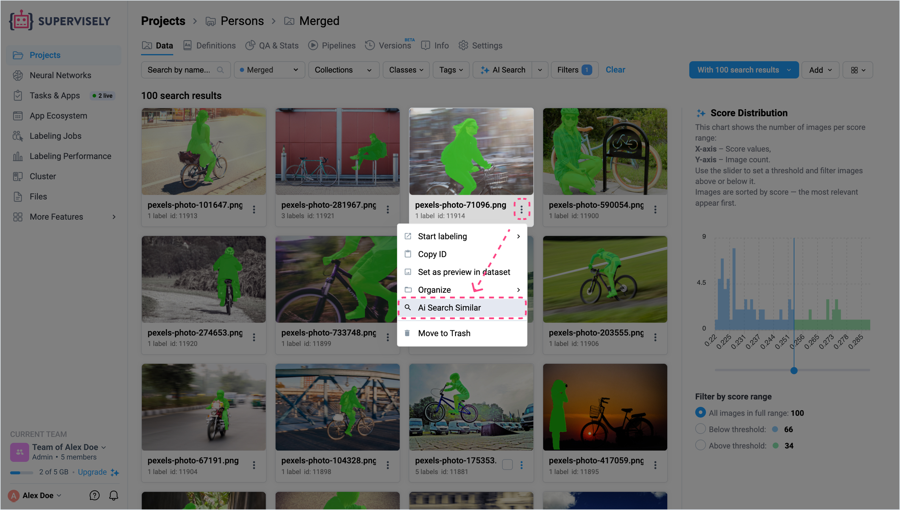<figcaption></figcaption></figure>

### Batch AI Search Similar

You can also search for similar images using multiple selected images as reference:

1. Select multiple images using checkboxes in the project
2. Click **"With N Selected"** button
3. Choose **"AI Search Similar images"** from the dropdown menu
4. The system will find images most similar to your selected set

This is useful when you want to find images that are semantically similar to a group of reference images rather than just one.

<figure><figcaption></figcaption></figure>

### Visual Embedding Explorer


**Private Beta Feature**  
Visual embedding exploration in 2D and 3D space is currently available in **private beta**. This feature allows you to visualize your dataset's semantic structure and interactively explore image clusters in dimensional space.


The Visual Embedding Explorer provides an interactive way to understand your dataset's semantic organization:

-   **2D/3D Visualization**: View your images plotted in reduced dimensional space based on their CLIP embeddings
-   **Interactive Clustering**: Explore natural groupings and identify outliers visually
-   **Zoom and Navigate**: Pan, zoom, and rotate through the embedding space to discover patterns
-   **Click-to-Search**: Click on any point to find similar images in that semantic region

This feature is particularly useful for dataset analysis, quality control, and discovering unexpected patterns or edge cases in large image collections.

<figure>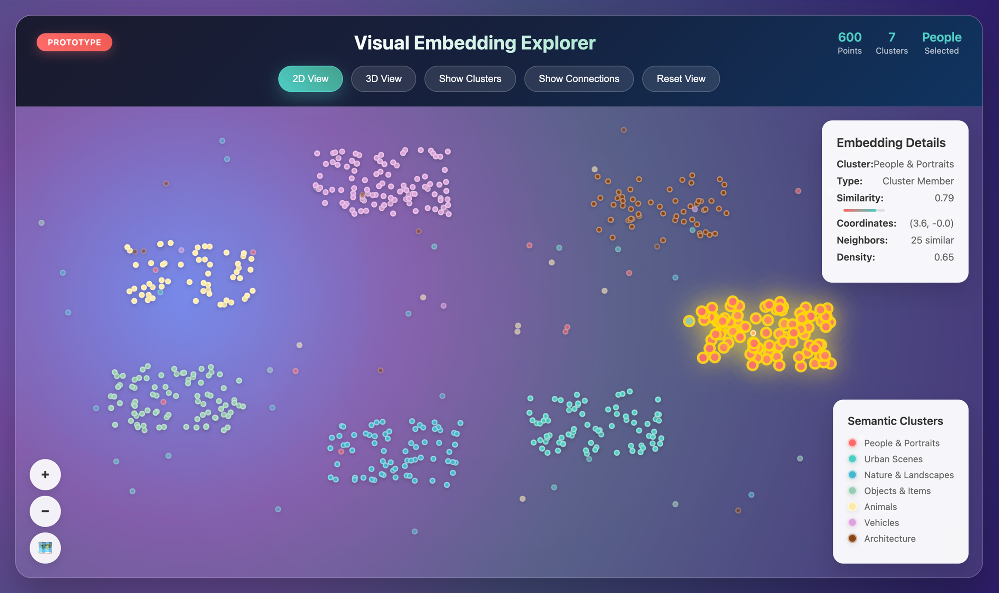<figcaption></figcaption></figure>

### Disable AI Search

Next to the **AI Search** button, there's a dropdown menu:

-   **Disable AI Search**
    -   Disconnects the project from AI Search.
    -   The project is removed from the auto-update queue.
    -   Note: Image embeddings are not deleted upon disabling.


Embeddings are automatically refreshed on a schedule (e.g., every few days) if AI Search is enabled.


<figure>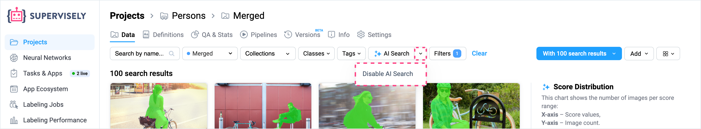<figcaption></figcaption></figure>
