# Creating Project & Dataset

In Supervisely, a Project is a core element of the system. It is where your data and annotations are stored, and it serves as the foundation for training and evaluating models.

### Creating a Project
1. To create your first project in the current Team, click the “Import Data” button.
2. If you don’t have any data yet, you can also upload ready-to-use sample projects to explore and learn what Supervisely has to offer.

<figure>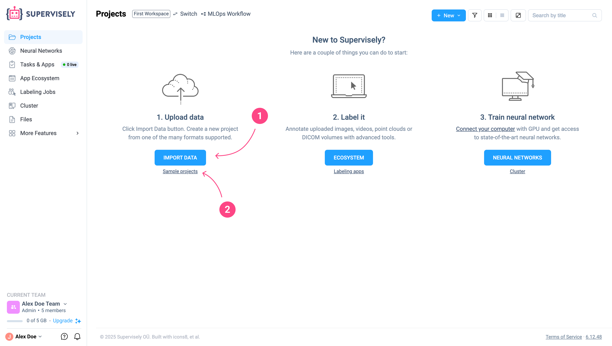<figcaption></figcaption></figure>

3. To create another project to the existing ones, simply click on the section with “+” and the text “Create project and import data” next to the folder of the created project.

<figure>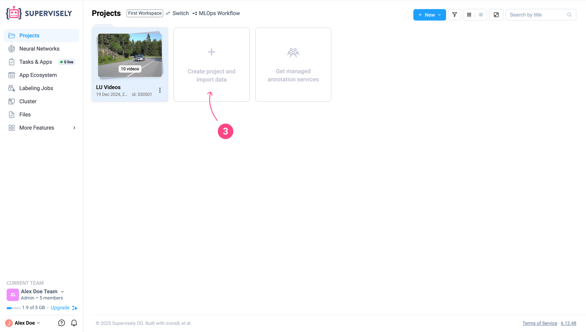<figcaption></figcaption></figure>

4. Supervisely supports different project types depending on the kind of data you're working with:
    * Images
    * Videos
    * DICOM volumes
    * Point cloud sequences

    Each project type is tailored to its specific data format, making it easier to manage annotations and prepare datasets for your Computer Vision tasks.

    After entering a **Name** and **Description** for your project, make sure to select the correct **Project type** based on your data format, as each project can contain only one type of data.

    
    **Note:** Once the project is created, its type cannot be changed.
    

    Next, select a **Labeling interface** — you can read a description of each one by hovering over the question mark icon next to it.

    Finally, click the **`Create`** button.

<figure>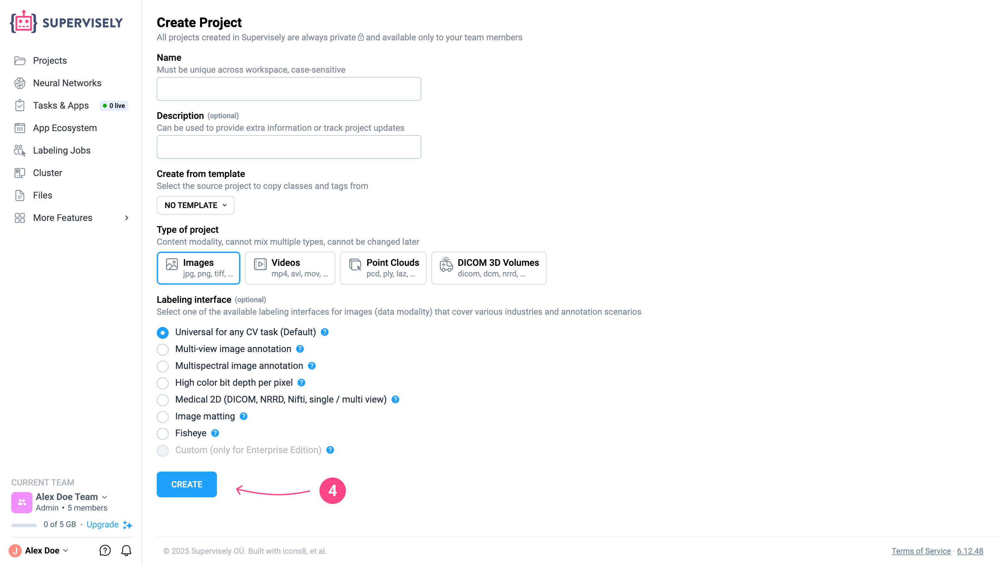<figcaption></figcaption></figure>

🎉 Great! The project has been successfully created — you are now inside it.

### Creating a Dataset

Now that your project is ready, it’s time to import your data and start working.
1. So click the **`Import Data`** button. A dataset will be created automatically, and your data will be placed inside it.

<figure><figcaption></figcaption></figure>

2. Notice that next to the Project Name, a field with the **Dataset Name** has appeared.
By default, the dataset is named after the date it was created, but you can rename it now or later.

3. Supervisely will now offer you the option to use the **Quick Auto Import** feature.
In this tab, you can review the supported data formats, annotation formats, and file size limits based on your current subscription Plan.
Once you're ready, go ahead and import your data.

<figure>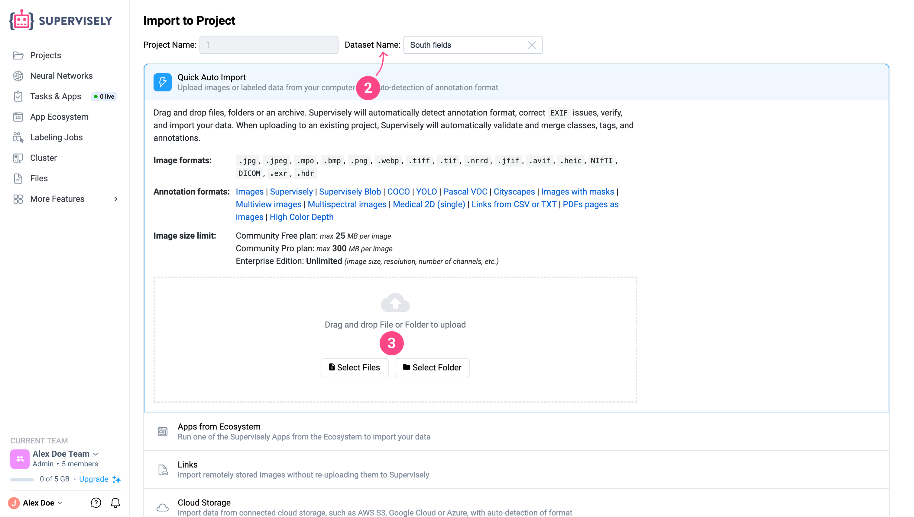<figcaption></figcaption></figure>

Below the **Quick Auto Import** tab, you'll also find other import options, each offering different ways to bring your data into Supervisely.
You can learn more about them in the article [**How to Import & Export**]().

<figure>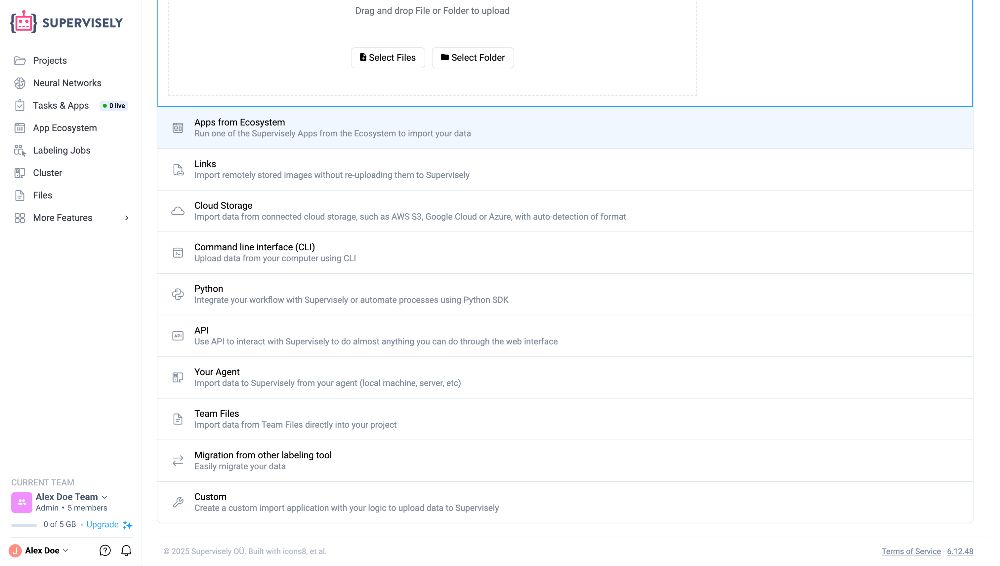<figcaption></figcaption></figure>

Right after uploading your data, you’ll be taken to the **Tasks** page, where you can monitor the upload process.

<figure>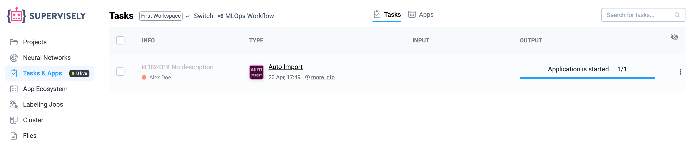<figcaption></figcaption></figure>

Once the upload is complete, the task will be marked as finished.
You can then go to your project by clicking the project link(1)  in the task card or by navigating to it through the **Main Menu**(2).

<figure>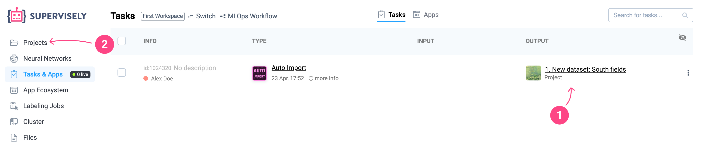<figcaption></figcaption></figure>

And here it is — your **Project** with the imported data!
Now let’s take a quick look at how to rename your project.

Just follow the simple steps shown in the illustrations below — you'll see how easy it is to change the **Project Name**, as well as explore other features and options available for managing your projects in Supervisely.

<figure>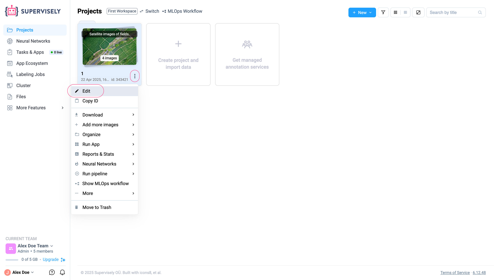<figcaption></figcaption></figure>
<figure>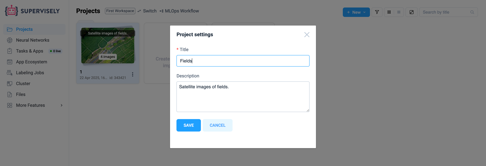<figcaption></figcaption></figure>
<figure>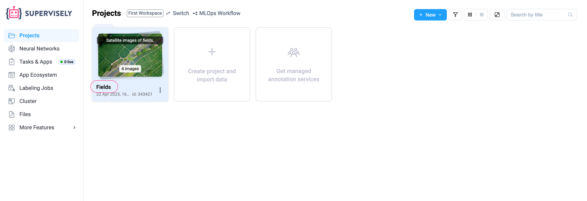<figcaption></figcaption></figure>

So now you’ve learned how to **сreate a Project** and import data into a **Dataset**, which is located inside the Project.

<figure>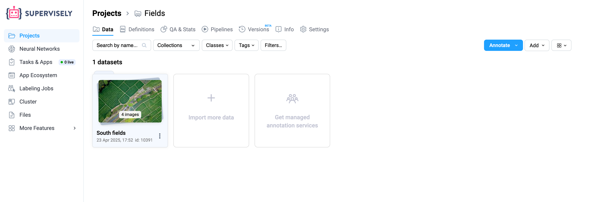<figcaption></figcaption></figure>

To learn more about the structure and organization of data in Supervisely, check out the article [**Folders Hierarchy**]().