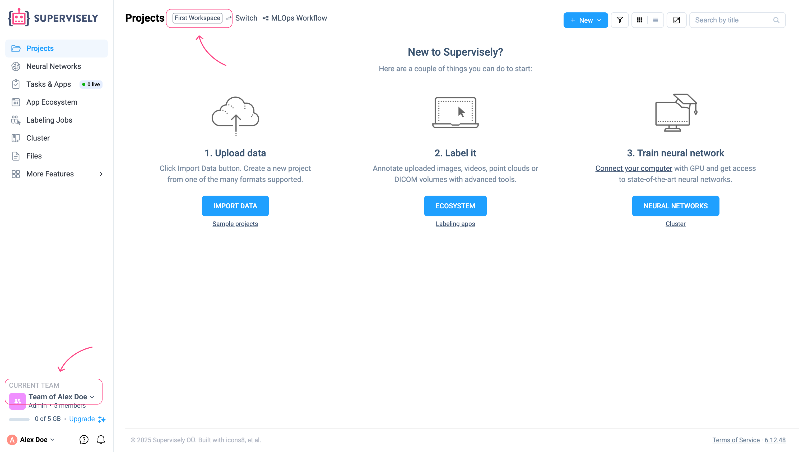
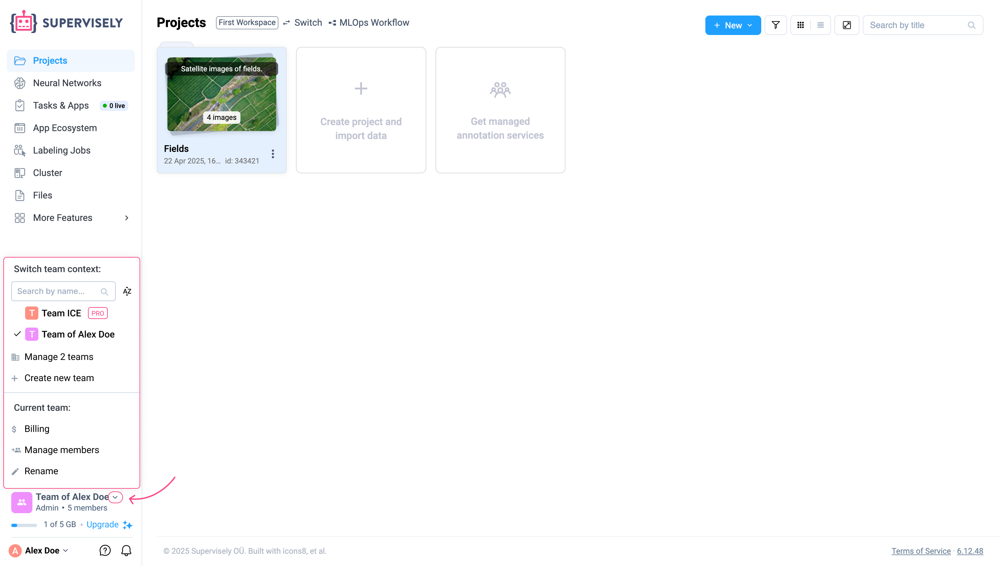
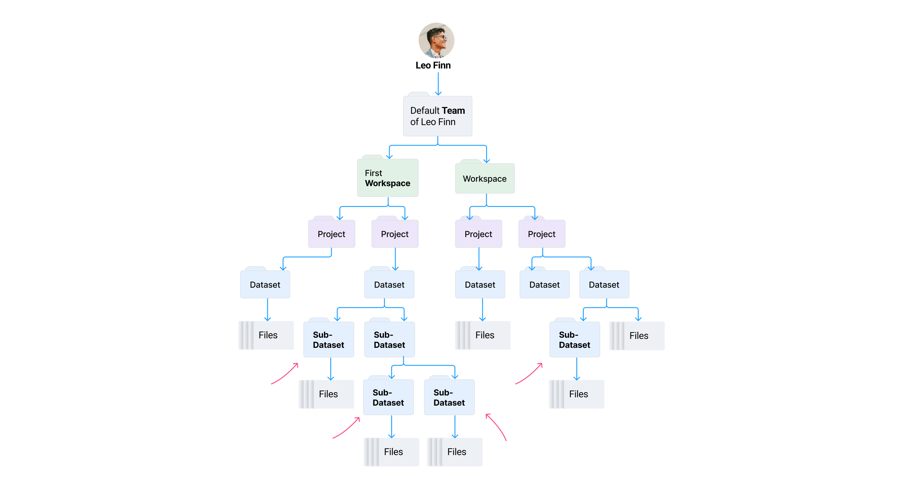
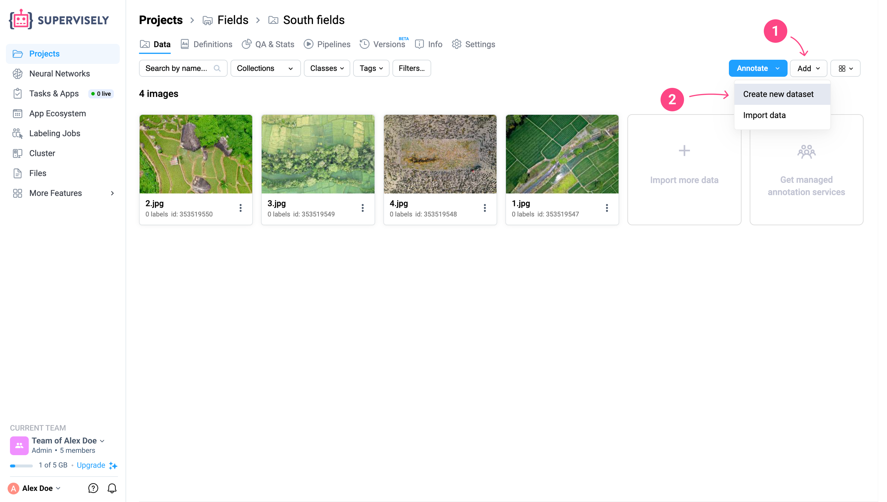
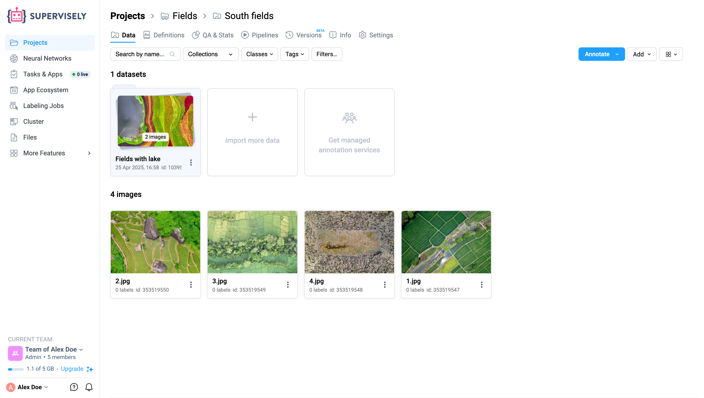

# Data Structure in Supervisely

### Teams and Workspaces

#### 1. Automatic Creation at Registration

When a user registers on the Supervisely platform, one **Team** and one **Workspace** are automatically created in their account. By default, this workspace is named _**First Workspace**_.

This is how it looks on the Supervisely platform:

<figure><figcaption></figcaption></figure>

And this is how it looks schematically:

<figure><figcaption></figcaption></figure>

#### 2. Team & Workspace Structure Rules

Every Member with [Full-scope Permission](../../collaboration/admin-panel/users-management.md) is always a part of at least one **Team**.
A member may leave or delete a personal **Team**, provided that they remain associated with at least one **Team** that includes at least one **Workspace** at all times.

Each **Team** must always have at least one **Workspace**, although it doesn't have to be the original one created at registration.

The Supervisely system strictly enforces these rules and will not allow any actions that would violate them. For example, you won’t be able to delete your last remaining Team or its only Workspace.

#### 3. Creating & Managing Teams

A Member with the Admin role can invite other Members to their **Team**. The invited member will gain access to all projects within this **Team**.

<figure><figcaption></figcaption></figure>

In addition to their default **Team**, a Member can also create new **Teams** to collaborate on separate projects or with different groups.

#### 4. Switching Between Teams

To manage or switch between **Teams**, click the arrow next to the name of your current Team.
A menu will appear with a list of all Teams you are a member of (not necessarily the ones you created) along with other settings.

<figure><figcaption></figcaption></figure>

When you [invite other Members]() to your **Team**, make sure you have the correct **Team** selected as active.
The invitations will be sent specifically to the currently active **Team** that you created.

### Projects and Datasets

Inside a **Workspace**, a Member can create an unlimited number of Projects.
Each **Project** can contain multiple **Datasets**, which store the actual data and annotations.

This flexible structure allows Members to organize data in a way that fits their workflow.

Furthermore, a Member can create additional **Workspaces** inside any **Team** where they have the Admin role.
Inside a **Dataset**, you can create **Sub-Datasets**, enabling flexible and deeply nested data structures — just like folders and subfolders on your computer. There are no limitations on nesting depth, so you can organize your data in whatever hierarchy makes sense for your workflow.

<figure><figcaption></figcaption></figure>

Let’s repeat an important rule: at the **Project** level, you cannot store files directly — only **Datasets** can exist there. Files and **Sub-Datasets** can only be added inside a **Dataset**.

You can think of **Datasets** as folders and **Sub-Datasets** as **subfolders**. This allows you to recreate complex directory structures exactly the way you organize data on your local machine or in your company’s cloud storage. It’s especially useful if you’re working with a shared storage system that already follows a specific hierarchy — you can mirror that same structure inside Supervisely without restrictions.

To create a sub-dataset inside an existing dataset:
1. Click the `Add` button
2. Select **Create New Dataset**
Then, you can navigate into the newly created sub-dataset and upload your files there.

<figure><figcaption></figcaption></figure>

Great! Your sub-dataset with files is now ready.

<figure><figcaption></figcaption></figure>

### Version Control

The platform includes version control features, allowing your team to track changes and revisions to documents, ensuring transparency and accountability.

Project versions are created automatically when training tools are run, but you can also create versions manually at any time.