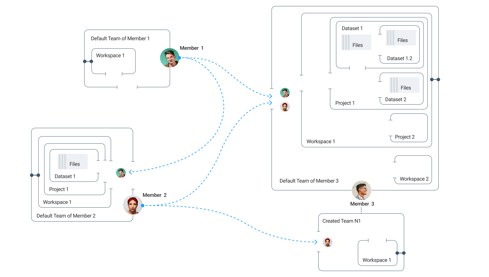

# Data Structure in Supervisely

### Teams and Workspaces

When a user registers on the Supervisely platform, one **Team** and one **Workspace** are automatically created in their account. By default, this workspace is named _**First Workspace**_.

<figure><figcaption></figcaption></figure>

Each **Team** must always have at least one **Workspace**, although it doesn't have to be the original one created at registration.

Every Member is always a part of at least one **Team** — the personal **Team** created during registration.
A Member cannot leave or delete this personal **Team**, ensuring they are always associated with at least one Team that includes at least one **Workspace**.
This structure is illustrated in the scheme for Member 1.

<figure><figcaption></figcaption></figure>

A Member with the Admin role can invite other Members to their **Team**, as shown in the scheme above of Member 2 and Member 3.
In addition to their default **Team**, a Member can also create new **Teams** to collaborate on separate projects or with different groups.


**Note:** All the projects you work on are located in the current Workspace within the current Team.


To manage or switch between **Teams**, click the arrow next to the name of your current Team.
A menu will appear with a list of all Teams you are a member of (not necessarily the ones you created) along with other settings.

<figure><figcaption></figcaption></figure>

When you [invite other Members]() to your **Team**, make sure you have the correct **Team** selected as active.
The invitations will be sent specifically to the currently active **Team** that you created.

### Projects and Datasets

Inside a **Workspace**, a Member can create an unlimited number of Projects.
Each **Project** can contain multiple **Datasets**, which store the actual data and annotations.

This flexible structure allows Members to organize data in a way that fits their workflow, as shown in the scheme above of Member 2 and Member 3.

Furthermore, a Member can create additional **Workspaces** inside any **Team** where they have the Admin role.
Inside a **Dataset**, it's also possible to create sub-datasets, allowing for even more structured data management (see Member 3 in the scheme avobe).

Let’s repeat this important point once again:
аt the **Project** level, you cannot store **Files** directly — only **Datasets** can exist there.
At the **Dataset** level, you can store both **Files** and **Sub-Datasets**.

To create a sub-dataset inside an existing dataset:
1. Click the `Add` button
2. Select **Create New Dataset**
Then, you can navigate into the newly created sub-dataset and upload your files there.

<figure><figcaption></figcaption></figure>

Great! Your sub-dataset with files is now ready.

<figure><figcaption></figcaption></figure>