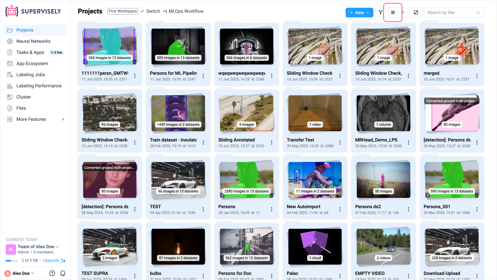
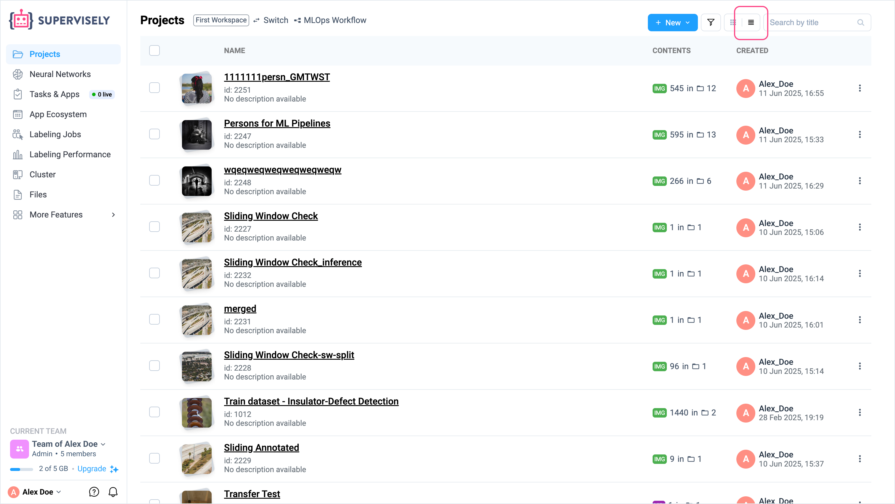
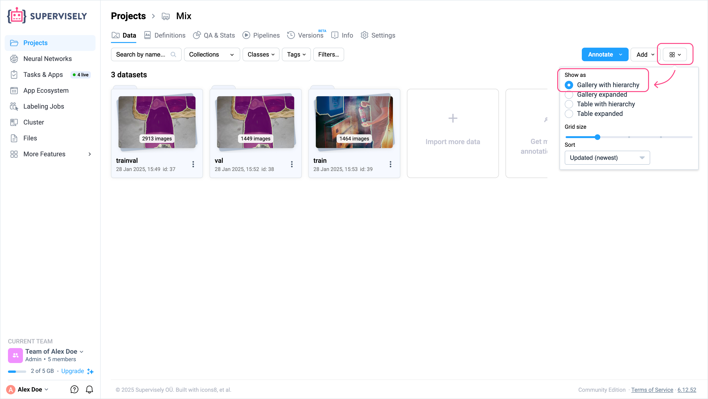
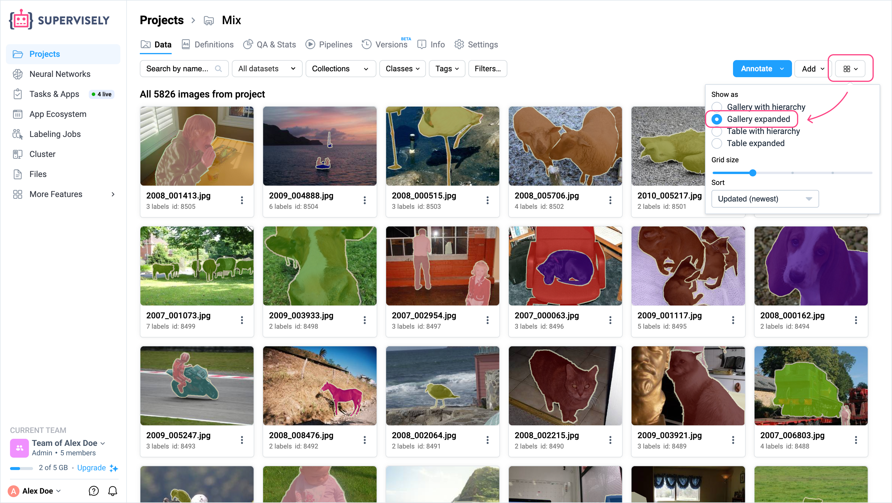
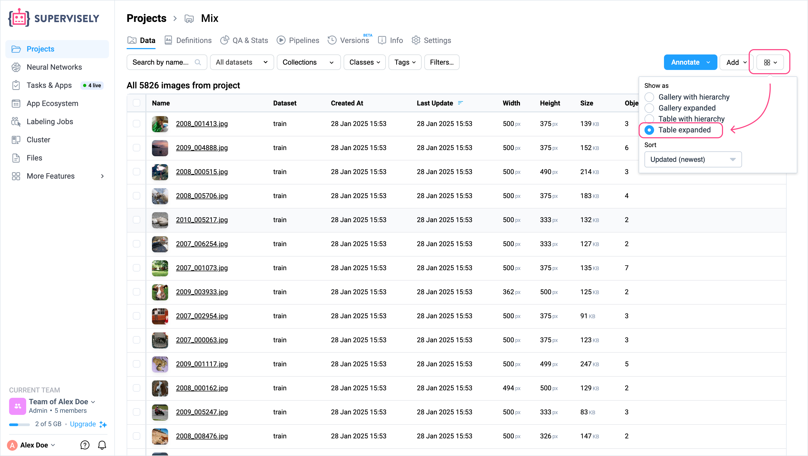

# Gallery & Table Views

Supervisely provides multiple data display modes to help you **explore and analyze your data more effectively**. Depending on the context, you can choose between visual gallery-based views and structured table-based views. These display modes are available both on the **project list page** and **inside individual projects and datasets**.

Gallery views are best suited for getting a quick **visual overview** of your data. Table views offer a **structured and sortable layout**, which helps when comparing metadata or filtering based on specific attributes.

These features are designed to help teams **understand the composition of their datasets**, **inspect content before labeling**, and **navigate large projects more efficiently**.

The data display modes on the project list page and within a project differ slightly:

## On the Project List Page

On the main project list page (inside a workspace), you can toggle between two display modes. Use the **view switcher icon** in the upper-right corner of the page to switch between **gallery view** and **table view**.

### Gallery View

Projects are displayed as visual cards with thumbnails (default), making it easier to recognize them at a glance.

<figure><figcaption></figcaption></figure>

### Table View

Projects are listed in a tabular format, which allows for sorting by various parameters such as **project name**, **creator**, and **project size** (based on the number of datasets and files inside each project).

<figure><figcaption></figcaption></figure>


**Note**: To select all projects, switch to the **Table View** mode.


## Inside a Project

Within a specific project - whether on the datasets overview page or inside an individual dataset - you have additional display modes to choose from. These let you control how files and annotations are visualized.

Use the display settings icon located in the upper-right corner of the screen (next to the **Add** button) to switch between modes:

### Gallery with Hierarchy

Datasets are displayed as visual cards with thumbnails (default), making it easier to recognize them at a glance.

<figure><figcaption></figcaption></figure>

### Gallery Expanded

Flattens all datasets and sub-datasets into a single, continuous gallery. This is helpful for **visually scanning large volumes of data** across the entire project.

<figure><figcaption></figcaption></figure>

### Table with Hierarchy

Displays a **nested table** that shows the list of datasets and their files at the **top level** of the project. Useful for **reviewing dataset structure** and inspecting associated metadata in a structured format.

<figure><figcaption></figcaption></figure>

### Table Expanded

Displays all data from all datasets - including nested sub-datasets - in a **single-level table**. Ideal for **sorting and comparing** files across the entire project, regardless of their position in the dataset hierarchy.

<figure><figcaption></figcaption></figure>


**Note**: To select all datasets within a project, switch to one of the **Table View** modes.


## Grid Size (Gallery Views Only)

When using any gallery mode, you can adjust the **grid size** to control how many items are shown per row:

- Smaller grid size: More thumbnails per row, helpful for scanning large datasets.
- Larger grid size: Bigger previews, better suited for reviewing image or point cloud content in detail.

This allows users to **customize the visual density** of the gallery depending on their review or labeling context.

#### Summary

Different display modes are tailored for different stages of dataset management - from **visual exploration** to **structured inspection and filtering**. By choosing the right view, users can better navigate complex projects, understand dataset composition, and prepare data for annotation workflows.