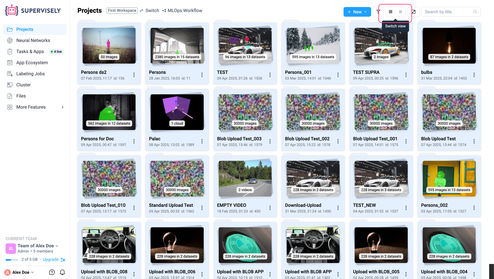
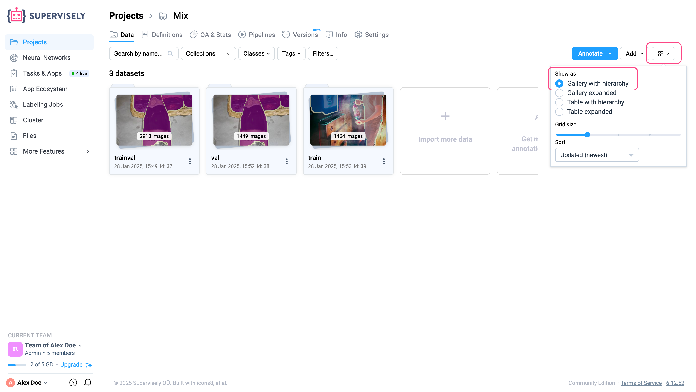
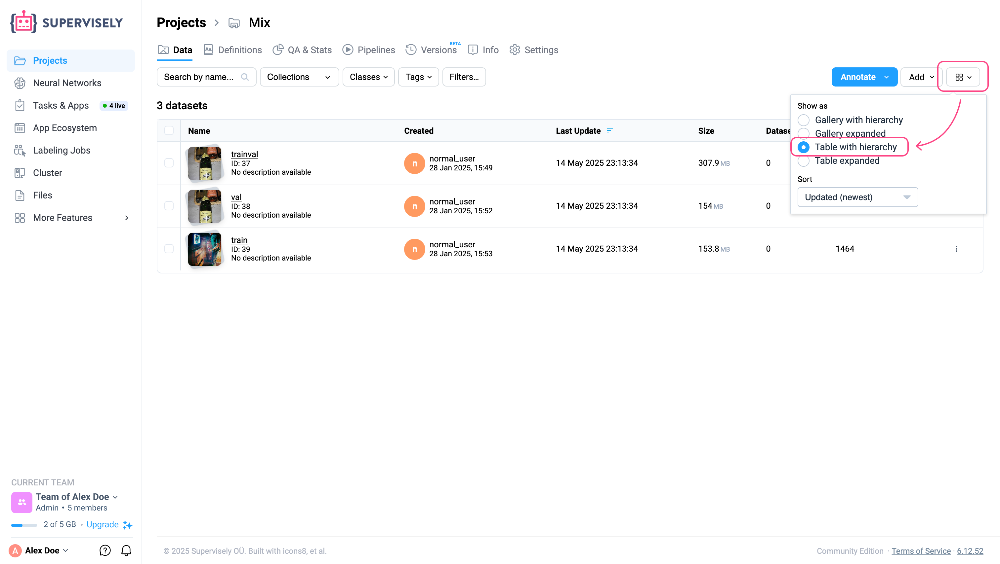

# Gallery & Table Views

The data display modes on the project list page and within a project differ slightly:

### 1. On the Project List Page

On the project list page, you can switch between card view and table view to display your projects. Use the icon in the upper right corner to toggle between these views.

<figure><figcaption></figcaption></figure>

### 2. Inside a project

Inside a project — on the datasets page, as well as within individual datasets — there is also functionality that allows you to change how data is displayed. In the upper right corner next to the "Add" button, click the button to adjust the data display settings on the page. By default, data is displayed as a dataset gallery with a hierarchy.

<figure><figcaption></figcaption></figure>

The “Expanded Gallery” mode will show all data stored within datasets inside the project on a single level within the current project.

<figure><figcaption></figcaption></figure>

The “Hierarchical Table” mode displays the data as datasets in a table format.

<figure><figcaption></figcaption></figure>

The “Expanded Table” mode displays the data in a table that includes all data from different datasets within one project on a single level.

<figure><figcaption></figcaption></figure>