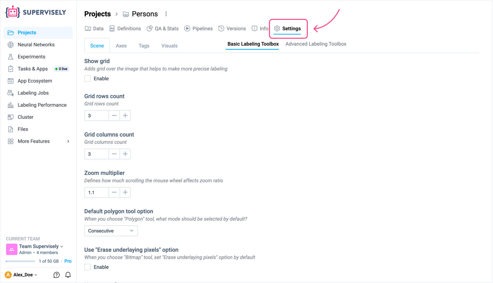
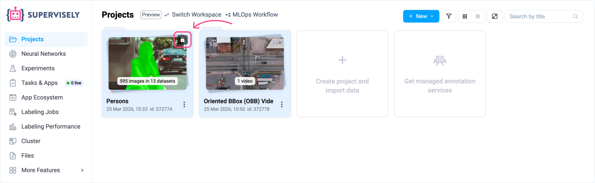
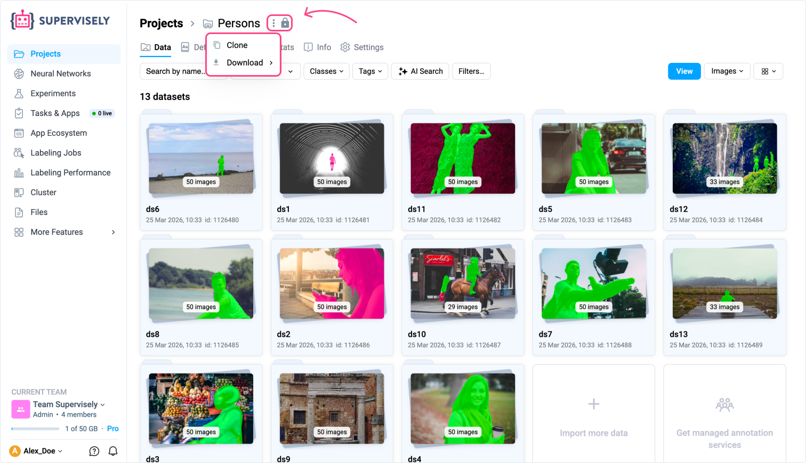
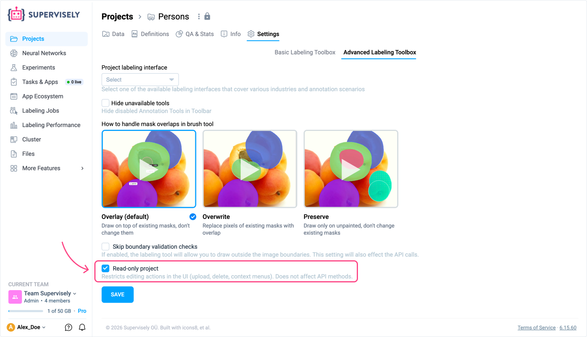

# Project Settings

Every project in Supervisely has a dedicated **Settings** tab where you can configure the labeling interface and control how the project behaves in the UI. The available settings depend on the project type — Images projects have an extended set of options split across two toolbox tabs, while Videos projects have a single, focused settings page.

## Accessing Settings

Open any project and click the **Settings** tab in the top navigation bar.

- For **Images** projects, the tab is divided into two sections: **Basic Labeling Toolbox** and **Advanced Labeling Toolbox**.
- For **Videos** projects, all settings are available on a single page.

<figure><figcaption></figcaption></figure>

---

## Images Project

### Basic Labeling Toolbox

The Basic Labeling Toolbox is organized into four sub-tabs: **Scene**, **Axes**, **Tags**, and **Visuals**.

#### Scene

- **Show grid** — overlays a grid on the image to help with precise labeling.
- **Grid rows count** — number of grid rows (default: 3).
- **Grid columns count** — number of grid columns (default: 3).
- **Zoom multiplier** — controls how much the mouse wheel affects the zoom level (default: 1.1).
- **Default polygon tool option** — default mode when the Polygon tool is selected (e.g., Consecutive).
- **Use "Erase underlaying pixels" option** — pre-enables the "Erase underlying pixels" option when the Bitmap tool is selected.
- **Keep zoom factor** — preserves the current zoom level when switching between images.
- **Show keypoints labels mode** — controls when keypoint labels are visible: Always, On hover, or Never.
- **Object dashed borders** — objects carrying specified tags are rendered with a dashed border.
- **Hook on image change** — a JavaScript hook that fires whenever the active image changes.
- **Open properties when edit** — automatically opens the image/object properties panel when editing begins.
- **Transparent parts color** — color used to fill transparent areas of an image (default: #FFFFFF).
- **Show point position** — displays the cursor coordinates while dragging a point.
- **Use only original images** — disables image conversion and compression.
- **Default Smart Model** — the Smart Tool model pre-selected in the annotation toolbox.

#### Axes

- **Enable axes on rectangle** — shows auxiliary crosshair lines while drawing a rectangle.
- **Enable axes on smart object** — shows auxiliary crosshair lines while using the Smart tool.
- **Enable axes on graph** — shows auxiliary crosshair lines while creating a graph (skeleton) object.
- **Axes opacity** — opacity of the auxiliary crosshair lines.
- **Axes border size** — thickness of the auxiliary crosshair lines.
- **Axes main color** — color of the primary auxiliary line.
- **Axes additional color** — color of the secondary auxiliary line.

#### Tags

- **Category separator** — a character used to split tag names into hierarchical categories.
- **Show tags mode** — when to display tags when no tool is active: Never, On hover, or Always.
- **Tags location over objects** — where tags appear relative to the object: Top point or Top left point.
- **Display class** — shows the object class as a tag label.
- **Display author** — shows the user who created the object as a tag label.
- **Display tag author** — shows the user who created a tag.
- **Display object size** — shows the size of the object as a label.
- **Multiple tags mode** — allows the same tag to be applied to an object more than once.
- **Toggle tags** — pressing a tag hotkey again removes the tag instead of adding a duplicate.

#### Visuals

- **Border size** — border width for all visible figures in pixels (or `auto`).
- **Show bitmap contours** — toggles the visibility of bitmap mask contours.
- **Polygon edit fill** — fills the polygon area while it is being drawn or edited.
- **Points size** — size of annotation points in pixels.
- **Point shape radius** — radius of the point shape in pixels.
- **Rectangle opacity** — fill opacity for rectangle objects.
- **Rectangle border size** — border thickness for rectangle objects.
- **Default opacity** — default fill opacity applied to all figures.
- **Default brush size** — default radius of the brush tool.
- **Project labeling interface** — selects a specialized labeling interface tailored to a specific industry or annotation scenario.
- **Group Images mode** — enables grouping of images by a selected tag.
- **Group Images by Tag** — the tag used to group images (only active when Group Images mode is enabled).
- **Group Images sync mode** — synchronizes pan, zoom, and figure visibility across images in a group.
- **Show all objects from the group on sync** — displays all objects from the entire group instead of only those belonging to the current image; requires sync mode to be enabled.
- **Show hotkeys hint** — shows a hotkey reference overlay in the labeling toolbox.

### Advanced Labeling Toolbox

- **Project labeling interface** — selects a specialized labeling interface tailored to a specific industry or annotation scenario.
- **Hide unavailable tools** — hides disabled annotation tools from the toolbar instead of showing them as inactive.
- **How to handle mask overlaps in brush tool** — defines behavior when brush strokes overlap existing masks:
  - **Overlay (default)** — draws on top of existing masks without modifying them.
  - **Overwrite** — replaces the pixels of existing masks where they overlap.
  - **Preserve** — draws only on unpainted areas; existing masks are never changed.
- **Skip boundary validation checks** — allows drawing outside the image boundaries; also affects API calls.
- **Read-only project** — restricts all editing actions in the UI (upload, delete, context menus). Does not affect API methods.

---

## Videos Project

Videos projects have a single **Settings** page without the Basic/Advanced split.

- **Project labeling interface** — selects a specialized labeling interface tailored to a specific industry or annotation scenario.
- **Hide unavailable tools** — hides disabled annotation tools from the toolbar instead of showing them as inactive.
- **Show object trajectories** — displays the movement trajectories of annotated objects across frames. Useful when labeling footage from a static CCTV camera.
- **How to handle mask overlaps in brush tool** — defines behavior when brush strokes overlap existing masks:
  - **Overlay (default)** — draws on top of existing masks without modifying them.
  - **Overwrite** — replaces the pixels of existing masks where they overlap.
  - **Preserve** — draws only on unpainted areas; existing masks are never changed.
- **Skip boundary validation checks** — allows drawing outside the frame boundaries; also affects API calls.
- **Read-only project** — restricts all editing actions in the UI (upload, delete, context menus). Does not affect API methods.

---

## Read-only mode

The **Read-only project** setting is available for both Images and Videos projects. It puts the project into a protected state that prevents accidental edits through the UI while keeping full access for viewing and exporting data.

<figure><figcaption></figcaption></figure>

### What you can do in Read-only mode

- Browse the project in the **project panel** — gallery, table view, filters, AI Search, QA & Stats — exactly as with a regular project.
- Open images or videos in the **labeling toolbox** to visualize annotations.
- **Clone** the project to another workspace.
- **Download** and export data using ecosystem apps.

<figure><figcaption></figcaption></figure>

### What is restricted in Read-only mode

All UI actions that modify the project or its data are disabled, including:

- Uploading or deleting images, videos, or datasets.
- Editing, adding, or removing annotations.
- Renaming or deleting the project and datasets.
- Context menu actions that change data state.

<figure><figcaption></figcaption></figure>


**Note:** Read-only mode only restricts the UI. API access is not affected — programmatic operations via the Supervisely SDK or REST API remain fully available.


### Enabling and disabling Read-only mode

<figure><figcaption></figcaption></figure>

**For Images projects:**

1. Open the project and navigate to **Settings → Advanced Labeling Toolbox**.
2. Check the **Read-only project** checkbox.
3. Click **Save**.

**For Videos projects:**

1. Open the project and navigate to **Settings**.
2. Check the **Read-only project** checkbox.
3. Click **Save**.

To allow editing again, uncheck the **Read-only project** checkbox and click **Save**.

You can also toggle Read-only mode programmatically using the [`set_read_only`](https://supervisely.readthedocs.io/latest/sdk/supervisely.api.project_api.ProjectApi.html?h=set_read#supervisely.api.project_api.ProjectApi.set_read_only) method of the Supervisely Python SDK.


**Tip:** Use Read-only mode to lock down a project after reaching a stable state, so collaborators can safely browse and export data without the risk of accidentally modifying it.

