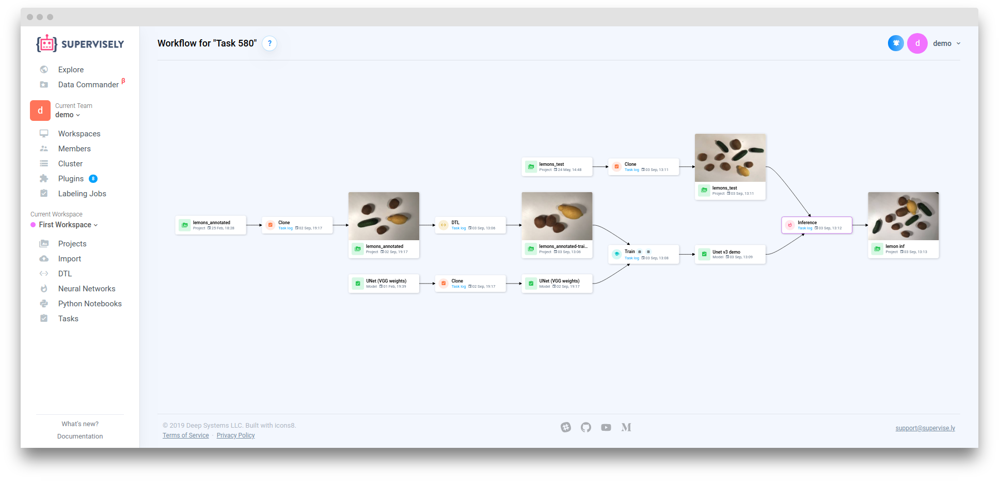

# Project Versions

Project Versions let you capture, restore, and compare specific states of your project data over time. Combined with the visual MLOps Workflow, this ensures reproducibility, traceability, and efficient collaboration across labeling, augmentation, training, and evaluation stages.

## Why tracking and reproducibility matter

- Data evolves over time. Track when and how changes occur to maintain model accuracy.
- Avoid confusion after multiple iterations. Keep a clear history of which datasets and models were used.
- Ensure reproducibility and collaboration. Make it easy to reproduce results and share accurate insights across teams.

## Key capabilities

- Version control: Save and manage different states of a project.
- Centralized history: View and describe all changes in one place.
- One-click restore: Create a new project version from any previous state.
- Efficient storage: Versions are stored in a secure binary format; media files are linked, not duplicated.


Note: Project Versions are available on Pro and Enterprise plans.


## Versions tab

Use the Versions tab on a project to:

- Create versions at any stage (data upload, annotation, augmentation, or transformation).
- Add meaningful descriptions for future reference.
- Restore a prior state by creating a new project from a selected version.

<figure><figcaption></figcaption></figure>

## Typical workflow

1. Import data and annotate with labeling tools.
2. Create a version to capture the baseline state before transformations.
3. Apply augmentations, filtering, or other data operations.
4. Train a model; training apps automatically create versions and produce checkpoints and reports.
5. Compare versions and, if needed, restore to a previous state to branch experiments.

## Visualizing data evolution with MLOps Workflow

The MLOps Workflow provides a visual map of how data flows through apps and operations in your project. Use it to inspect application sessions, navigate to projects and files, and understand how each transformation impacts results.

- Data operations include:
  - Augmentation (cropping, resizing, rotation, blurring, adding noise, etc.)
  - Annotation transformations (convert shapes, merge, rasterize)
  - Dataset split/merge/subsample/filter
  - Training data generation and format conversions

See the dedicated guide for details and best practices: [MLOps Workflow](../mlops-workflow.md).

<figure><figcaption></figcaption></figure>
<figure><figcaption></figcaption></figure>

## Model training and evaluation

Training apps automatically:

- Create a new project version capturing the training state.
- Produce checkpoints and benchmark reports (e.g., mAP, Precision, Recall, IoU, Classification Accuracy, Inference Speed).

Use these reports to compare model versions, understand the effect of architecture and hyperparameter changes, and track performance across data versions.

## Best practices for clear Workflows

1. Use project cards to group related datasets for better readability.
2. Prefer folder cards over many file cards to reduce clutter; name source folders clearly.
3. Add descriptions to nodes to provide context.
4. Rename the main node only when necessary to indicate special modes.
5. Customize cards accurately with relevant info.
6. Avoid overwriting card states; keep a clear connection history.
7. Organize session-based apps to keep workflows compact around a single task.

By adopting Project Versions and the MLOps Workflow together, you ensure data governance, reproducibility, and efficient team collaboration throughout the label → train → evaluate cycle.