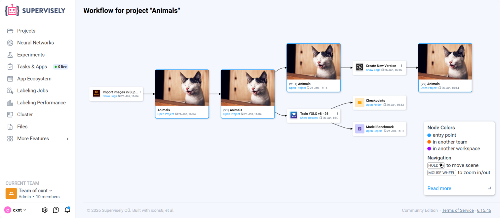
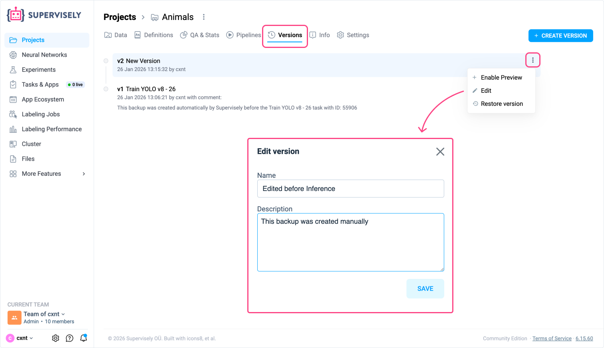
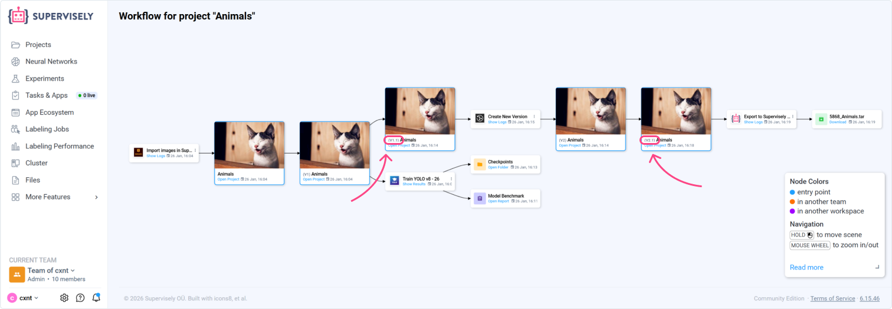

# Project Versions

Project Versions let you capture, restore, and compare specific states of your project data over time. Combined with the visual MLOps Workflow, this ensures reproducibility, traceability, and efficient collaboration across labeling, augmentation, training, and evaluation stages.

Project Versions currently support the following project types:

- Images
- Videos
- Pointclouds

<figure><figcaption></figcaption></figure>

## Why tracking and reproducibility matter

- Data evolves over time. Track when and how changes occur to maintain model accuracy.
- Avoid confusion after multiple iterations. Keep a clear history of which datasets and models were used.
- Ensure reproducibility and collaboration. Make it easy to reproduce results and share accurate insights across teams.

## Key capabilities

- Version control: Save and manage different states of a project.
- Centralized history: View and describe all changes in one place.
- One-click restore: Create a separate project that represents the current project's state at the selected version.
- Efficient storage: Versions are stored in a secure binary format; media files are linked, not duplicated.


Note: Project Versions are available on Pro and Enterprise plans.


## Versions tab

Use the Versions tab on a project to:

- Create versions at any stage (data upload, annotation, augmentation, or transformation).
- Add meaningful descriptions for future reference.
- Restore a prior state by creating a new project from a selected version.


You can create a version only if the project has changed since the last version. If there are no changes, creating a new version is not available.


<figure><figcaption></figcaption></figure>

## Typical workflow

1. Import data and annotate with labeling tools.
2. Create a version to capture the baseline state before transformations.
3. Apply augmentations, filtering, or other data operations.
4. Train a model - training apps automatically create versions and produce checkpoints and reports
5. Compare versions and, if needed, restore to a previous state to branch experiments.

## Visualizing data evolution with MLOps Workflow

The MLOps Workflow provides a visual map of how data flows through apps and operations in your project. Use it to inspect application sessions, navigate to projects and files, and understand how each transformation impacts results.

- Data operations include:
  - Augmentation (cropping, resizing, rotation, blurring, adding noise, etc.)
  - Annotation transformations (convert shapes, merge, rasterize)
  - Dataset split/merge/subsample/filter
  - Training data generation and format conversions

See the dedicated guide for details and best practices: [MLOps Workflow](../mlops-workflow.md).

### Minor versions on the Workflow graph

Minor versions indicate that the project changed after the last major version was cut and before the next major version is created.

On the screenshot below, minor versions are underlined (e.g., **1.1** and **2.1**).

<figure><figcaption></figcaption></figure>

- Shown as 1.1, 2.1, ... where 2 is the last restorable (major) version.
- Each minor version reflects the current state of the project at that point on the graph.
- You cannot restore a project from a minor version; only major versions are restorable.
- Minor versions appear automatically on the graph when the project changes (manual edits or app sessions) without cutting a new major version.
- If nothing changed after a major version, minor versions will not appear.

Example (as shown on the screenshot): you cut version **2** (major). After that, you changed the project (e.g., edited annotations manually or ran an app without cutting a new major version) — the graph displays **2.1** to indicate the project state has changed since version 2.