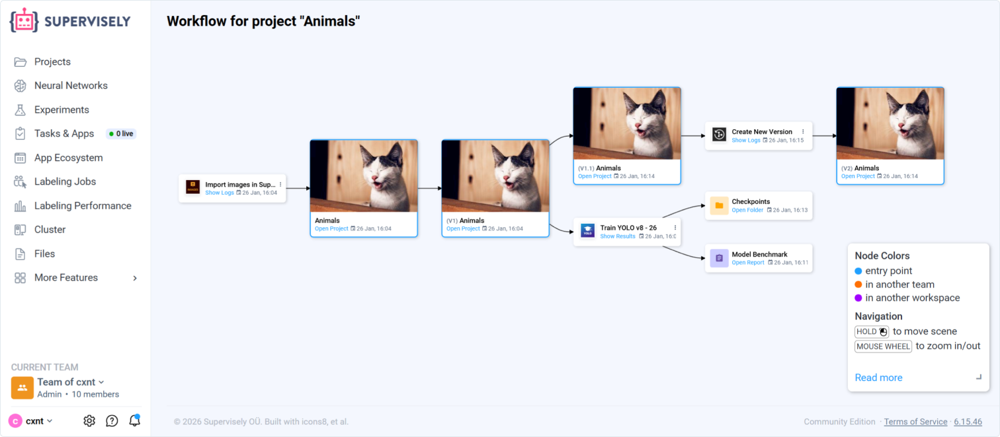
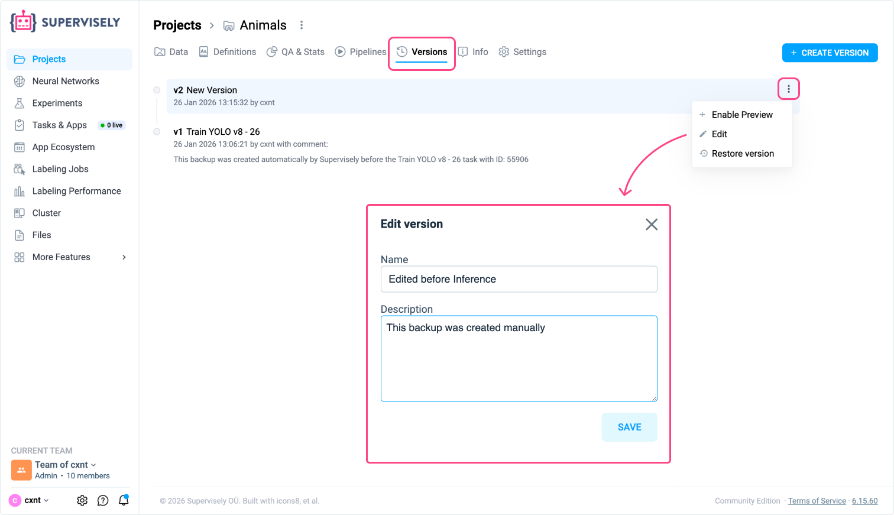
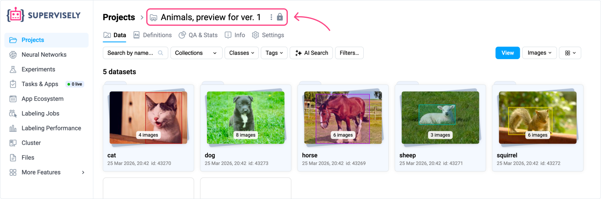
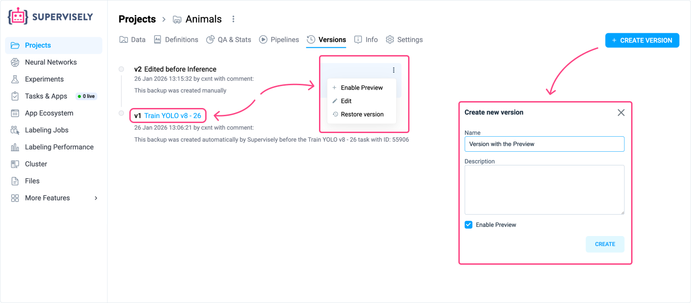
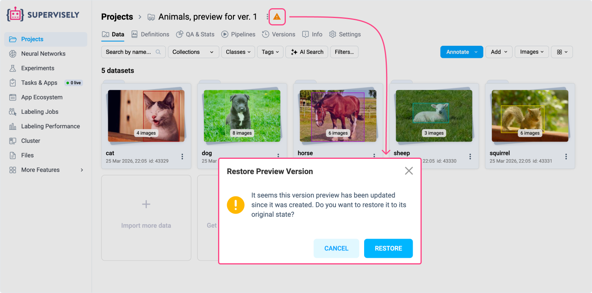
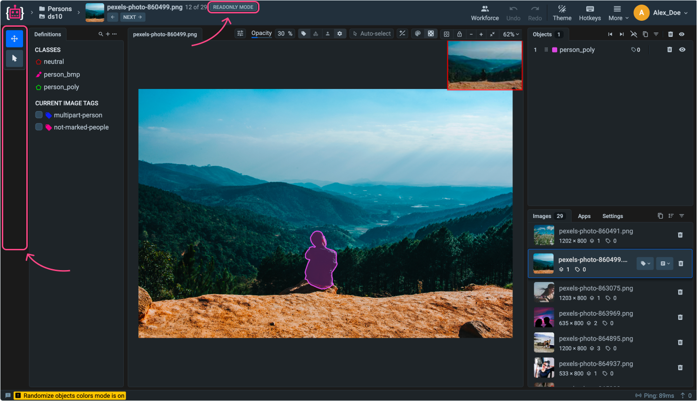
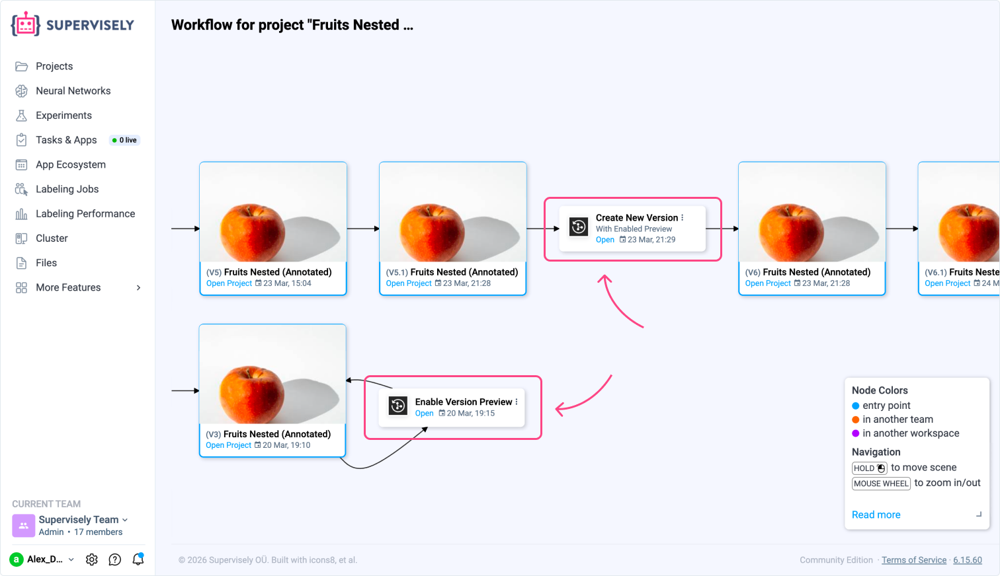
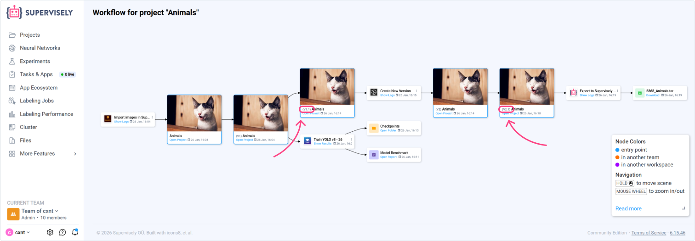

# Project Versions

Project Versions let you capture, restore, and compare specific states of your project data over time. Combined with the visual MLOps Workflow, this ensures reproducibility, traceability, and efficient collaboration across labeling, augmentation, training, and evaluation stages.

Project Versions currently support the following project types:

- Images
- Videos
- Volumes

<figure><figcaption></figcaption></figure>

## Why tracking and reproducibility matter

- Data evolves over time. Track when and how changes occur to maintain model accuracy.
- Avoid confusion after multiple iterations. Keep a clear history of which datasets and models were used.
- Ensure reproducibility and collaboration. Make it easy to reproduce results and share accurate insights across teams.

## Key capabilities

- **Version control:** Save and manage different states of a project.
- **Centralized history:** View and describe all changes in one place.
- **Instant previews:** Create read-only snapshots to quickly inspect data without restoring the full project (Images and Videos only).
- **One-click restore:** Create a separate project that represents the current project's state at the selected version.
- **Version comparison:** See what changed between any two versions — datasets, items, annotations, tags, classes, and project settings.
- **Flexible metadata:** Edit version titles and descriptions at any time to keep context clear.
- **Efficient storage:** Versions are stored in a secure binary format. Previews only store unique annotations, while media files are linked, not duplicated.


**Note:** Project Versions are available on Pro and Enterprise plans.


## Versions tab

Use the **Versions** tab on a project to:

- Create versions at any stage (data upload, annotation, augmentation, or transformation).
- Edit the **Title** and **Description** of existing versions for future reference.
- Access an instant Preview of the data by clicking on the version's Title link.
- Restore a prior state by creating a new project from a selected version.
- [Compare two versions](#comparing-versions) to see what changed between them.


You can create a version only if the project has changed since the last version. If there are no changes, creating a new version is not available.


<figure><figcaption></figcaption></figure>

## Version Previews

For Image and Video projects, you can instantly inspect a version's data using **Project Previews**. A preview acts like a standard project but operates in a [read-only state](./project-settings.md#read-only-mode), allowing you to verify data without waiting for a full project restoration from a binary version.

<figure><figcaption></figcaption></figure>

### Creating and managing Previews

- **During creation:** Check the **Enable Preview** flag when creating a new version to automatically generate a snapshot accessible in the well-known UI.
- **For existing versions:** Retroactively enable previews for older versions. This is especially useful for checking versions automatically generated by apps during training pipelines.

<figure><figcaption></figcaption></figure>

- **Restoring state:** If a preview snapshot is accidentally altered, you can easily restore it to its original version state.

<figure><figcaption></figcaption></figure>

### Using Previews

Once enabled, access the preview by clicking the version's **Title** in the Versions tab. Inside the preview snapshot, you can:

- Open images or videos in the labeling toolbox to visualize annotations.
- Use **AI Search** and data filtering to find specific assets.
- Clone the snapshot or download it using ecosystem apps.
- Perform any standard project action that does not modify the data state.

<figure><figcaption></figcaption></figure>

💡 **Tip:** Previews are highly storage-efficient. They only consume local storage for annotations. Media data (images or videos) is safely linked without duplication.

## Comparing versions

Compare any two versions of a project to see exactly what changed between them. The comparison works the same way for Images, Videos, and Volumes projects, and does not need Previews.


Comparing versions requires Supervisely instance version `6.18.3` or later and the **Data Versioning** app version `v0.4.0` or later.


### Comparing two versions

1. Open the **Versions** tab of the project. The **Compare versions** panel is shown next to the timeline when the project has at least two versions.
2. Open the actions menu of a version and click **Add to comparison**. Repeat for the second version. The panel shows the selected pair, for example `v3 ↔ v7`.
3. Click **Compare**. The comparison runs as a Data Versioning task, and its progress is shown in the panel. You can leave the page: the comparison keeps running, and its state is shown again when you select the same pair.
4. When the status is **Ready**, click **Open report**.

The order in which you pick the two versions does not matter: the report always compares the older version with the newer one.

A comparison is computed once and saved. Selecting the same pair later opens the existing report straight away, without computing it again. When a report exists for two neighbouring versions, a **diff** link appears between them on the timeline.

To pick a different pair, click **Clear**. This only drops the selection; a comparison that is already running keeps running. If a comparison fails, click **Logs** to see the task logs, or **Try again** to run it again.

### Reading the report

The report header shows how many items changed out of the total, with a count for each type of change. The report then lists:

- **Class definitions** and **Tag definitions** that were added, removed, or modified.
- **Project settings** that changed.
- An overview of annotation changes by class, and of tag changes by tag, with the number added and removed for each.
- **What changed** — a tree of datasets and items, each marked as added, removed, modified, renamed, or moved. Filter the tree by type of change, and use **Expand all** / **Collapse all** to open or close all branches.

Click **Download HTML** to save the report as a single file you can share or open offline.

A comparison describes what changed, not how it looks: it does not show images or annotations side by side. Use [Previews](#version-previews) to inspect the data of a version visually.

### Which versions can be compared


Only versions saved in the newer storage format can be compared. Versions created on the **Versions** tab with Supervisely `6.18.3` or later (Data Versioning `v0.4.0` or later) use it. Versions created earlier use an older format: they can still be restored and previewed, but not compared. To start comparing, create a new version after upgrading.


Versions created automatically by other apps (for example, training apps) use the format of the SDK version that app runs, so older apps may still create versions that cannot be compared. A version that cannot be compared has **Add to comparison** disabled in its menu, and the reason is shown in a tooltip. Between two neighbouring versions that cannot be compared, the timeline shows **no diff**.

Annotations are matched between versions by their IDs. Editing an annotation in the labeling tool keeps its ID, so it is reported as modified. If annotations are re-uploaded instead (for example, an app replaces all annotations of an item), they get new IDs and are reported as removed and added.

Comparing a version with the current, unsaved state of the project is not supported. Create a new version first, then compare it with an earlier one.

## Typical workflow

1. Import data and annotate with labeling tools.
2. Create a version (with **Enable Preview** checked) to capture the baseline state before transformations.
3. Apply augmentations, filtering, or other data operations.
4. Train a model — training apps automatically create versions and produce checkpoints and reports.
5. Quickly inspect auto-generated versions using Previews.
6. [Compare versions](#comparing-versions) and, if needed, restore to a previous state to branch experiments.

## Visualizing data evolution with MLOps Workflow

The MLOps Workflow provides a visual map of how data flows through apps and operations in your project. Use it to inspect application sessions, navigate to projects and files, and understand how each transformation impacts results.

- **Preview Integration:** Previews are fully integrated into the workflow. You can see preview availability and access them directly from the MLOps Workflow cards. Creating a preview from an existing version is also documented on the workflow graph.

<figure><figcaption></figcaption></figure>

- **Data operations include:**
  - Augmentation (cropping, resizing, rotation, blurring, adding noise, etc.)
  - Annotation transformations (convert shapes, merge, rasterize)
  - Dataset split/merge/subsample/filter
  - Training data generation and format conversions

See the dedicated guide for details and best practices: [MLOps Workflow](../mlops-workflow.md).

### Minor versions on the Workflow graph

Minor versions indicate that the project changed after the last major version was cut and before the next major version is created.

On the screenshot below, minor versions are underlined (e.g., **1.1** and **2.1**).

<figure><figcaption></figcaption></figure>

- Shown as 1.1, 2.1, ... where 2 is the last restorable (major) version.
- Each minor version reflects the current state of the project at that point on the graph.
- You cannot restore a project from a minor version; only major versions are restorable.
- Minor versions appear automatically on the graph when the project changes (manual edits or app sessions) without cutting a new major version.
- If nothing changed after a major version, minor versions will not appear.

**Example** (as shown on the screenshot): You cut version **2** (major). After that, you changed the project (e.g., edited annotations manually or ran an app without cutting a new major version) — the graph displays **2.1** to indicate the project state has changed since version 2.
