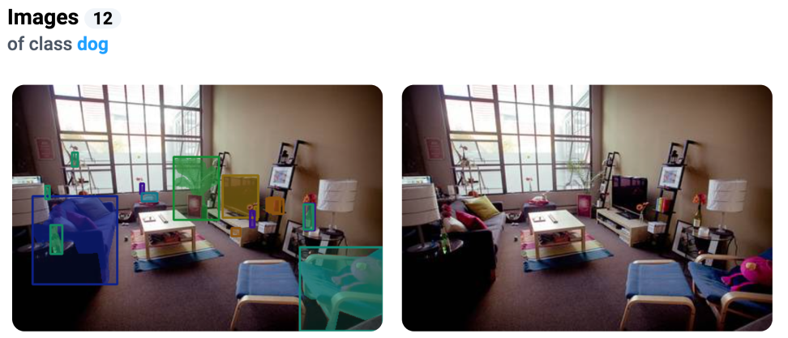
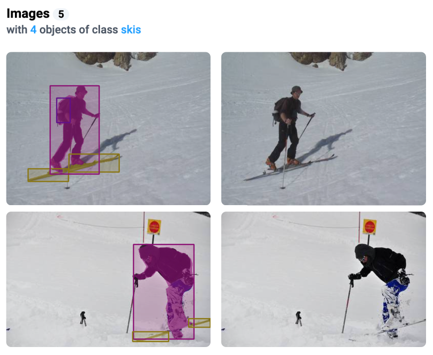
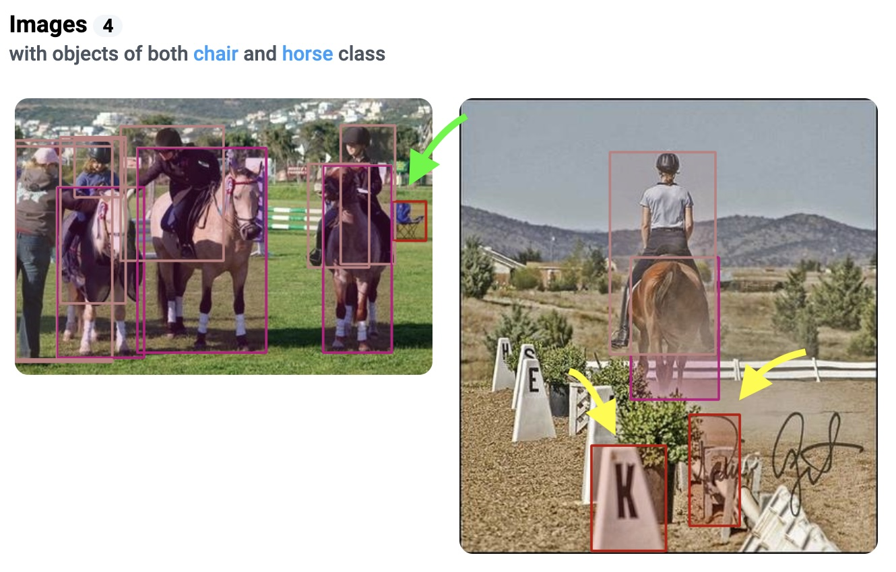

# Practical applications of statistics

In this guide, we explore how to leverage best-in-class quality assurance and interactive statistical tools to improve the quality of your custom training datasets. These tools are crucial for identifying and rectifying data issues, such as class imbalances, annotation errors, and outliers, which can significantly impact the performance of neural network models. The guide includes practical applications of statistics, providing insights on data validation, anomaly detection, and optimizing the data acquisition process.

## Use Case 1: Missing or misclassified annotations

When analyzing the class `dog`, it is found that the selected class is presented on 12 images. However, when reviewing these images, it is found that there are no actual objects related to this class in one image. This may indicate problems with the clarity of the annotation or insufficient quality of the data labeling - annotators put the bounding box of class "dog" but there are no dogs on the image.

<figure><figcaption></figcaption></figure>

Steps to solve using Class Balance and Image Statistics 👇

#### **Step 1. Class Balance Analysis**

1. Review the distribution of objects across different classes to identify any anomalies. For example, check the frequency of the "dog" class.
2. Compare the total number of objects labeled as "dog" with the expected number based on the visual review.

#### **Step 2. Check Images Statistic**

1. Use the per image statistics to find and analyze images containing the "dog" class. Verify the presence and correctness of the annotations.
2. Look for images that either lack the annotated object or where the annotation is incorrect (e.g., wrong bounding box placement). Sorting images by the number of objects or area covered can help identify these inconsistencies.

#### **Step 3.** Make corrections and provide feedback

1. Use the information from the tables to document specific cases of misclassification or missing annotations.
2. Provide feedback to the data annotation team for corrections and improve future annotations.

#### Step 4. Update the annotations

1. Based on the issues identified, update the annotations to accurately match the objects in the images.

## Use Case 2: Mismatch in the number of objects

When sorting the images by the Object Distribution for the class `skis`, it is found that all of images have 4 objects in this class. However, a detailed view of some images reveals that they do not contain such a large number of objects of the class `skis`. This may indicate errors in objects segmentation (one object is partially covered and labeled as two separate masks), objects duplication or a mismatch between the actual content of the images and their annotations.

<figure><figcaption></figcaption></figure>

Steps to solve Using Object Distribution and Co-Occurrence Matrix 👇

#### **Step 1. Object Distribution Heatmap**

1. Check the heatmap to see the distribution of the "skis" class objects across images. Look for inconsistencies, such as images annotated with more objects than actually present.
2. Click on specific cells to view images with annotated object counts and verify these counts visually.

#### **Step 2. Co-Occurrence Matrix**

1. Analyze the co-occurrence of the "skis" class with other classes. Unusual or unexpected co-occurrences may indicate annotation errors or misunderstandings during the labeling process.

#### **Step 3. Identify and correct mistakes**

1. Record any discrepancies found during the analysis.
2. Provide detailed feedback to the data annotation team about identified issues, such as over-segmentation or duplicate annotations.

#### **Step 4. Review and update annotations**

1. Re-annotate the images where discrepancies were found, ensuring that the number of objects is accurate.

## Use Case 3: Errors in model predictions

Quality assurance tools can be used to quickly expose and review anomalies in model predictions. When reviewing objects co-occurrence matrix, data scientists can investigate unusual object pairs: for example `horse` and `chair` are presented on the image at the same time. It may help to find errors in training data. Or this may indicate that the model is not working properly or that there is a lack of training data for certain classes.

The purpose of analyzing the statistics for model predictions is to debug model mistakes and to determine what data needs to be added to training dataset of how training data augmentations can be improved. For example, having found a lack of images with objects of the class `chair`, a decision can be made to expand the training dataset by acquiring and labeling more images for this class to achieve a better class balance distribution and quality of the model.

<figure><figcaption>
Green arrow - model correctly detected the chair on the left image. Yellow arrows - errors in predictions, objects are not chairs on the right image.
</figcaption></figure>

Steps to Solve Using Co-Occurrence Matrix and Spatial Heatmap 👇

#### **Step 1. Co-Occurrence Matrix Analysis**

1. Use the co-occurrence matrix to identify unusual pairs of predicted and actual classes, such as a high frequency of "horse" and "chair" co-occurrences which may not make semantic sense.
2. Pinpoint cells in the confusion matrix where the model frequently confuses certain classes, indicating potential issues in the training data or model architecture.

#### **Step 2. Spatial Heatmap**

1. Examine the spatial heatmap to understand where objects are typically located in the images. This can reveal biases in the model's learning, such as consistently predicting objects in certain areas.

#### **Step 3. Data Analysis and Augmentation**

1. &#x20;Use the insights from the matrices to review the training data for underrepresented classes or missing annotations.
2. Plan data augmentation techniques to address class imbalance or introduce variability in object locations to improve model generalization.

#### **Step 4. Model Retraining and Evaluation**

1. Based on the analysis, augment the dataset or collect additional data to balance class representation.
2. Train the model with the updated dataset and evaluate its performance using standard metrics like precision, recall, and F1-score.

#### **Step 5. Continuous Monitoring**

1. Regularly review the co-occurrence matrix and other statistics to identify and rectify new issues, ensuring ongoing model robustness and accuracy.