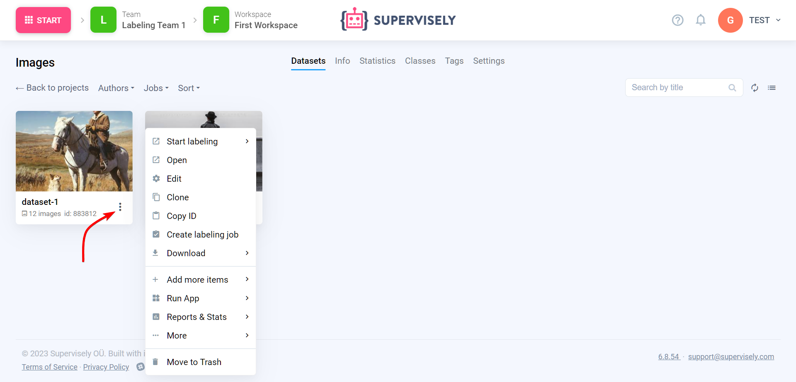

# Datasets

Dataset is the second most important concept in Supervisely. Here is where your labeled and unlabeled images and  images, videos, and so on. There is no more levels: images or videos are directly attached to a dataset.

But most importantly, a dataset is a unit of work. To start labeling, you need to click on a dataset card — and you can only label a single dataset in the labeling interface at a time. Also, you cannot assign a [labeling job](/labeling/jobs/README.md) to a project — only to a dataset.

You can also perform other actions on context menu datasets.

