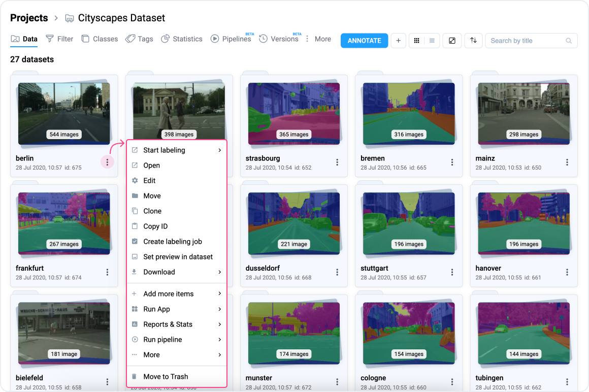

# Datasets

Dataset is the second most important concept in Supervisely. This is where your labeled and unlabeled images, videos, and other data are stored. There are no additional levels of hierarchy: images and videos are directly attached to a dataset.

But most importantly, a dataset is a unit of work. To start labeling, click on a dataset tile—only one dataset can be labeled at a time in the labeling interface.


Note that [labeling job](../../../labeling/jobs/) can only be assigned to datasets, not to projects.


You can also perform other actions on datasets through the context menu.

<figure><figcaption></figcaption></figure>
