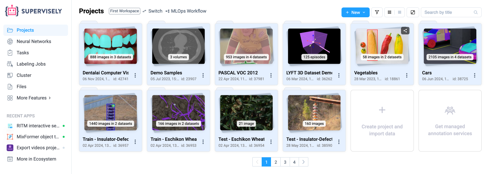
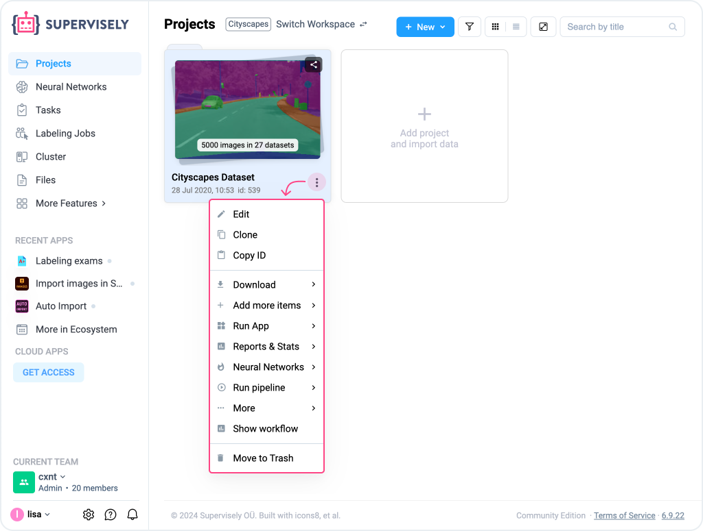
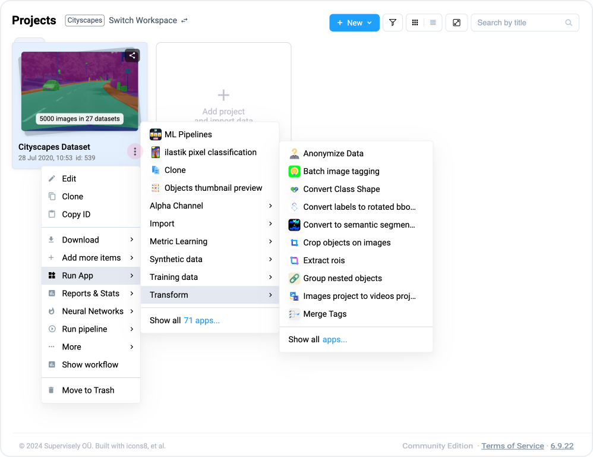
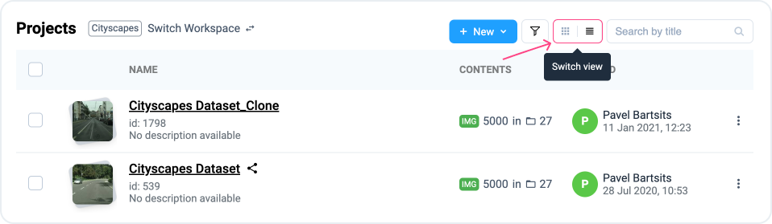
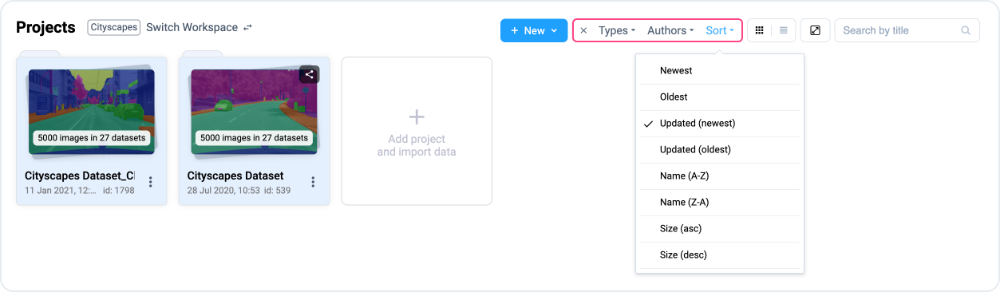
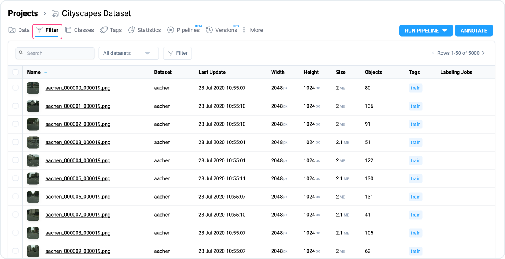

# Projects

**Project** is a primary organizational unit designed to house and manage datasets, along with metadata such as **classes** and **tags**. Think of it as a "superfolder" where all datasets within the project share common metadata configurations, including predefined classes and tags set at the project-level.

## Navigating the Projects Page

The **Projects** page displays all available projects in the currently selected [Workspace](../../collaboration/teams.md#workspaces). Each project appears as a card or line, showing key details such as:

* **Thumbnail Preview**: Provides a quick visual overview of the project's content (e.g. an image or video frame).
* **Project Name**: The title of the project, such as "Wood Defect Detection".
* **Data Count**: Shows the total items within the project, broken down by data type (e.g., "888 images in 3 datasets").
* **Project ID and Creation Date**: Helps track and organize projects, especially in collaborative environments.

Projects are displayed either in **Card View** (default) or **Table View**. You can switch between these views by using the icon at the top-right corner of the page.

<figure><figcaption></figcaption></figure>

## Projects List

At the **Projects** page you can view all projects you have in the current [workspace](../../collaboration/teams.md).

<figure><figcaption></figcaption></figure>

Please note the **"three dots" (⋮)** icon in the bottom right corner of a project. This is what we call the "context menu". From here, you can perform many important activities related to the project, such as cloning the project, running an app for the project, or deleting the project.

<figure><figcaption></figcaption></figure>

## How to create a Project

Wait, there is no `Create` button on this page. So how do I create one?

You can take a [sample project](https://ecosystem.supervisely.com/import+images+project) from the ecosystem.

### Import Data

[Upload](../import/import/import.md) images, videos or other files from your computer at the [Import](../import/import/import.md) page. You will be asked to provide a name for a Project — and after successful import, you will have one.

### Add using API

If you want to automate the process of adding new data, it's a way to go! We have a powerful [API](https://api.docs.supervisely.com) and [SDK](https://supervisely.readthedocs.io/en/latest/sdk\_packages.html) that lets you start in no time.

## Project Type

At the moment we support:

* Images
* Videos
* 3D Point Clouds
* DICOM

You can see a project type in the top left corner of a project card.

## Cards & table views

At the Project page you can change how to list projects and datasets: as cards or as a table. You can switch the view by clicking the icon at the most right side of the page.

<figure><figcaption></figcaption></figure>

## Filter & sort projects

Show only specific projects and datasets by multiple parameters, including project type, labeling job, author and so on.

<figure><figcaption></figcaption></figure>

<figure><figcaption></figcaption></figure>

Learn more about using conditional filters and building custom queries on your training data in our comprehensive blog post.



## Data Commander

You can also find the list of your projects across all of your teams and workspaces by navigating to the [Data Commander](../data-commander/). There, you can move or copy both projects, datasets, images and even project metadata.

## Trash Bin

You can remove one or multiple projects and datasets by selecting them using checkboxes and clicking the `Move to Trash` button. This won’t delete your data immediately — you can learn more in the [Storage Cleanup](../storage/) section.

<table data-view="cards"><thead><tr><th></th><th></th><th data-hidden data-card-target data-type="content-ref"></th></tr></thead><tbody><tr><td><strong>Datasets</strong></td><td>Dataset is the second most important concept in Supervisely.</td><td><a href="datasets/datasets.md">datasets.md</a></td></tr><tr><td><strong>Classes</strong></td><td>Classes are pre-defined types of your annotations.</td><td><a href="broken-reference">Broken link</a></td></tr><tr><td><strong>Tags</strong></td><td>Sometime you need more than a bunch of marked pixels on an image.</td><td><a href="broken-reference">Broken link</a></td></tr><tr><td><strong>Statistics</strong></td><td>Having entered the project, in the top menu we see the statistics section.</td><td><a href="broken-reference">Broken link</a></td></tr></tbody></table>
