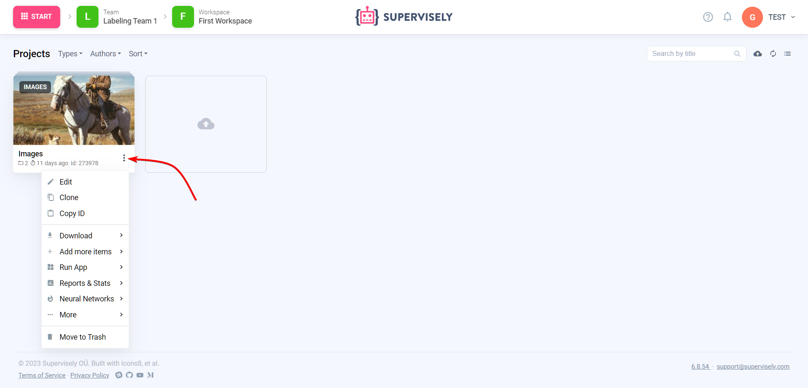
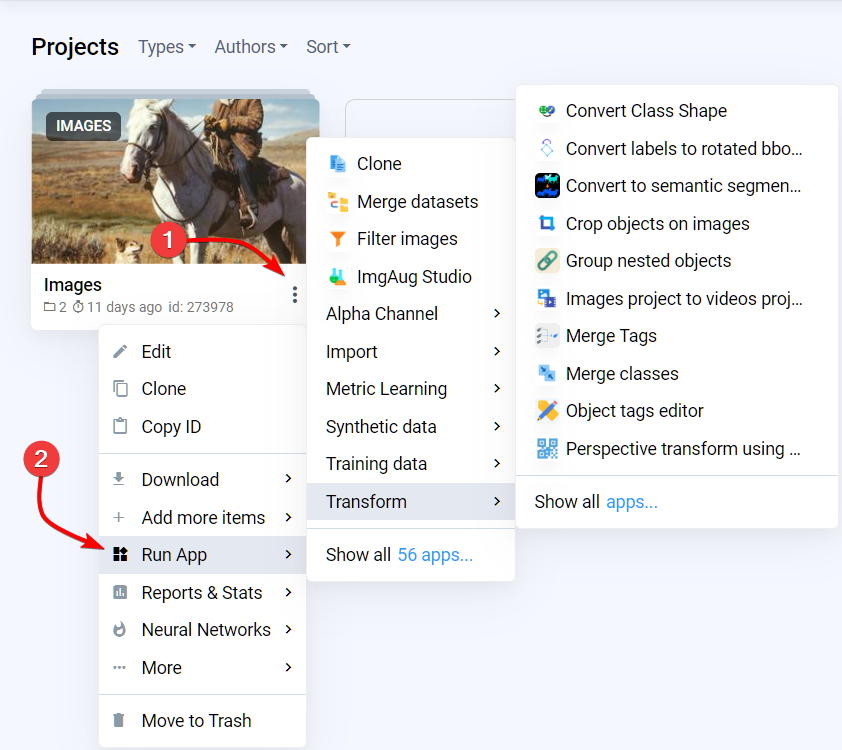
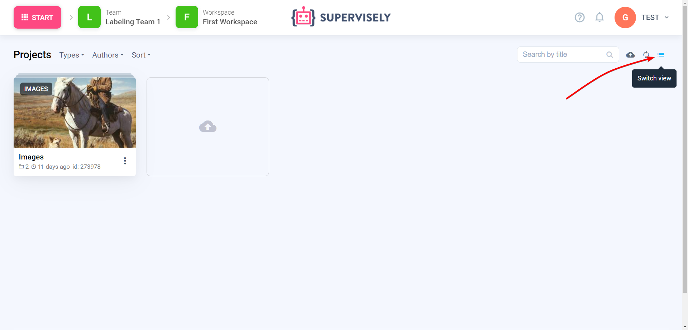
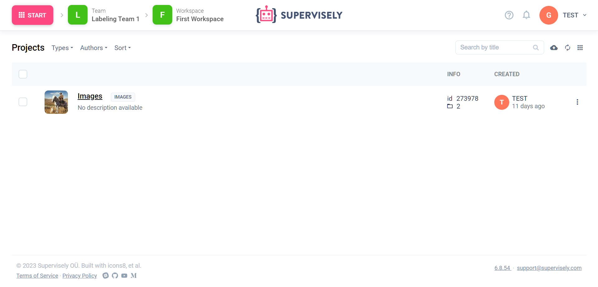

# Projects

You can think of a Project as a superfolder with data and metadata, like classes and tags. Every dataset inside the project will share the same metadata and have the same classes and tags defined on the project-level.

## Projects List

At the "Projects" page you can view all projects you have in the current [workspace](/collaboration/teams.md).

Please note the ⋮ ("three dots") icon in the bottom right corner of a project. From here (we call it a "content menu") you can perform many important activities related to the project: for example: like clone, run app for project or delete a project.  

## How to create a Project

Wait, there is no "Create" button on this page. So how do I create one?

### Import Data

Upload images or videos or other files from your computer at the "Import" page. You will be asked to provide a name for a Project — and after successful import, you will have one.

### Add using API

If you want to automate the process of adding new data, it's a way to go! We have a powerful [API](https://api.docs.supervisely.com) and [SDK](https://supervisely.readthedocs.io/en/latest/sdk_packages.html) that lets you start in no time. 

## Project Type

At the moment we support:

- Images
- Videos
- 3D Point Clouds
- DICOM

You can see a project type in the top left corner of a project card.

## Additional features:
- Switch view mode

    
    
- Filter projects by:
    - **Types.** Image, Video, Point cloud, Volumes.
    - **Authors.** The person who uploaded the project
- Manipulate projects via [Data Commander](data-organization/data-commander/README.md)
- The project can be placed in the trash, this will not delete it. [(Storage Cleanup)](enterprise/cleanup/README.md)

