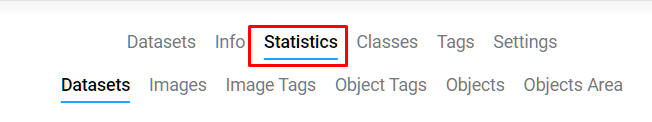

# Statistics

Having entered the project, in the top menu we see the statistics section. In this section you can see various statistics for the project.

## Datasets
**In the datasets section we see:**
- Name of the dataset
- The amount of data inside each dataset located in the selected project
- Data size of individual datasets and the entire project

## Images
**In the Images section we see:**
- What classes are used in the dataset and how many of them are marked
- Partially / completely marked
- Image not marked
- Images in dataset

## Images Tags and Object Tags
**In the Images tags and Object Tags sections you can see:**
- What tags are used in the dataset and how many of them are marked
- Images tagged
- Images not tagged

## Object
**In the Object section we see:**
- Name of the dataset
- How many labeled objects are inside each dataset.

## Object Area
**In the Object Area section we see:**
- What percentage area is covered by objects of each class