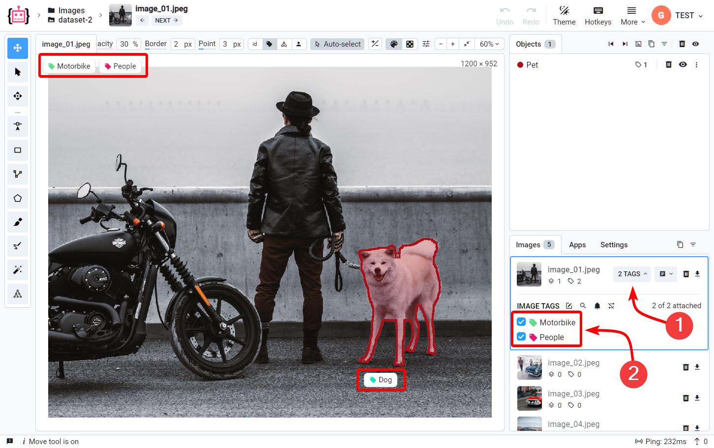

# Tags

Sometime you need more than a bunch of marked pixels on an image. You may need to associate some extra information with annotations or files. For example, you may want to label what type of defect on a road is that or point out that this image should be selected for training. To structure this, you can define a Tag.

A Tag defines a name, possible values for a tag instance and what types of things it can be attached to. Usually, you can't attach a particular Tag to a particular object multiple times. 

                              
## Type

You can tag the entire image or just one or a few objects

                    
You can also define tags with values, i.e. "number_of_wheels". We support values of the following types: Text, Number, and One of. You can, of course, select None and provide no value at all.               
      
## Hotkey

Optionally, you can assign a Hotkey for a tag to quickly select it during labeling. You can only set a single latin character (because other combinations may be unavailable).

## Filtering

Tags can be later used to filter out images or objects in the labeling interface or define a labeling jobs to annotate files that are marked with a particular tags

## Examples

- "probability" (of "Number" type) — automatically attached to the generated labels during inference
- "to_train" (of "None" type) — can used for filtering to automatically move those images to the training set
- "bad_one" (of "None" type) — especially with a hotkey attached, can be used to quickly mark images that needs to be re-labeled
- "color" (of "String" type) — describes some information about an object
